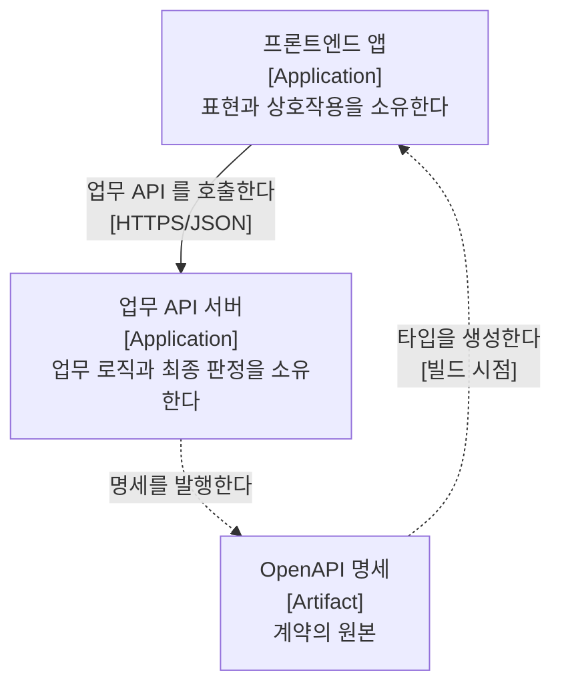

# 애플리케이션 아키텍처

본 문서는 디커플드 구성에서 **앱을 몇 개로 나누고 각자 무엇을 소유하는지**를 정의합니다.

앱 내부의 코드 구조는 다루지 않습니다. 그것은 [Angular](angular/index.md)와 Spring Boot 문서가 각자 소유합니다. **본 문서는 두 문서 어느 쪽에서도 물을 수 없는 질문만 다룹니다.** "상태를 어디에 두는가"는 프론트엔드 문서가 답하고 "트랜잭션 경계를 어디에 긋는가"는 백엔드 문서가 답하지만, "같은 검증 규칙을 양쪽이 다 갖는가"는 어느 쪽도 혼자 답할 수 없습니다.

## 1. 소개와 목표

| 순위 | 목표 | 정의 및 선정 사유 |
| :---: | :--- | :--- |
| **1** | **최종 판정의 단일 소유** | 같은 판단을 양쪽이 내리되 최종 판정자는 하나여야 합니다. 구현이 중복되는 것은 정상이며, 판정자가 둘이 되는 것이 결함입니다 |
| **2** | **계약의 명시성** | 두 앱은 계약 하나로만 만납니다. 계약에 적히지 않은 합의가 생기면 한쪽의 변경이 다른 쪽에서 조용히 깨집니다 |
| **3** | **어휘의 독립성** | 화면의 어휘와 저장소의 어휘가 같을 필요가 없습니다. 강제로 맞추면 한쪽의 사정이 다른 쪽으로 넘어옵니다 |

## 2. 제약 조건

| 항목 | 내용 |
| :--- | :--- |
| **앱의 수** | 프론트엔드 하나와 API 서버 하나입니다. 중간 서버를 두지 않습니다 |
| **인터페이스** | REST/JSON 계약이 유일한 접점입니다 |
| **변경 비용의 비대칭** | 기존 응답 필드의 삭제가 필드 추가보다 비쌉니다. 삭제는 양측 사전 협의를 요구합니다 |

배포와 출처에 관한 제약은 [시스템 아키텍처](../system/index.md) 2절이 원본입니다.

## 3. 전략

### 1) 계약을 명세에서 생성합니다

서버 응답 타입을 손으로 옮겨 적지 않고 OpenAPI 명세에서 생성합니다. 손으로 적으면 계약이 두 벌이 되고, 어긋난 사실이 런타임에야 드러납니다.

- **선택 사유:** 품질 목표 2를 도구로 강제합니다. 명세가 바뀌면 생성 결과가 바뀌고 타입 검사가 그 자리에서 실패합니다.
- **트레이드오프:** 백엔드가 명세를 발행해야 성립합니다. 발행하지 않는 프로젝트에서는 이 전략을 쓸 수 없습니다.

### 2) 최종 판정을 서버에 둡니다

검증과 인가의 최종 판정자는 서버입니다. 프론트엔드의 같은 규칙은 즉시 피드백을 위한 것이며 서버 검증을 대체하지 않습니다.

- **선택 사유:** 클라이언트 코드는 전부 조작 가능하므로 판정을 나눌 수 없습니다. 품질 목표 1이 여기서 나옵니다.
- **트레이드오프:** 같은 규칙이 양쪽에 존재합니다. 이 중복은 제거 대상이 아닙니다.

### 3) 조립을 서버에 우선 요청합니다

여러 응답을 조합해야 하는 화면에서는 분할 호출이 HTTP 왕복 비용을 더하므로 서버 측 집계를 먼저 검토합니다.

| 조립 위치 | 선택 기준 |
| :--- | :--- |
| **서버** | 목록 조회 시 행별 추가 조회가 필요한 경우 조립 로직에 업무 규칙이 포함된 경우 데이터 간 시점 일관성이 필요한 경우 |
| **프론트엔드** | 각 데이터가 독립적인 UI 영역으로 분리된 경우 영역별로 권한 체계가 다른 경우 화면마다 조합 규칙이 달라지는 경우 |

판정이 모호하면 재사용성으로 가릅니다. 여러 화면이 같은 조합을 쓰면 서버에 응답 구조를 요청하고, 한 화면 전용의 1회성 조합이면 프론트엔드에서 조립합니다.

## 4. 빌딩블록 뷰

범례: 사각형은 애플리케이션이며 대괄호 안은 요소의 종류입니다. 실선 화살표는 런타임 의존 관계, 점선 화살표는 빌드 시점의 산출물 흐름입니다. **의존은 한 방향입니다.** API 서버는 프론트엔드의 존재를 알지 못합니다.

## 5. 경계에 걸친 결정

각 항목은 한쪽 앱의 문서에 적으면 반대편에서 같은 문장을 다시 쓰게 되므로 본 문서가 소유합니다.

> [!IMPORTANT]
> **아래 표의 원본이 아직 스택 문서에 있습니다**
>
> 결정 자체는 이미 내려져 있으나 기록된 자리가 Angular 문서입니다. Spring Boot 문서를 채우는 시점에 본 문서로 올리고, 스택 문서에는 그것을 소비하는 규칙만 남깁니다. 지금 옮기면 참조하는 쪽이 없어 링크만 늘어납니다.

| 결정 | 내용 | 현재 원본 |
| :--- | :--- | :--- |
| **검증의 최종 판정** | 서버가 판정하며 프론트엔드 검증은 즉시 피드백용입니다 | [폼과 검증](angular/concepts/폼과-검증.md) 3절 |
| **인가의 최종 판정** | 서버가 판정하며 라우트 가드는 경험을 위한 장치입니다 | [보안](angular/concepts/보안.md) |
| **인증 만료 처리** | 401을 인터셉터가 받아 세션 정리 후 이동합니다 | [예외 · 에러 표시 · 로깅](angular/concepts/예외-에러표시-로깅.md) 2절 |
| **에러 문구의 출처** | 서버가 준 사용자 대상 메시지를 우선 표시합니다 | [예외 · 에러 표시 · 로깅](angular/concepts/예외-에러표시-로깅.md) 3.1절 |
| **타입의 원본** | OpenAPI 명세에서 생성하며 손으로 쓰지 않습니다 | [API 계약 소비](angular/concepts/API-계약-소비.md) |
| **렌더링 위치** | 공개 경로만 정적 생성합니다 | [렌더링 전략](angular/concepts/렌더링-전략.md) 1절 |

### 아직 결정하지 않은 것

| 항목 | 물어야 하는 것 |
| :--- | :--- |
| **계약 버저닝** | 필드를 삭제해야 할 때 어떤 절차를 밟는가. 버전을 URL에 두는가 |
| **목록 규약** | 페이지네이션 · 정렬 · 필터의 형태와 기본값을 어느 쪽이 정하는가 |
| **오류 응답 형태** | 필드별 메시지를 어떤 구조로 내려주는가 |

## 6. 리스크

| 항목 | 내용 | 완화 |
| :--- | :--- | :--- |
| **계약의 반대편이 비어 있음** | 백엔드 문서가 아직 없어 계약이 한쪽에서만 기술되어 있습니다 | Spring Boot 문서를 채우며 5절의 원본을 본 문서로 올립니다 |
| **변경 절차의 부재** | 계약 변경이 양측 협의를 요구한다고 적었으나 그 협의의 형태가 정의되지 않았습니다 | 5절의 계약 버저닝 항목으로 등재했습니다 |
