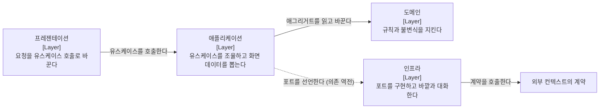

# 계층

본 문서는 계층별 책임 범위와 의존 방향을 정의합니다.

의존성은 단방향으로 흐릅니다. 외부 자원에 접근해야 하면 포트를 선언해 방향을 역전시킵니다.

범례: 실선은 직접 호출 관계이며 점선은 의존 역전 관계입니다. 애플리케이션 계층이 인터페이스를 선언하고 인프라 계층이 그것을 구현합니다.

## 1. 계층별 책임

| 계층 | 책임 범위 | 수행하지 않는 것 |
| :--- | :--- | :--- |
| **프레젠테이션** | 요청 검증, 유스케이스 호출, 응답 조립 | 비즈니스 판단 |
| **애플리케이션** | 유스케이스 조율, 화면 데이터 조회, 트랜잭션 경계 | 도메인 규칙의 직접 구현 |
| **도메인** | 비즈니스 규칙과 불변식 검증 | 상위 계층 참조, 프레임워크 인지 |
| **인프라** | 포트 구현, 외부 컨텍스트와 기술 연동 | 도메인 규칙 구현 |

트랜잭션 경계는 **명령 서비스의 공개 메서드**입니다. 컨트롤러나 도메인이 경계를 소유하지 않습니다.

## 2. 계층과 폴더의 관계

폴더를 계층 단위로 나누면 하나의 기능을 고칠 때 네 폴더를 오갑니다. 기능 단위로 나누면 그 기능의 코드가 한자리에 모이는 대신 폴더명만으로는 계층을 알 수 없습니다.

**기능을 1차 분류로 채택했으므로 계층은 폴더 위치가 아니라 클래스의 역할과 어노테이션으로 식별합니다.** 근거는 [ADR-0002](../decisions/0002-ADR-피쳐-단위-패키지.md)입니다.

식별 규약은 다음과 같으며 ArchUnit이 이 이름으로 판정합니다.

| 역할 | 식별 |
| :--- | :--- |
| **컨트롤러** | `@RestController` 와 `Controller` 접미사 |
| **명령 서비스** | `Service` 접미사 |
| **조회 서비스** | `QueryService` 접미사 |
| **조회 포트** | `Queries` 접미사 |
| **저장소** | `Repository` 접미사 |

조회 포트의 이름을 `QueryRepository` 로 짓지 않습니다. DDD 의 저장소(애그리거트 저장소)와 의미가 충돌합니다. **포트의 이름은 제공하는 것으로 짓습니다.**

## 3. 도메인 모델과 영속 모델

**두 모델을 분리합니다.** 도메인 엔티티는 순수 Java 이며 프레임워크와 영속성 라이브러리를 알지 못합니다. 저장소 구현이 생성 레코드와 도메인 엔티티를 변환합니다.

ORM 을 쓰는 구성에서는 이 분리가 비용입니다. 엔티티가 곧 영속 객체이므로 분리하려면 매핑 계층을 따로 만들고 필드 하나를 추가할 때마다 세 곳을 고쳐야 합니다. **jOOQ 에서는 그 비용이 발생하지 않습니다.** 생성 레코드와 도메인 엔티티가 애초에 별개라 분리가 기본이고, 붙이려는 쪽이 오히려 작업입니다.

> [!IMPORTANT]
> **매핑 계층을 따로 만들지 않습니다**
>
> 변환은 저장소 구현 안의 비공개 메서드가 담당합니다. 매퍼 클래스나 매퍼 패키지를 두면 파일이 늘고 그 자체가 유지 대상이 됩니다. 저장소는 어차피 레코드를 다루므로 변환의 자연스러운 자리입니다. 상세는 [ADR-0003](../decisions/0003-ADR-도메인과-영속모델-분리.md)에 있습니다.

분리가 값을 갖기 위한 조건이 둘입니다.

1. **엔티티가 스스로 불변식을 검증합니다.** 생성자와 정적 팩토리, 비즈니스 메서드에서 위반 시 예외를 던집니다. 검증이 서비스로 새어 나가면 분리한 이점이 소멸합니다.
2. **프레임워크 없이 단위 테스트가 가능합니다.** 도메인 테스트가 컨텍스트를 요구하기 시작하면 분리가 이름만 남습니다.

두 조건은 [테스트](테스트.md) 2절이 검증 대상으로 등재합니다.

## 4. 생성과 재구성의 구분

도메인 엔티티는 생성 경로를 둘로 나눕니다.

| 경로 | 이름 | 쓰는 곳 | 하는 일 |
| :--- | :--- | :--- | :--- |
| **생성** | `register` · `open` 등 업무 낱말 | 애플리케이션 | 불변식을 검증하고 새 인스턴스를 만듭니다 |
| **재구성** | `restore` | 저장소 구현 | 저장된 값을 그대로 되살립니다 |

기본 생성자를 공개하지 않습니다. 공개하면 불변식을 통과하지 않은 인스턴스가 존재할 수 있게 되어 타입이 보장하는 것이 사라집니다.

재구성 경로가 필요한 이유는 이미 저장된 값이 현재 불변식을 통과하지 못할 수 있기 때문입니다. 규칙이 강화된 뒤에도 옛 데이터는 읽혀야 합니다. **다만 재구성은 저장소만 호출하며 그 사실을 문서 주석으로 명시합니다.**

## 5. 시각의 출처

시각은 데이터베이스 기본값이 아니라 **주입된 시계에서 받습니다.**

만료와 수명에 관한 불변식은 시각을 통제할 수 있어야 검증됩니다. 데이터베이스가 시각을 채우면 테스트가 그것을 앞뒤로 옮길 수 없어 만료 판정 규칙이 검증 대상에서 빠집니다.

전역 시계 빈을 두고 도메인과 어댑터가 그것을 주입받습니다. 테스트는 그 자리에 조작 가능한 구현을 넣습니다.
