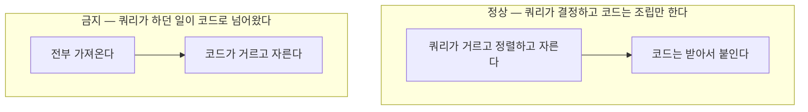
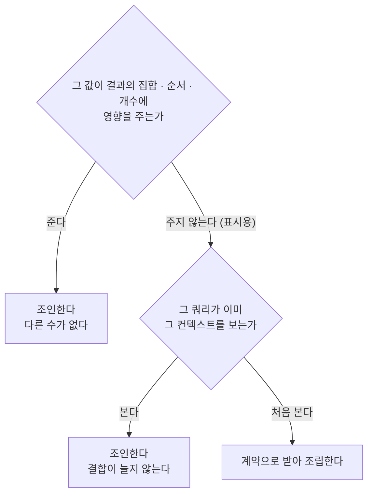

# 조회와 명령

본 문서는 읽기 경로와 쓰기 경로의 분리 기준, 그리고 각 경로에 적용되는 제약을 정의합니다. **다수의 아키텍처 규칙이 두 경로의 비대칭에서 파생됩니다.**

## 1. 두 경로의 차이

| 항목 | 명령 | 조회 |
| :--- | :--- | :--- |
| **목적** | 상태를 바꾸면서 불변식을 검증합니다 | 화면 요구에 맞는 응답 구조를 만듭니다 |
| **애그리거트 경계** | 준수합니다. 트랜잭션이 경계를 넘지 않습니다 | 제약받지 않습니다 |
| **의존 대상** | 도메인 모델 | 화면 요구사항 |
| **타 컨텍스트 접근** | 계약을 통해서만 접근합니다 | 조건부로 조인을 허용합니다 |
| **접근 수단** | 도메인 저장소 | 피쳐가 소유한 조회 포트 |

**두 경로가 같은 도구를 씁니다.** 도구를 나누면 두 기술 사이의 미커밋 변경 가시성, 반영 순서, 조각 재사용 같은 항목이 규칙으로 자라납니다. 경로를 나누되 도구는 하나로 둡니다.

## 2. 조회의 자리

| 자리 | 클래스 | 역할 |
| :--- | :--- | :--- |
| `application/<피쳐>/` | `XxxQueryService` | 조회 유스케이스. 읽기 전용 트랜잭션 |
| `application/<피쳐>/` | `XxxQueries` | 조회 포트. 피쳐가 소유합니다 |
| `infrastructure/query/` | 어댑터 | 여기서만 SQL이 보입니다 |

**포트는 조회 하나당이 아니라 피쳐당 하나입니다.** 그 피쳐의 조회 메서드를 한 인터페이스에 모으고 어댑터도 하나로 둡니다. 조회를 하나 더 붙이는 비용은 인터페이스 한 줄과 구현 몇 줄입니다.

**기본은 포트가 화면 DTO를 직접 반환합니다.** 도메인 보강이 필요한 조회에서만 중간 타입을 둡니다. 모든 조회에 두 겹을 강제하면 그것이 새로운 형식이 됩니다.

조회는 도메인 애그리거트를 조립하지 않습니다. 다만 도메인 규칙(만료 판정 등)을 순수 판정 함수로 **재사용하는 것은 허용합니다.** 규칙이 SQL에 복제되어 두 곳에 존재하는 것을 막기 위함입니다. 원칙은 **판정 로직만 빌려오고 데이터 로딩은 프로젝션으로**입니다.

## 3. 화면 조회의 성격

조회 경로에 도메인 모델을 태우면 화면 요구가 모델로 유입됩니다. 목록에 표시명이 필요하다는 이유로 엔티티에 필드가 추가되고, 그 필드는 쓰기 로직에서 아무 의미를 갖지 않습니다.

**애그리거트 하나면 충분한 간단한 조회라도 도메인 저장소로 화면 데이터를 만들지 않습니다.** 이유가 셋입니다.

1. 애그리거트는 화면의 모양이 아닙니다. 자라면 화면이 쓰지 않는 것까지 로드하게 됩니다.
2. **화면 요구가 도메인 모델을 끌어당깁니다.** 간단한 조회에서 문을 열면 그 문으로 전부 들어옵니다.
3. 도메인 객체가 API 바깥으로 샙니다.

조회는 계층을 통과하되 로직 없이 전달되는 형태가 되며 이는 통로 안티패턴에 해당합니다. **화면 조회에 한해 그 형태를 허용합니다.**

대신 화면의 필터 · 정렬 · 페이징은 쿼리 안에서 처리해야 합니다.

범례: 위 블록은 허용되는 처리 흐름이고 아래 블록은 금지되는 흐름입니다. 화살표는 처리 순서입니다.

> [!WARNING]
> **판정 기준은 결합 위치가 아닙니다**
>
> 부모를 조회한 뒤 자식을 따로 조회해 붙이는 방식은 코드에서 결합하는 형태이지만 정상이며, 컬렉션이 여럿일 때의 표준 해법입니다. 판정 기준은 **쿼리가 수행하던 필터 · 정렬 · 페이징이 코드로 이동했는가**입니다. 이 구분을 놓치면 정상 해법을 금지하고 실제 위반은 통과시킵니다.

## 4. 명령 처리 중의 조회

같은 질문도 목적이 다르면 경로가 갈립니다.

| 상황 | 경로 | 이유 |
| :--- | :--- | :--- |
| 명령 안에서의 중복 검사 | 도메인 저장소 | 불변식 검증의 일부입니다. 트랜잭션 안에서 정확해야 합니다 |
| 입력 중 실시간 중복 안내 | 조회 포트 | 사용자 편의입니다. 캐시나 제한이 붙을 수 있습니다 |

**둘은 다른 이유로 진화하므로 나눕니다.**

**명령 서비스는 조회 포트를 주입받지 않습니다.** 허용하면 명령이 도메인을 우회해 상태를 판단하는 지름길이 열립니다. ArchUnit이 강제합니다.

명령 처리에서 상태를 바꾸거나 불변식을 검증할 근거가 되는 값은 반드시 애그리거트를 통해 얻습니다.

## 5. 명령 응답의 조립

명령의 응답에 화면용 데이터가 필요하면 둘을 먼저 가릅니다.

| 구분 | 내용 | 처리 |
| :--- | :--- | :--- |
| **명령이 만들어낸 것** | 생성된 식별자, 부여된 상태, 처리 시각 | 명령 서비스가 애그리거트에서 그대로 반환합니다 |
| **다음 화면이 필요로 하는 것** | 연관 정보, 안내에 쓰이는 정책 값 | 컨트롤러가 조회 서비스를 이어서 호출해 조립합니다 |

리트머스는 **"이 명령을 하지 않았어도 조회로 얻을 수 있는 데이터인가"** 입니다. 그렇다면 뒤쪽입니다.

부수 효과로 트랜잭션도 맞습니다. 명령이 커밋된 뒤 조회가 별도 트랜잭션으로 돌므로 방금 쓴 데이터가 보입니다.

트레이드오프는 명령 응답에 화면 데이터를 얹을수록 API가 화면에 종속된다는 것입니다. 그 화면에서만 쓰는 정보면 얹고, 여러 화면이 쓰거나 자주 바뀔 것 같으면 별도 조회로 뺍니다. **어느 쪽이든 조립은 컨트롤러에서 합니다.**

## 6. 컨텍스트를 넘는 조회

하나의 화면이 타 컨텍스트의 조건으로 거르면서 동시에 페이징해야 하는 상황이 자주 생깁니다. 선택지가 셋입니다.

| 방안 | 트레이드오프 | 채택 |
| :--- | :--- | :---: |
| **데이터 조인** | 스키마 결합이 생깁니다 | 채택 |
| **사본 보유** | 정합성 책임이 데이터베이스에서 애플리케이션으로 넘어옵니다 | 기각 |
| **상대에게 ID 목록 조회** | 화면 요구가 상대 계약으로 유입되어 화면마다 계약이 늘어납니다 | 기각 |

스키마 결합은 인지한 상태에서 수용합니다. 타 컨텍스트의 컬럼이 바뀌면 본 컨텍스트의 조회가 실패하며, **코드상 참조가 없어 정적 분석으로 검출되지 않습니다.** 근거와 감수 사항은 [ADR-0005](../decisions/0005-ADR-컨텍스트-넘는-조인.md)에 있습니다.

### 6.1 예외 — 표시용 값으로 새 컨텍스트를 참조하는 경우

범례: 마름모는 판정 조건이고 사각형은 판정 결과입니다. 화살표 라벨은 조건의 응답입니다.

표시용이란 타 컨텍스트 데이터가 **결과 행의 집합 · 순서 · 개수에 영향을 주지 않는 상태**를 뜻합니다. 구문이 아니라 의미로 판정하며, 조건절과 정렬절은 그 판정의 대표적 발현 형태일 뿐입니다.

실무 규칙으로 **표시용 조인은 외부 조인으로 작성합니다.** 내부 조인이 필요해지는 시점에 그 조인은 표시용이 아니며 이 예외가 적용되지 않습니다. 코드 리뷰에서 기계적으로 판정할 수 있습니다.

공통 코드처럼 범용 참조 데이터는 이 판정의 대상이 아닙니다.

## 7. 명령 경로의 제약

조회 경로의 판정 기준은 명령 경로에 적용되지 않습니다. **명령은 예외 없이 계약을 사용합니다.**

더 엄격한 제약을 두는 이유가 둘입니다. 명령은 실행 시점의 정확한 값을 요구하며, 검증 로직이 타 컨텍스트의 스키마에 종속되면 도메인 규칙이 경계를 넘어 흩어집니다. **조회 오류는 화면 표시 오류로 끝나지만 명령 오류는 데이터 손상이 됩니다.**
