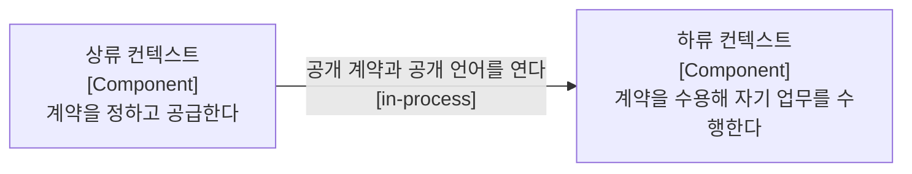
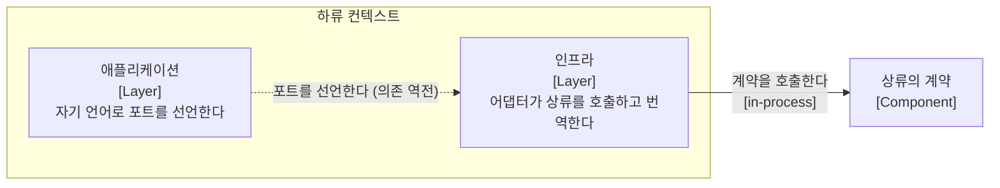
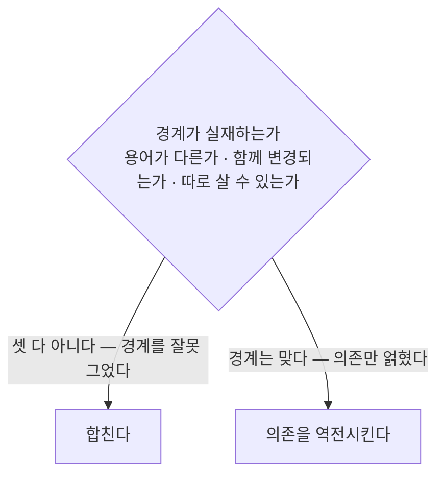

# 컨텍스트 협력

본 문서는 컨텍스트 간 통신 방식과 순환 의존의 해소 기준을 정의합니다.

컨텍스트가 협력하면 계약을 정하는 쪽과 수용하는 쪽이 갈립니다. 앞을 상류, 뒤를 하류라 합니다.

범례: 사각형은 컨텍스트 단위 컴포넌트이며 화살표는 계약 공급 방향입니다. 대괄호는 통신 방식으로 `in-process` 는 동일 프로세스 안의 메서드 호출을 뜻합니다.

## 1. 상류의 계약

소비자마다 인터페이스를 따로 협상하면 상류는 소비자 수만큼의 인터페이스를 갖게 됩니다. 그래서 **하나를 공개하고 모든 소비자가 그것을 씁니다.**

계약이 주고받는 타입은 내부 엔티티가 아니라 별도로 정의합니다. 내부 모델의 변경이 하류로 번지는 것을 막기 위함이며, 이 별도 타입의 집합이 컨텍스트가 바깥에 쓰는 공개 언어입니다.

**계약은 별도 패키지로 격리하고 타 컨텍스트는 그 패키지만 참조합니다.** 이 경계는 ArchUnit이 강제합니다([ADR-0007](../decisions/0007-ADR-컨텍스트-경계-ArchUnit-강제.md)).

계약 패키지에는 성격이 다른 둘이 공존합니다. **본 컨텍스트가 제공하는 인터페이스**와 **본 컨텍스트가 상대에게 구현을 요구하는 인터페이스**입니다. 후자는 남용하면 의존이 얽히므로 적용 조건을 [ADR-0009](../decisions/0009-ADR-out-port-상대-컨텍스트-구현.md)가 따로 정의합니다.

## 2. 하류의 수용 방식

| 방식 | 처리 내용 | 이점 | 트레이드오프 |
| :--- | :--- | :--- | :--- |
| **순응** | 상류 타입을 변환 없이 씁니다 | 번역 계층이 없어 비용이 낮습니다. 상류가 안정적이고 범용적일 때 적합합니다 | 상류가 바뀌면 하류가 함께 영향을 받습니다 |
| **부패 방지** | 자기 도메인 언어로 포트를 선언하고 어댑터가 번역합니다 | 하류 애플리케이션이 상류의 존재를 모르며, 가짜 포트로 단위 테스트가 됩니다 | 클래스 수가 늘어납니다 |

범례: 점선은 의존 역전 관계이고 실선은 직접 호출입니다. 애플리케이션 계층이 포트를 선언하고 인프라 계층의 어댑터가 구현합니다.

**둘 중 절대적인 정답은 없습니다.** 상류의 변경 빈도와 그 의존의 중요도로 판단합니다. 어느 쪽을 고르든 참조 대상은 상류의 계약으로 한정됩니다.

## 3. 양방향 참조

컨텍스트가 서로를 참조하면 각자의 계약을 경유하더라도 코드 의존이 순환합니다. 순환에 속한 패키지는 하나의 변경이 나머지에 영향을 미치며 따로 떼어 테스트할 수 없습니다.

**협력의 상호성과 코드 의존의 순환은 다른 층위입니다.** 두 컨텍스트가 서로를 필요로 하더라도 코드 의존은 단방향으로 구성할 수 있습니다.

순환은 주로 데이터 참조 방향과 반대로 요구사항이 생길 때 형성됩니다.

| 원인 | 발생 형태 |
| :--- | :--- |
| **생명주기 전파** | 상위가 삭제되면 하위도 정리되어야 하는데 하위가 상위 ID를 보유합니다 |
| **단일 유스케이스가 두 컨텍스트에 걸침** | 한 번의 저장 요청으로 양쪽 데이터를 함께 기록합니다 |
| **교차 검증** | 타 컨텍스트의 ID를 갖고 있으나 자기 데이터로 유효성을 판정할 수 없습니다 |

새 테이블이 타 컨텍스트의 ID를 가지면서 위에 해당하면 설계 시점에 이미 순환이 예정된 상태입니다.

범례: 마름모는 판정 조건이며 세 하위 질문을 모두 검토합니다. 사각형은 판정 결과에 따른 조치입니다.

**이 세 질문은 이미 그은 경계를 재검토할 때 씁니다.** 경계를 새로 그을 때의 판정은 애그리거트 소유이며 그 기준은 [아키텍처 4절](../index.md)에 있습니다. 두 기준은 경합하지 않고 시점이 다릅니다.

역전의 구체적 수단은 [ADR-0009](../decisions/0009-ADR-out-port-상대-컨텍스트-구현.md)에 있습니다.

## 4. 조인으로 해결되지 않는 영역

조회는 조건부로 타 컨텍스트 테이블의 조인을 허용합니다([조회와 명령](조회와-명령.md) 3절). 그러나 조인은 테이블에 저장된 값만 가져옵니다.

서명된 주소 발급처럼 비밀키나 그 컨텍스트의 고유 절차가 필요한 값은 조인 범위를 넓혀도 만들어지지 않습니다. **데이터는 조인으로 가져오되 그 기능은 계약으로 위임합니다.**

판정선은 계산을 수행하는가가 아니라 **도메인 로직을 포함하는가**입니다. 조회 결과에 없는 값을 응답 조립 과정에서 만드는 것 자체는 허용됩니다.
