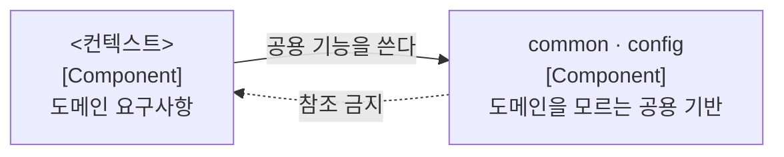

# 패키지 배치와 참조 규칙

본 문서는 코드의 배치 위치와 참조 허용 범위를 정의합니다.

## 1. 최상위 구조

루트 패키지 아래를 업무 컨텍스트와 공용 기반으로 나눕니다.



범례: 실선은 허용된 참조 방향이고 점선은 금지된 방향입니다.

**컨텍스트는 루트 패키지의 직계 하위입니다.** `module.` 같은 중간 겹을 두지 않습니다. 모든 것이 그 아래에 있으면 구분 기능이 없습니다.

공용 기반에 도메인 지식이 유입되면 재사용성이 소실되고 도메인 변경이 공용 코드로 전파됩니다. 그래서 **역방향 참조를 금지**하며, 참조하는 순간 바닥이 아니라 또 하나의 컨텍스트가 됩니다.

`common` 의 입장 조건은 컨텍스트 내부 `shared` 보다 엄격합니다. **두 컨텍스트 이상이 실제로 쓰고 있고, 도메인 개념이 아닐 것**입니다. 도메인 개념이면 그것을 소유할 컨텍스트가 어딘가 있습니다. 편의 유틸리티의 집합소로 쓰지 않습니다.

## 2. 컨텍스트 내부 구조

컨텍스트 내부는 성격이 다른 세 패키지로 나뉩니다.

```text
<컨텍스트>/
├── contract/          바깥이 참조하는 유일한 창구
├── application/       피쳐(유스케이스 단위) 패키지
│   ├── <피쳐>/           컨트롤러 · 서비스 · DTO · 포트 · 흐름 예외
│   └── shared/           레이어 내 공유
├── domain/            애그리거트 패키지
│   └── <애그리거트>/      엔티티 · 값 객체 · 저장소 인터페이스 · 불변식 위반 예외
└── infrastructure/    기술 세그먼트 패키지
    ├── repository/       애그리거트 저장소 구현
    ├── query/            조회 어댑터
    ├── adapter/          타 컨텍스트 ACL 어댑터
    └── config/           빈 조립
```

`application` 과 `domain` 은 **분할 축이 다릅니다.** 전자는 유스케이스, 후자는 애그리거트입니다. 두 축은 독립적으로 변하므로 하나의 유스케이스 서비스가 복수 애그리거트의 저장소를 참조하는 것이 정상이며, **애그리거트당 서비스 하나를 전제하지 않습니다.** 경로가 이미 축을 구분하므로 두 축의 패키지명이 같아도 무방합니다.

애그리거트가 하나뿐인 컨텍스트는 레이어 패키지 아래에 파일을 직접 배치하고 하위 패키지를 만들지 않습니다. **승격 기준은 애그리거트 2개 이상 또는 피쳐 3개 이상**이며, 그 전에는 평면으로 둡니다.

예외의 배치는 성격으로 가릅니다. **불변식 위반은 `domain` 에, 흐름과 정책 실패는 해당 피쳐에** 둡니다. 이메일 형식 위반은 앞이고 인증 시도 초과는 뒤입니다.

설정 타입은 그 설정을 읽는 계층 곁에 둡니다. 피쳐가 읽는 값은 `application/shared` 에, 특정 어댑터만 쓰는 값은 그 어댑터 옆에 둡니다. **`config` 에 몰아 두면 application 이 설정을 읽으려고 infrastructure 를 참조하게 되어 3절의 의존 방향이 깨집니다.**

## 3. 레이어 참조

| 참조 주체 | 참조 대상 | 허용 여부 | 근거 |
| :--- | :--- | :--- | :--- |
| **컨트롤러** | `Service` · `QueryService` | 허용 | 컨트롤러의 유일한 진입 경로입니다 |
| **컨트롤러** | 도메인(엔티티 · 저장소) | **금지** | 유스케이스를 우회한 데이터 접근이 발생합니다 |
| **컨트롤러** | 조회 포트 | **금지** | 조회 서비스가 전후에 수행하는 가공이 누락됩니다 |
| **`Service` · `QueryService`** | 동일 컨텍스트 도메인 | 허용 | 정상 경로입니다 |
| **`Service`** | ACL 포트 | 허용 | 포트는 이를 사용하는 피쳐가 선언합니다 |
| **`Service`** | 타 컨텍스트 `contract` | 허용 | 상류 계약이 안정적인 경우입니다 |
| **`Service`** | 인프라 구현체 | **금지** | 포트를 선언하고 구현은 인프라에 배치합니다 |
| **명령 `Service`** | 조회 포트 | **금지** | 명령이 도메인을 우회해 상태를 판단하는 지름길이 열립니다 |
| **`QueryService`** | 조회 포트 | 허용 | 화면 조회의 표준 경로입니다 |
| **도메인** | application · 인프라 | **금지** | 도메인은 상위 계층을 참조하지 않습니다 |
| **도메인** | 프레임워크 · 영속성 라이브러리 | **금지** | [ADR-0003](../decisions/0003-ADR-도메인과-영속모델-분리.md)의 전제입니다 |
| **인프라** | 동일 컨텍스트 포트 · 도메인 | 허용 | 포트 구현이 존재 목적입니다 |
| **인프라** | 타 컨텍스트 `contract` | 허용 | ACL 어댑터가 상류와 통신하는 지점입니다 |

**도메인이 프레임워크를 참조하지 않는다는 행이 이 표에서 가장 중요합니다.** 다른 규칙은 어기면 구조가 지저분해지지만, 이 규칙이 깨지면 도메인 단위 테스트가 컨텍스트를 요구하게 되어 검증 속도와 범위가 함께 무너집니다.

## 4. 피쳐 간 참조

| 대상 | 준수 지침 (Do) | 금지 지침 (Don't) |
| :--- | :--- | :--- |
| **DTO · 포트 인터페이스** | 참조를 허용합니다. 피쳐가 인접 피쳐에 공개하는 계약입니다 | 4.1의 판정 없이 참조합니다 |
| **명령 서비스** | 4.1의 절차로 공유 대상을 추출합니다 | 상호 직접 호출합니다 |
| **조회 서비스** | 컨트롤러와 타 조회 서비스가 호출합니다 | 명령 서비스가 호출합니다 |
| **참조 방향** | 단방향으로 유지합니다 | 순환 참조를 만듭니다 |

명령 서비스 간 직접 호출을 금지하는 이유는 트랜잭션 경계가 혼재되어 단일 요청의 처리 범위를 추적할 수 없게 되기 때문입니다. 조회 서비스 호출을 허용하는 것은 상태를 바꾸지 않아 트랜잭션 경계에 영향이 없기 때문이며, 여러 구획을 조립하는 화면 조회가 이 경로를 씁니다.

### 4.1 같은 코드가 두 피쳐에 필요한 경우

위에서부터 순서대로 검토하고 먼저 해당하는 항목에서 멈춥니다.

1. **도메인 규칙의 중복** — `domain` 으로 내립니다. 피쳐에서 도메인으로 내리는 것이 공유의 정석 경로입니다.
2. **조율 로직의 공유** — 그 기능을 소유하는 피쳐를 정하고 단방향으로 의존합니다.
3. **어느 피쳐에도 귀속되지 않는 공용** — `application/shared` 에 둡니다. 입장 조건은 **두 개 이상 피쳐가 실제로 쓰고 있을 것**이며 "나중에 쓸 것 같아서"는 해당하지 않습니다.
4. **DTO와 계약의 형태만 유사** — 복제를 유지합니다. 세 곳 이상이 같은 개념으로 쓸 때만 승격합니다.

판단 리트머스는 하나입니다. **두 코드가 다른 이유로 변경될 것 같으면 우연한 닮음이므로 합치지 않습니다.** 항상 같은 이유로 함께 변경되면 진짜 중복이므로 1~3으로 올립니다. 잘못된 추상화가 중복보다 비쌉니다.

> [!WARNING]
> **컨텍스트 레벨 공유 패키지를 만들지 않습니다**
>
> `<컨텍스트>/shared` 는 사실상 네 번째 레이어가 되어 별도 의존 규칙이 필요해집니다. 그보다 나쁜 것은 "어느 레이어의 것인가"라는 방어 질문을 생략하게 만든다는 점이며, 그 결과 미분류 코드의 집합소가 됩니다. 공유는 항상 레이어 안에 둡니다.

## 5. 애그리거트 간 참조

| 구분 | 준수 지침 (Do) | 금지 지침 (Don't) |
| :--- | :--- | :--- |
| **타 애그리거트 참조** | ID로만 참조합니다 | 애그리거트 패키지 간 임포트를 수행합니다 |
| **복수 애그리거트에 걸친 규칙** | 도메인 서비스로 추출해 `domain` 직하위에 둡니다 | 한쪽 엔티티에 넣습니다 |
| **복수 애그리거트에 걸친 조율과 트랜잭션** | 애플리케이션 서비스가 담당합니다 | 도메인 계층이 담당합니다 |

트랜잭션은 애그리거트 경계를 넘지 않는 것을 기본으로 합니다.

## 6. 강제 현황

| 규칙 | 강제 수단 |
| :--- | :--- |
| **컨텍스트 경계** (타 컨텍스트는 `contract` 만) | ArchUnit이 강제합니다([ADR-0007](../decisions/0007-ADR-컨텍스트-경계-ArchUnit-강제.md)) |
| **도메인의 바깥 의존 금지** | ArchUnit이 강제합니다 |
| **레이어 참조 방향** | ArchUnit이 강제합니다 |
| **애그리거트 간 ID 참조** | 미강제 상태이며 코드 리뷰가 확인합니다 |

구조를 바꿔야 하면 본 문서를 먼저 고치고 테스트를 함께 고칩니다. **테스트만 완화하는 변경은 허용하지 않습니다.**
