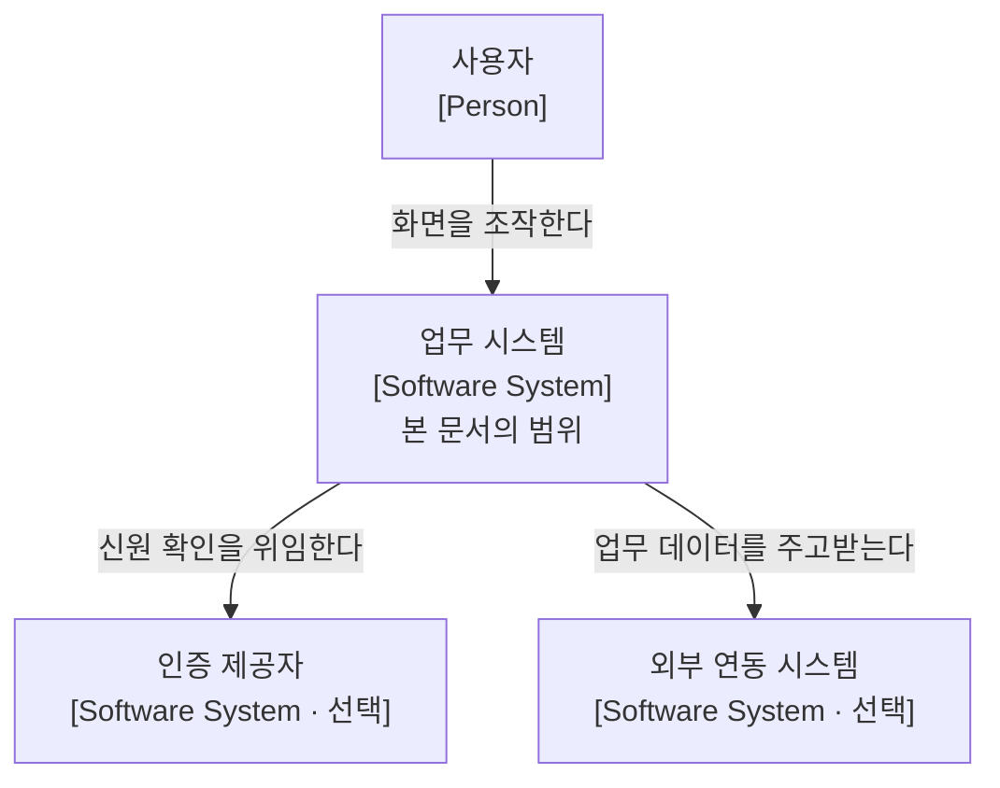
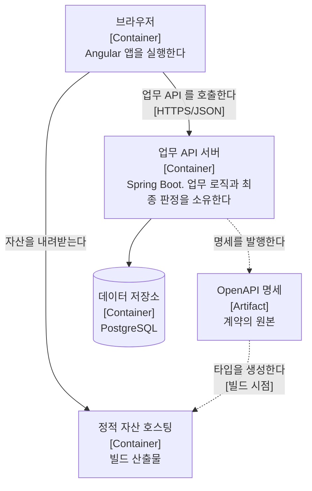
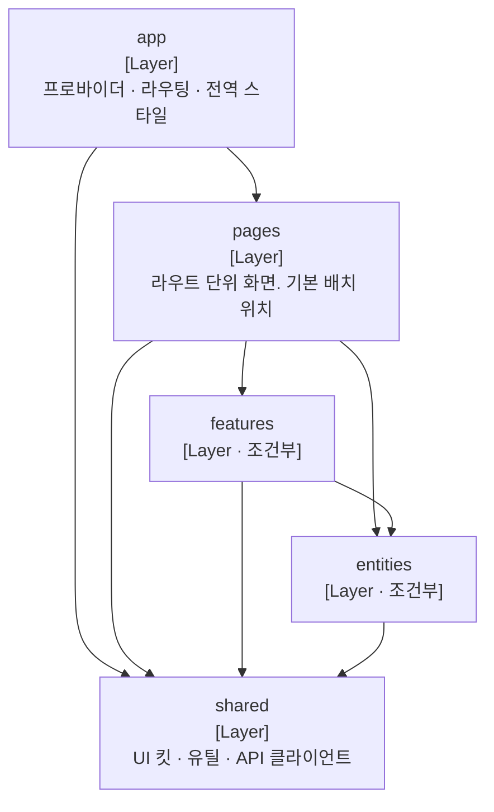
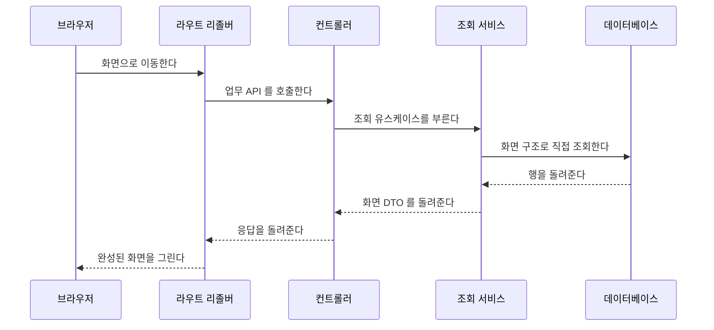
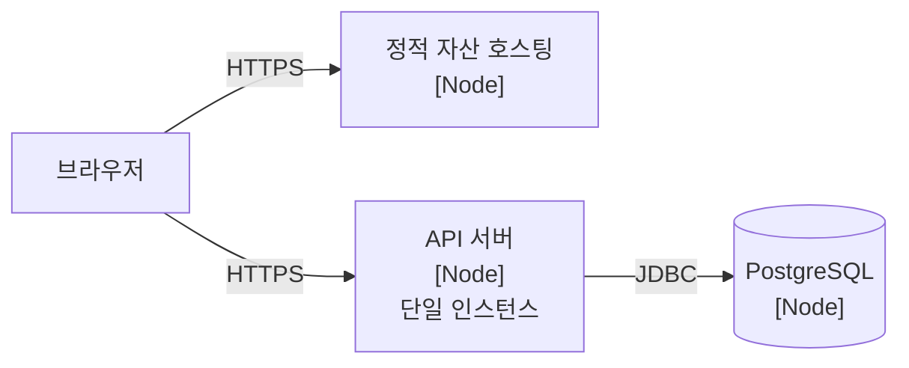

# 디커플드 아키텍처

본 문서는 **Angular 프론트엔드와 Spring Boot 백엔드를 별도 애플리케이션으로 나누고 API로만 통신하는 구성**의 아키텍처를 기술합니다.

**이 저장소의 기본 구성입니다.** 제가 다루는 프로젝트 대부분이 이 형태이며, 여기 적힌 것은 여러 프로젝트에 두루 적용하는 일반론이 아니라 **실제로 이 조합을 쓰면서 정한 것**입니다. 다른 구성을 고르면 같은 질문에 다른 답이 나오므로 폴더가 갈립니다.

문서 체계는 [arc42](https://arc42.org/) 12절 구조를 따르며, 구성 요소 간 관계 시각화에는 [C4 Model](https://c4model.com/) 표기 규약을 적용했습니다.

**세부 규칙은 본 문서가 소유하지 않습니다.** 각 스택 폴더의 참조 문서가 원본이며 본 문서는 구조와 그 선택의 근거를 담습니다. 결정의 사유와 기각한 대안은 각 스택의 결정 기록에 있습니다.

## 1. 소개와 목표

### 본 문서의 역할

본 문서는 두 앱의 경계와 각 앱 내부의 구조를 정의합니다. 업무 기능과 화면 요구사항은 다루지 않으며, 그 원본은 각 프로젝트의 요구사항정의서와 유스케이스 명세서입니다.

주된 독자는 **작성자 본인과 AI 코딩 에이전트**입니다. 에이전트가 규칙을 읽고 코드를 올바른 위치에 배치하는 것이 1차 목적이며, 사람이 읽는 것은 2차입니다. 이 우선순위가 아래 품질 목표와 4절의 전략을 결정합니다.

### 이 구성을 고르는 조건

분리 자체가 목적이 아닙니다. 분리는 비용을 치르고 사는 것이며, 그 비용이 이득을 넘기는 구간이 실재합니다.

| 조건 | 판단 |
| :--- | :--- |
| 클라이언트가 둘 이상 (웹 · 모바일 앱 · 외부 연동) | 분리합니다. 표현을 서버가 소유하면 클라이언트마다 서버가 갈라집니다 |
| 프론트엔드와 백엔드의 담당이 나뉘어 있음 | 분리합니다. 계약이 협업의 접점이 됩니다 |
| 화면의 상호작용이 서버 왕복으로 표현되지 않음 | 분리합니다 |
| 위 셋 중 어느 것도 아님 | **분리하지 않는 편이 낫습니다** |

마지막 줄이 가장 자주 잊힙니다. 관성으로 분리를 고르면 2절의 비용 다섯이 얻는 것 없이 순수 비용으로 남습니다.

### 품질 목표

| 순위 | 품질 목표 | 정의 및 선정 사유 |
| :---: | :--- | :--- |
| **1** | **최종 판정의 단일 소유** | 같은 판단을 양쪽이 내리되 최종 판정자는 하나여야 합니다. 구현이 중복되는 것은 정상이며 판정자가 둘이 되는 것이 결함입니다 |
| **2** | **규칙의 자동 강제** | 린터와 빌드로 차단되는 규칙만 실효성을 가집니다. 강제 장치가 없는 규칙은 규칙이 아니라 권고입니다 |
| **3** | **배치의 예측 가능성** | 규칙만으로 코드의 위치가 일의적으로 결정되어야 합니다. 배치가 결정적이면 위반 자체가 덜 발생합니다 |
| **4** | **변경 유연성** | 화면 요구사항 변경이 도메인 구조 수정으로 번지지 않아야 합니다. 1~3과 충돌할 때 양보하는 쪽입니다 |

**두 앱이 먼저 잃는 것은 서로 다릅니다.** 서열은 넷으로 하나이되 각 앱에서 어느 항목이 먼저 무너지는지가 다르므로, 전략이 그 차이를 반영합니다.

| 앱 | 먼저 잃는 것 | 그래서 |
| :--- | :--- | :--- |
| **프론트엔드** | 배치의 일의성. 같은 코드를 둘 자리가 여럿이 됩니다 | 계층 규칙과 그 강제 수단을 먼저 세웁니다(4.2절) |
| **백엔드** | 도메인의 독립성. 프레임워크와 화면 요구가 도메인을 끌어당깁니다 | 경계와 접근 경로를 먼저 나눕니다(4.3절) |

### 이해관계자별 관심사

| 이해관계자 | 주요 관심사항 |
| :--- | :--- |
| **AI 코딩 에이전트** | 코드 배치 판정 규칙, 참조 허용 범위, 어느 쪽이 무엇을 소유하는가 |
| **프론트엔드 개발자** | 슬라이스 구조, 상태 소유 위치, 서버가 판정하는 범위 |
| **백엔드 개발자** | 컨텍스트 경계, 조회와 명령의 구분, 계약의 하위 호환 조건 |
| **인프라 담당** | 배포 단위와 출처 구성 |

## 2. 제약 조건

4절의 전략과 각 결정의 전제가 되는 제약사항입니다.

### 기술 스택

본 문서는 프레임워크 중립이 아닙니다. **중립적으로 기술하면 규칙이 "상태를 적절히 분리합니다" 수준으로 흐려져 판정 기준으로 기능하지 못합니다.**

| 앱 | 항목 | 값 |
| :--- | :--- | :--- |
| **프론트엔드** | 프레임워크 | Angular |
| | 스타일 | Tailwind CSS |
| | UI 기반 | Spartan (brain + helm), Angular CDK |
| | 모듈 분할 | Feature-Sliced Design |
| | 테스트 러너 | Vitest |
| **백엔드** | 프레임워크 | Spring Boot |
| | 언어 | Java |
| | 데이터 접근 | jOOQ |
| | 마이그레이션 | Flyway |
| | 데이터베이스 | PostgreSQL |
| | 구조 검사 | ArchUnit |

버전과 의존성의 원본은 각 저장소의 `package.json` 과 `build.gradle` 입니다. 본 문서에 버전 목록을 중복 기재하지 않습니다.

**jOOQ 선택이 백엔드 전략 전체와 맞물립니다.** ORM은 엔티티가 곧 영속 객체라 도메인이 프레임워크 어노테이션을 달게 되지만, jOOQ는 생성 레코드와 도메인 엔티티가 처음부터 별개이므로 "도메인은 프레임워크를 모른다"가 타협 없이 성립합니다.

### 배포 단위와 저장소

| 항목 | 내용 |
| :--- | :--- |
| **앱의 수** | 프론트엔드 하나와 API 서버 하나입니다. 중간 서버를 두지 않습니다 |
| **저장소** | 두 앱이 별도 저장소입니다 |
| **백엔드 배포 단위** | 단일 애플리케이션입니다. 서비스 분리 운영 부담을 지지 않습니다 |
| **인스턴스 수** | 단일 인스턴스를 전제합니다 |
| **인터페이스** | HTTPS 위의 REST/JSON 하나뿐입니다. 데이터베이스를 공유하지 않습니다 |
| **인증 방식** | 백엔드의 인증 방식을 문서가 강제하지 않습니다 |

인스턴스 수가 조용한 함정을 만듭니다. **단일 인스턴스를 전제하면 인메모리 상태가 허용되는데, 그 상태를 가진 채로 다중화하면 한도나 카운터가 인스턴스 수만큼 배수가 됩니다.** 오류 없이 값만 틀리므로 발견이 늦습니다.

인증 방식을 강제하지 않는 것이 4.1절 세 번째 전략의 전제입니다. 서버가 인증 상태를 알아야 하는 구성을 표준으로 두면 토큰을 httpOnly 쿠키로 강제하게 되고, 그것은 백엔드의 인증 설계를 프론트엔드 문서가 규정하는 일이 됩니다.

### 계약의 변경 비용

기존 응답 필드의 **삭제가 필드 추가보다 비쌉니다.** 삭제는 양측 사전 협의를 요구하며 백엔드 선행 배포가 안전하지 않게 됩니다. 이 비대칭이 생성 타입을 상위 계층에 그대로 노출하는 결정(4.1절)의 근거입니다.

### 치르는 비용

| 비용 | 내용 |
| :--- | :--- |
| **계약** | 두 저장소가 REST 계약 하나로만 만나므로 그 계약을 유지해야 합니다 |
| **인증 왕복** | 토큰 보관과 갱신을 클라이언트가 다룹니다. 세션 하나로 끝나지 않습니다 |
| **출처 분리** | 자산과 API의 출처가 다르면 CORS 설정이 배포 구성의 일부가 됩니다 |
| **배포 두 벌** | 파이프라인과 롤백 절차가 각각 필요하며 배포 순서를 정해야 합니다 |
| **검증 두 벌** | 같은 규칙이 양쪽에 존재합니다 |

마지막만 성격이 다릅니다. 앞의 넷은 없앨 수 있으면 없애는 편이 나은 비용이지만, **검증 중복은 없애면 안 되는 비용**입니다. 프론트엔드 검증을 생략하면 사용자가 제출 후에야 오류를 알게 되고, 서버 검증을 생략하면 데이터가 손상됩니다.

### 문서화 정책

- 본 저장소의 Markdown 문서가 아키텍처 명세의 원본입니다.
- **규범만 기재하고 현황은 참조로 지정합니다.** 버전 표, 파이프라인 흐름, API 시그니처, 설정 값은 코드와 설정 파일이 원본입니다.
- **기계로 강제 가능한 규칙은 실행 가능한 규칙으로 이전합니다.** 문서에는 근거와 기계가 검출하지 못하는 규칙만 남기며, 규칙마다 강제 여부를 표기합니다.

## 3. 컨텍스트와 범위

### 3.1 업무 컨텍스트



범례: 사각형은 사용자 또는 소프트웨어 시스템이며 대괄호 안은 요소의 종류입니다. `선택`이 붙은 것은 프로젝트에 따라 없을 수 있습니다. 화살표는 런타임 의존 방향입니다.

### 3.2 기술 컨텍스트

| 연계 대상 | 채널 | 계약의 주도권 |
| :--- | :--- | :--- |
| **사용자 · 브라우저** | HTTPS | 시스템이 제공합니다 |
| **인증 제공자** | HTTPS · OIDC 등 | 외부가 정하며 시스템이 따릅니다 |
| **외부 연동 시스템** | 대상마다 다릅니다 | 대상이 정합니다 |
| **데이터베이스** | JDBC | 마이그레이션 파일이 스키마의 단일 원본입니다 |

**시스템 안에서 두 앱이 만나는 유일한 채널은 HTTPS 위의 REST/JSON입니다.** 그 채널의 명세는 백엔드가 소유하며 프론트엔드는 소비자입니다.

### 3.3 데이터 조립 위치의 판정 기준

여러 응답을 조합해야 하는 화면에서 서버가 집계할지 프론트엔드가 조합할지의 기준입니다. 분할 호출은 HTTP 왕복 비용을 더하므로 **서버 측 집계를 우선 검토합니다.**

| 조립 위치 | 선택 기준 |
| :--- | :--- |
| **서버** | 목록 조회 시 행별 추가 조회가 필요한 경우<br/>조립 로직에 업무 규칙이 포함된 경우<br/>데이터 간 시점 일관성이 필요한 경우 |
| **프론트엔드** | 각 데이터가 독립적인 UI 영역으로 분리된 경우<br/>영역별로 권한 체계가 다른 경우<br/>화면마다 조합 규칙이 달라지는 경우 |

판정이 모호하면 재사용성으로 가릅니다. 여러 화면이 같은 조합을 쓰면 서버에 응답 구조를 요청하고, 한 화면 전용의 1회성 조합이면 프론트엔드에서 조립합니다.

## 4. 솔루션 전략

품질 목표(1절)와 제약 조건(2절)을 달성하기 위한 전략입니다. 경계에 걸친 것, 프론트엔드 안의 것, 백엔드 안의 것 순으로 좁혀집니다.

### 4.1 경계와 계약

**1) 계약을 명세에서 생성합니다.** 서버 응답 타입을 손으로 옮겨 적지 않고 OpenAPI 명세에서 생성합니다.

- **선택 사유:** 품질 목표 2를 도구로 강제합니다. 명세가 바뀌면 생성 결과가 바뀌고 타입 검사가 그 자리에서 실패합니다.
- **트레이드오프:** 백엔드가 명세를 발행해야 성립합니다. 발행하지 않는 프로젝트에서는 이 전략을 쓸 수 없습니다.

생성 타입에 변환 계층을 두지 않고 화면까지 그대로 노출합니다. 2절의 변경 비용 비대칭 때문이며, 필드가 추가될 때마다 매핑 함수를 고치는 작업은 값을 옮겨 담기만 할 뿐 판단을 담지 않습니다.

**2) 최종 판정을 서버에 둡니다.** 검증과 인가의 최종 판정자는 서버이며, 프론트엔드의 같은 규칙은 즉시 피드백을 위한 것입니다.

- **선택 사유:** 클라이언트 코드는 전부 조작 가능하므로 판정을 나눌 수 없습니다. 품질 목표 1이 여기서 나옵니다.
- **트레이드오프:** 같은 규칙이 양쪽에 존재합니다. 이 중복은 제거 대상이 아닙니다.

**3) 인증 화면을 서버에서 렌더링하지 않습니다.** 공개 경로만 빌드 시점에 생성하고 인증이 필요한 화면은 클라이언트에서 렌더링합니다.

- **선택 사유:** 2절의 인증 방식 제약을 지키기 위함입니다.
- **트레이드오프:** 서버 렌더링의 이득이 공개 경로에 국한됩니다.

### 4.2 프론트엔드

**1) 모듈 경계 — Feature-Sliced Design.** 계층 간 단방향 임포트와 슬라이스 공개 API가 방법론 자체에 정의되어 있고 공식 린터로 강제됩니다.

- **선택 사유:** 배치 규칙과 강제 수단이 이미 정의되어 있어 규범을 재발명하지 않습니다. 에이전트가 이미 학습한 규범이므로 문서 분량도 줄어듭니다. 품질 목표 2와 3을 동시에 만족합니다.
- **트레이드오프:** 공식 통합 가이드에 Angular가 없어 교차 규칙을 직접 정의해야 하며 검증된 선례가 부족합니다.

계층은 최소 구성으로 시작하고 재사용이 확인된 시점에 늘립니다. **`widgets` 계층은 사용을 금지합니다.** "재사용 가능한 UI 블록"과 "재사용 가능한 사용자 상호작용"의 정의가 겹쳐 하나의 코드가 두 정의를 만족하면 배치 위치가 둘이 되고, 이는 품질 목표 3과 정면으로 충돌합니다.

**2) 상태 소유권 — 세 종류의 분리.** 서버 상태는 조회 지점이, 클라이언트 상태는 해당 컴포넌트가, 목록 필터와 페이지 번호는 URL이 소유합니다.

- **선택 사유:** 데이터를 진입 전에 받으면 반쯤 채워진 화면과 순차적 레이아웃 이동이 없습니다. 필터를 URL에 두면 새로고침 · 뒤로가기 · 링크 공유가 별도 구현 없이 동작하고 대기 표현의 판정도 URL 비교로 자동 결정됩니다.
- **트레이드오프:** 첫 표시가 가장 느린 요청에 묶입니다.

**3) 렌더링 경계 — 인증 여부로 가름.** 공개 경로는 정적 생성하고 그 외 전체는 클라이언트 렌더링합니다. 기본값을 안전한 쪽에 두어 규칙을 모르는 사람이 라우트를 추가해도 빌드가 깨지지 않습니다.

### 4.3 백엔드

**1) 도메인 분할 — 바운디드 컨텍스트.** 컨텍스트 간에는 공개 계약을 통해서만 통신합니다.

**경계를 새로 그을 때의 판정 기준은 애그리거트 소유입니다.** 어떤 유스케이스가 어느 컨텍스트에 속하는지는 그것이 어느 애그리거트를 변경하는가로 정합니다. 요구사항 묶음으로 나누면 같은 애그리거트를 두 컨텍스트가 변경하게 되어 트랜잭션 경계와 불변식의 소유자가 흐려집니다.

이미 그은 경계를 재검토할 때는 다른 세 질문을 씁니다. **용어가 다른가, 함께 변경되는가, 따로 살 수 있는가**입니다.

**2) 컨텍스트 내부 — 피쳐 절단.** 1차 분류는 계층이 아니라 피쳐이며 컨트롤러 · 서비스 · DTO · 포트가 한 패키지에 모입니다.

- **선택 사유:** 요구사항 하나를 고칠 때 패키지 하나만 엽니다. 계층으로 나누면 같은 작업에 네 폴더를 오갑니다.
- **트레이드오프:** 폴더명만으로 계층을 알 수 없어 이름 규약에 의존하게 됩니다. 그 식별을 사람이 아니라 ArchUnit이 합니다.

**3) 데이터 접근 — 조회와 명령의 분리.** 명령은 애그리거트를 로드해 불변식을 검증하고, 조회는 피쳐가 소유한 포트가 화면 구조를 직접 만듭니다.

- **선택 사유:** 조회를 도메인 모델에 태우면 **화면 요구가 도메인을 끌어당깁니다.** 목록에 표시명이 필요하다는 이유로 엔티티에 필드가 추가되고, 그 필드는 쓰기 로직에서 아무 의미가 없습니다.
- **트레이드오프:** 같은 질문에 두 경로가 생깁니다.

**두 경로가 같은 도구를 씁니다.** 영속성 기술을 나누면 두 기술 사이의 반영 순서, 한쪽에서만 보이는 미커밋 변경, 조각 재사용 규칙 같은 항목이 규칙으로 자라납니다. 경로를 나누되 도구는 하나로 둡니다.

**4) 도메인과 영속 모델의 분리.** 도메인 엔티티는 순수 Java이며 저장소 구현이 생성 레코드를 변환합니다. **별도 매퍼 계층을 만들지 않습니다.**

- **선택 사유:** jOOQ에서는 분리가 비용이 아닙니다. 두 모델이 애초에 별개이므로 나누는 것이 기본 상태입니다.
- **트레이드오프:** 변경 감지가 없어 저장 호출을 빠뜨리면 오류 없이 아무 일도 일어나지 않습니다.

## 5. 빌딩블록 뷰

### 5.1 Level 1 — 컨테이너



범례: 사각형은 배포 단위이며 원통은 데이터 저장소입니다. 실선 화살표는 런타임 의존 관계, 점선 화살표는 빌드 시점의 산출물 흐름입니다. **런타임 의존은 한 방향입니다.** API 서버는 프론트엔드의 존재를 알지 못합니다.

정적 자산 호스팅과 API 서버 사이에 런타임 경로가 없다는 점이 이 구성의 특징입니다. 중간에 서버를 두어 응답을 조합하거나 토큰을 보관하면 그것은 BFF이며 배포 단위가 하나 늘어납니다.

### 5.2 Level 2 — 프론트엔드 내부



범례: 사각형은 계층이며 `조건부`는 재사용이 확인된 뒤에만 만드는 계층입니다. 화살표는 허용된 임포트 방향이고 화살표가 없는 방향은 금지입니다. 동일 계층 슬라이스 간 임포트도 금지입니다.

### 5.3 Level 2 — 백엔드 내부

```text
<루트 패키지>/
├── <컨텍스트>/
│   ├── contract/          바깥이 참조하는 유일한 창구
│   ├── application/       피쳐(유스케이스) 패키지
│   ├── domain/            애그리거트 패키지
│   └── infrastructure/    저장소 · 조회 어댑터 · ACL 어댑터
└── common · config/       도메인을 모르는 공용 기반
```

컨텍스트는 루트의 직계 하위이며 중간 겹을 두지 않습니다. **타 컨텍스트는 `contract` 만 참조할 수 있고 ArchUnit이 그 경계를 강제합니다.** 공용 기반은 어떤 컨텍스트도 참조하지 않습니다.

## 6. 런타임 뷰

화면 하나가 데이터를 얻기까지의 경로가 이 구성의 런타임 특성을 대표합니다.



범례: 실선 화살표는 호출이고 점선은 응답입니다.

주목할 점이 둘입니다. **데이터가 도착한 뒤에 화면이 그려집니다.** 반쯤 채워진 화면과 순차적 레이아웃 이동이 발생하지 않으며, 대기 중에는 이전 화면이 유지됩니다.

**조회가 도메인 애그리거트를 거치지 않습니다.** 화면이 요구하는 구조를 데이터베이스에서 직접 만들며, 그 사이에 도메인 모델이 없으므로 화면 요구가 도메인으로 유입되지 않습니다.

## 7. 배포 뷰



범례: 사각형은 배포 노드이며 원통은 데이터 저장소입니다. 화살표는 통신 방향과 프로토콜입니다.

실제 호스트와 파이프라인은 프로젝트마다 다르므로 각 프로젝트가 자신의 문서에서 기술합니다. 다만 **세 가지는 이 구성이 반드시 답해야 하는 항목**입니다.

| 항목 | 답해야 하는 것 |
| :--- | :--- |
| **출처 구성** | 자산과 API가 같은 출처인가. 다르면 허용 목록을 어디에 두는가 |
| **배포 순서** | 계약이 바뀔 때 어느 쪽을 먼저 올리는가 |
| **롤백** | 한쪽만 되돌릴 수 있는가. 없다면 그 사실을 적습니다 |

## 8. 횡단 개념

전 계층에 공통 적용되는 원칙입니다. **세부 규칙은 각 스택의 참조 문서가 원본이며 본 절은 경계에 걸친 것만 소유합니다.**

### 8.1 경계에 걸친 결정

각 항목은 한쪽 앱의 문서에 적으면 반대편에서 같은 문장을 다시 쓰게 되므로 본 문서가 소유합니다.

> [!IMPORTANT]
> **아래 표의 원본이 아직 프론트엔드 참조 문서에 있습니다**
>
> 결정 자체는 이미 내려져 있으나 기록된 자리가 한쪽입니다. 백엔드 쪽 서술이 채워지는 시점에 본 절로 올리고, 참조 문서에는 그것을 소비하는 규칙만 남깁니다. 지금 옮기면 참조하는 쪽이 없어 링크만 늘어납니다.

| 결정 | 내용 | 현재 원본 |
| :--- | :--- | :--- |
| **검증의 최종 판정** | 서버가 판정하며 프론트엔드 검증은 즉시 피드백용입니다 | [폼과 검증](angular/references/폼과-검증.md) 3절 |
| **인가의 최종 판정** | 서버가 판정하며 라우트 가드는 경험을 위한 장치입니다 | [보안](angular/references/보안.md) |
| **인증 만료 처리** | 401을 인터셉터가 받아 세션 정리 후 이동합니다 | [예외 · 에러 표시 · 로깅](angular/references/예외-에러표시-로깅.md) 2절 |
| **에러 문구의 출처** | 서버가 준 사용자 대상 메시지를 우선 표시합니다 | [예외 · 에러 표시 · 로깅](angular/references/예외-에러표시-로깅.md) 3.1절 |
| **타입의 원본** | OpenAPI 명세에서 생성하며 손으로 쓰지 않습니다 | [API 계약 소비](angular/references/API-계약-소비.md) |
| **렌더링 위치** | 공개 경로만 정적 생성합니다 | [렌더링 전략](angular/references/렌더링-전략.md) 1절 |

### 8.2 아직 결정하지 않은 것

| 항목 | 물어야 하는 것 |
| :--- | :--- |
| **계약 버저닝** | 필드를 삭제해야 할 때 어떤 절차를 밟는가. 버전을 URL에 두는가 |
| **목록 규약** | 페이지네이션 · 정렬 · 필터의 형태와 기본값을 어느 쪽이 정하는가 |
| **오류 응답 형태** | 필드별 메시지를 어떤 구조로 내려주는가 |
| **추적 식별자** | 요청 하나를 두 시스템의 로그에서 잇는 값을 누가 만들고 어떻게 전파하는가 |

### 8.3 각 앱 안의 개념

| 앱 | 참조 문서 |
| :--- | :--- |
| **프론트엔드** | 계층 배치 · 상태 · 로딩 · 렌더링 · 레이아웃 · 라우팅 · 폼 · 컴포넌트 · 디자인 토큰 · 적응형 UI · 보안 · 에러 · 접근성 · 성능 · 명명 · 테스트 · 개발 환경 |
| **백엔드** | 패키지 배치 · 계층 · 컨텍스트 협력 · 조회와 명령 · 데이터 접근 · API 설계 · 보안 · 에러 · 테스트 · 개발 환경 |

목록은 사이드바가 보여주므로 본 절에 링크를 나열하지 않습니다.

## 9. 아키텍처 결정 기록

주요 설계 선택의 사유와 기각한 대안은 각 스택 폴더의 `decisions/` 에 ADR로 관리합니다.

### 대상 선정 기준

| 구분 | 기록 대상 (Do) | 비기록 대상 (Don't) |
| :--- | :--- | :--- |
| **대상 범위** | 계층 구조 · 의존성 · 외부 인터페이스 · 주요 구현 기법에 영향을 주는 결정 ([Michael Nygard 기준](https://cognitect.com/blog/2011/11/15/documenting-architecture-decisions)) | 단일 화면이나 피쳐 내부의 일회성 구현 방식, 기존 패턴을 그대로 따르는 코드 추가 |
| **판단 기준** | 변경 비용이 높거나 설계 이유에 대한 설명이 반복적으로 필요한 항목 | 대안 검토 사실만 존재하는 단기성 결정 |

에이전트와의 협업 과정에서 생성되는 다수의 일시적 대안은 커밋 메시지로 기록하며 ADR로 발췌하지 않습니다.

### 채번과 관리

- 파일명 포맷은 `XXXX-ADR-한글-슬러그.md` 이며 **스택 안에서 채번합니다.**
- **결정 변경 시** 기존 ADR을 직접 수정하지 않고 신규 ADR을 작성해 이전 것을 상쇄하도록 기록합니다. 소규모 완화와 예외 추가는 원 ADR의 개정 절에 날짜와 함께 추기합니다.
- 커밋 메시지와 코드 주석이 ADR 번호를 참조하므로 부여된 번호는 변경하지 않습니다.
- **어느 스택에 두는지는 그 결정이 반대편 앱을 바꾸는지로 가릅니다.** 바꾸지 않으면 그 스택에, 바꾸면 본 문서 8.1절에 둡니다.

## 10. 품질 요구사항 검증

1절의 품질 목표를 검증 가능한 시나리오로 정의합니다.

| 품질 목표 | 검증 시나리오 | 판정 기준 |
| :--- | :--- | :--- |
| **최종 판정의 단일 소유** | 프론트엔드 검증을 우회한 요청을 서버에 직접 전송 | 서버가 같은 규칙으로 거부 |
| **자동 강제** | 하위 계층에서 상위 계층을 임포트하는 코드 작성 | 프론트엔드는 Steiger, 백엔드는 ArchUnit 실패로 빌드 차단 |
| **자동 강제** | 타 컨텍스트의 내부 패키지를 참조하는 코드 작성 | ArchUnit 실패로 빌드 차단 |
| **자동 강제** | 도메인 패키지에서 프레임워크 타입을 임포트 | ArchUnit 실패로 빌드 차단 |
| **예측 가능성** | 규칙 문서만 읽고 신규 코드의 배치 위치를 판정 | 문서 외 정보 없이 위치가 하나로 결정됨 |
| **예측 가능성** | 도메인 단위 테스트를 프레임워크 컨텍스트 없이 실행 | 순수 객체만으로 통과 |
| **변경 유연성** | 응답에 필드가 1개 추가되고 화면이 이를 표시 | 타입 재생성과 화면 코드 수정만으로 완료. 도메인 변경 없음 |

## 11. 리스크 및 기술 부채

### 11.1 규칙 강제 수단 현황

**프론트엔드**

| 규칙 | 강제 수단 | 통제 방식 |
| :--- | :--- | :--- |
| 계층 임포트 방향, 슬라이스 공개 API, 크로스임포트, 조기 추출 | Steiger | 빌드 실패로 차단 |
| 번들 예산 | `angular.json` budgets | 빌드 실패로 차단 |
| 전역 프로바이더 위치, 상대 경로 임포트, Reactive Forms, XSS 우회, `console.log` | ESLint | 린트 실패로 차단 |
| 템플릿 접근성 | `angular-eslint` 규칙군 | 린트 실패로 차단 |
| 생성물 직접 수정 | CI 재생성 후 차이 검사 | 파이프라인 실패로 차단 |
| `shared` 의 비즈니스 로직, 적응형 두 모드 테스트, 정적 생성 경로의 적응형 컴포넌트 | 없음 | **코드 리뷰 (수동)** |

**백엔드**

| 규칙 | 강제 수단 | 통제 방식 |
| :--- | :--- | :--- |
| 컨텍스트 경계, 도메인의 바깥 의존, 계층 참조 방향, 피쳐 순환, 명령 서비스의 조회 포트 의존 | ArchUnit | 빌드 실패로 차단 |
| 코드 포맷 | Spotless | 빌드 실패로 차단 |
| 명명 규칙과 금지 패턴 | Checkstyle | 빌드 실패로 차단 |
| 버그 패턴 | SpotBugs | 빌드 실패로 차단 |
| 조인 허용 판정, 애그리거트 간 ID 참조 | 없음 | **코드 리뷰 (수동)** |

구조를 바꿔야 하면 문서와 ADR을 먼저 고치고 검사 테스트를 함께 고칩니다. **테스트만 느슨하게 만드는 변경을 금지합니다.**

### 11.2 미검증 위험

| 항목 | 내용 | 완화 |
| :--- | :--- | :--- |
| **경계가 도구 하나에 의존** | Java 컴파일러가 패키지 경계를 강제하지 못해 컨텍스트 경계 전체가 ArchUnit 하나에 걸려 있습니다 | 규칙을 끄는 변경을 리뷰 대상으로 고정하고 완화는 ADR로 남깁니다 |
| **FSD와 Angular의 선례 부족** | 공식 통합 가이드에 Angular가 없고 대규모 적용 보고를 확인하지 못했습니다 | 교차 규칙을 직접 정의하고 ADR로 근거를 남깁니다 |
| **읽기 경로의 스키마 결합** | 조회의 컨텍스트 간 조인을 허용했으므로 스키마 변경이 다른 컨텍스트의 조회를 깨뜨립니다. 정적 분석으로 검출되지 않습니다 | 조회를 통합 테스트 필수 대상으로 두었습니다 |
| **인메모리 상태와 다중화** | 시도 제한 카운터 등이 인스턴스마다 갈려 한도가 배수가 됩니다 | 다중화 시점에 공유 저장소 어댑터로 교체합니다 |
| **계약의 반대편이 비어 있음** | 8.1절의 원본이 한쪽 문서에만 있습니다 | 백엔드 서술을 채우며 본 문서로 올립니다 |
| **비교 대상의 부재** | 하이퍼미디어 구성이 없어 1절의 "분리하지 않는 편이 낫다"가 근거를 링크로 제시하지 못합니다 | 해당 구성을 문서로 남기고 같은 질문의 답을 나란히 둡니다 |

## 12. 용어집

| 용어 | 정의 |
| :--- | :--- |
| **디커플드 (Decoupled)** | 프레젠테이션 계층과 업무 계층을 별도 애플리케이션으로 분리하고 API로만 통신하는 구성 |
| **계약 (Contract)** | 두 앱이 지키기로 한 요청과 응답의 형태. 본 구성에서는 REST/JSON 명세가 그 실체입니다 |
| **최종 판정** | 같은 규칙을 양쪽이 구현하더라도 결과를 확정하는 한쪽. 본 구성에서는 항상 서버입니다 |
| **BFF (Backend For Frontend)** | 특정 클라이언트를 위해 응답을 조합하는 중간 서버. 배포 단위가 하나 늘어나므로 본 구성과 구분합니다 |
| **FSD (Feature-Sliced Design)** | 프론트엔드 코드를 계층 · 슬라이스 · 세그먼트로 나누고 단방향 임포트를 강제하는 방법론 |
| **바운디드 컨텍스트** | 특정한 도메인 용어 체계와 모델이 일관되게 적용되는 경계 |
| **애그리거트** | 데이터 변경의 단위로 다루어지는 연관 도메인 객체의 묶음 |
| **피쳐 (Feature)** | 백엔드 컨텍스트의 `application` 아래 유스케이스 단위 패키지 |
| **조회 포트** | 피쳐가 소유하는 인터페이스. 화면 DTO를 직접 반환하며 어댑터가 SQL을 갖습니다 |
| **재구성 (Restore)** | 저장된 값으로 도메인 엔티티를 되살리는 경로. 저장소만 호출하며 불변식 검증을 거치지 않습니다 |
