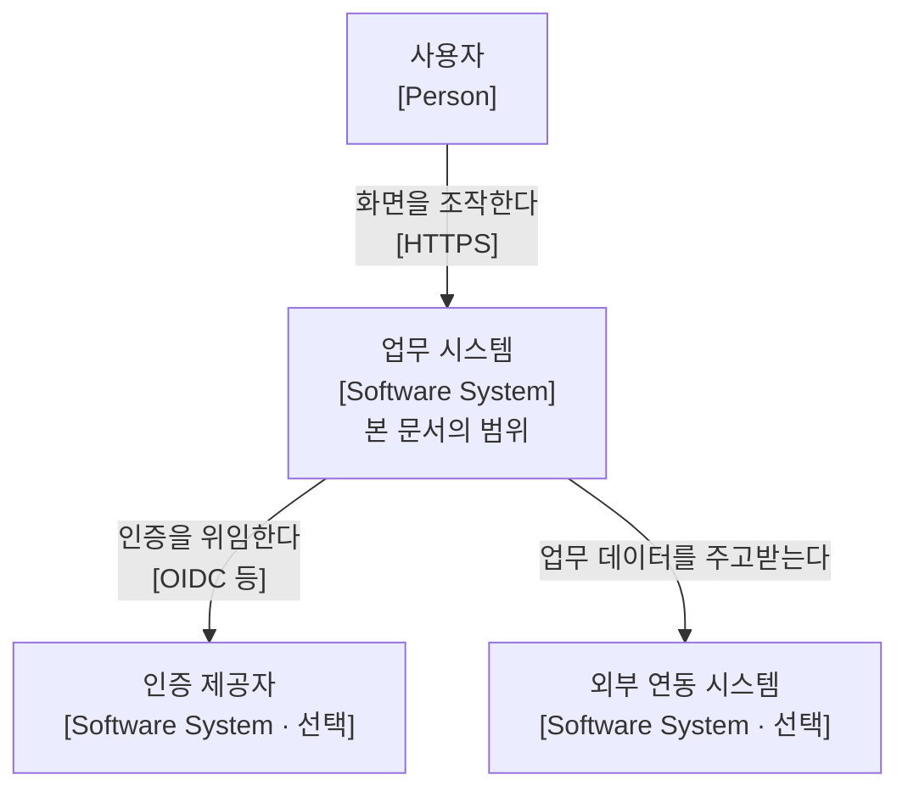
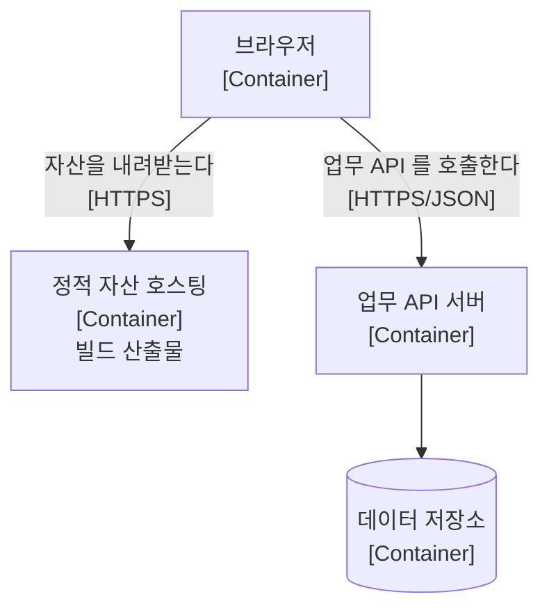

# 시스템 아키텍처

본 문서는 디커플드 구성에서 **무엇이 어디에 배포되고 바깥과 어떻게 만나는지**를 정의합니다.

앱 내부의 코드 구조는 다루지 않고, 앱을 몇 개로 나눌지도 다루지 않습니다. 후자는 [애플리케이션 아키텍처](../application/index.md)가 소유합니다. 본 문서는 그 앱들이 **실제로 어디에서 돌고 무엇과 통신하는가**만 봅니다.

## 1. 소개와 목표

| 순위 | 목표 | 정의 및 선정 사유 |
| :---: | :--- | :--- |
| **1** | **배포의 독립성** | 한쪽의 배포가 다른 쪽의 동시 배포를 요구하지 않아야 합니다. 요구하면 두 저장소로 나눈 이유가 사라집니다 |
| **2** | **출처의 명시성** | 자산과 API가 어느 출처에서 오는지가 설정 한 곳에 적혀 있어야 합니다. 흩어지면 CORS 실패의 원인을 찾을 수 없습니다 |
| **3** | **환경 간 동형성** | 개발·스테이징·운영의 토폴로지가 같아야 합니다. 다르면 배포 시점에만 드러나는 문제가 생깁니다 |

## 2. 제약 조건

| 항목 | 내용 |
| :--- | :--- |
| **저장소** | 프론트엔드와 백엔드가 별도 저장소입니다 |
| **통신** | HTTPS 위의 REST/JSON 하나뿐입니다. 데이터베이스를 공유하지 않습니다 |
| **인증 방식** | 본 표준은 백엔드의 인증 방식을 강제하지 않습니다 |

세 번째가 여러 결정의 전제입니다. 서버가 인증 상태를 알아야 하는 구성을 표준으로 두면 토큰을 httpOnly 쿠키로 강제하게 되고, 그것은 백엔드의 인증 설계를 프론트엔드 표준이 규정하는 일이 됩니다.

## 3. 컨텍스트와 범위

구체적인 외부 연계는 프로젝트마다 다르므로 전형적인 형태만 제시합니다.

범례: 사각형은 사용자 또는 소프트웨어 시스템이며 대괄호 안은 요소의 종류입니다. `선택`이 붙은 것은 프로젝트에 따라 없을 수 있습니다. 화살표는 런타임 의존 방향입니다.

## 4. 배포 뷰

범례: 사각형은 배포 단위이며 원통은 데이터 저장소입니다. 화살표는 런타임 의존 방향입니다.

**브라우저가 API 서버를 직접 호출합니다.** 정적 자산 호스팅과 API 서버 사이에 런타임 경로가 없다는 점이 이 구성의 특징이며, 출처가 갈리면 CORS 설정이 필요한 이유이기도 합니다.

중간에 서버를 두어 응답을 조합하거나 토큰을 보관하면 그것은 BFF이며 배포 단위가 하나 늘어납니다. 본 문서는 그 구성을 다루지 않습니다.

### 프로젝트가 정하는 것

본 문서는 규범집이므로 실제 호스트와 파이프라인을 알 수 없습니다. 각 프로젝트가 다음을 자신의 문서에서 기술합니다.

| 항목 | 기술할 내용 |
| :--- | :--- |
| **출처 구성** | 자산과 API가 같은 출처인가. 다르면 허용 목록을 어디에 두는가 |
| **배포 순서** | 계약이 바뀔 때 어느 쪽을 먼저 올리는가 |
| **롤백** | 한쪽만 되돌릴 수 있는가. 없다면 그 사실을 적습니다 |

## 5. 아직 결정하지 않은 것

| 항목 | 물어야 하는 것 |
| :--- | :--- |
| **추적 식별자** | 요청 하나를 두 시스템의 로그에서 잇는 값을 누가 만들고 어떻게 전파하는가 |
| **환경 구분** | 프론트엔드가 API 주소를 어떻게 알며 그 값이 빌드 시점인가 런타임인가 |
| **인증 제공자** | 자체 발급인가 위임인가. 위임이면 리다이렉트 경로를 누가 소유하는가 |

## 6. 리스크

| 항목 | 내용 | 완화 |
| :--- | :--- | :--- |
| **백엔드 저장소의 부재** | 배포 뷰의 API 서버 쪽이 이 저장소에 기록되지 않습니다 | Spring Boot 문서를 채우며 반대편을 기술합니다 |
| **비교 대상의 부재** | 하이퍼미디어 구성의 배포 뷰가 없어 "단일 배포가 더 단순하다"를 그림으로 대조할 수 없습니다 | 해당 구성을 문서로 남길 때 같은 형태로 그립니다 |
