> [!IMPORTANT]
> **읽기 전에 — 전제 조건과 안내**:
> * 본 글은 모든 기능이 하나의 데이터베이스를 공유하는 **모놀리식(Monolithic) 환경**을 기준으로 삼습니다.
> * 실용적인 백엔드 구조를 구축하기에 앞서, 설계의 정당성을 스스로 검증하기 위해 도메인 주도 설계(DDD)의 몇 가지 핵심 개념을 차용합니다. DDD 용어가 다소 낯설다면, 먼저 작성한 [경계를 긋는 언어, 도메인 주도 설계](/posts/language-of-boundaries)를 읽고 오시는 것을 추천해 드립니다. 이미 관련 개념이 익숙하시다면 그대로 이어서 읽으셔도 좋습니다.

백엔드 프로젝트를 시작할 때 아키텍처와 폴더 구조 설계는 언제나 풀기 어려운 숙제입니다. 많은 개발팀이 도메인의 응집도를 높이기 위해 명사 중심의 **기능 기반 구조(Feature-based structure)**를 채택하곤 합니다. 비슷한 관심사의 코드를 한곳에 모으는 이 방식은 초반에는 타입(레이어) 기반 구조보다 훨씬 깔끔하고 직관적으로 보입니다. 하지만 비즈니스가 복잡해지면서 얼마 지나지 않아 **기능 간의 복잡한 결합(Coupling)** 문제에 맞닥뜨리게 됩니다.

이러한 문제를 해결하기 위해 클린 아키텍처(Clean Architecture)나 헥사고날 아키텍처(Hexagonal Architecture) 같은 정교한 방법론을 대안으로 검토하곤 합니다. 하지만 이러한 방식들은 SOLID 원칙을 극단적으로 고수하려다 보니, 프로젝트 규모에 비해 과도한 보일러플레이트 코드와 복잡한 추상화 레이어를 동반합니다. 언제나 '정석'이 '내 프로젝트에 최적인 아키텍처'는 아닙니다. 

본 글에서는 기능 간 참조가 발생하는 **근본적인 원인**을 짚어보고, 거창한 아키텍처를 도입하지 않고도 모놀리식 환경에서 가볍고 점진적으로 백엔드 구조를 개선해 나갈 수 있는 실용적인 설계 선택지들을 제안합니다.

이야기를 구체적으로 풀기 위해, 최근 만들었던 사내연차관리 플랫폼에서 일부 코드를 추출한 [tiny-hr](https://github.com/dev-goraebap/tiny-hr)을 예제로 활용하겠습니다. 이 프로젝트는 사원·부서·직급을 관리하고, 휴가 신청 시 결재가 진행되며, 최종 승인 결과를 알림으로 발송하는 단순한 흐름을 가지고 있습니다.

---

## 기능 기반 구조(Feature-based Structure)의 현실

기능 기반 폴더 구조는 로버트 C. 마틴이 강조한 **[스크리밍 아키텍처(Screaming Architecture)](https://blog.cleancoder.com/uncle-bob/2011/09/30/Screaming-Architecture.html)**의 철학과 깊이 맞닿아 있습니다. 폴더 구조만 보아도 프로젝트가 어떤 프레임워크나 기술을 사용했는지가 아니라, '인사 관리'라는 도메인 비즈니스를 수행하고 있음이 직관적으로 드러나야 한다는 생각입니다. 

우리 플랫폼을 복잡한 아키텍처 없이 기능 단위로만 나열해 본다면 다음과 같은 플랫(Flat)한 구조가 될 것입니다.

```
com.example.tinyhr
├── user_account
├── role
├── auth
├── department
├── rank
├── notification
├── approval_request
├── leave_request
└── employee/
    ├── EmployeeController
    ├── EmployeeService
    ├── Employee          # JPA 엔티티
    ├── EmployeeRepository
    └── dto/
```

이 구조는 날것의 HR 시스템 요구사항을 기능별 명사 형태로 매핑하여 폴더로 펼쳐 놓은 모습입니다. **앞으로 이처럼 기능 단위로 나뉜 폴더 하나하나를 '모듈(Module)'이라고 정의하겠습니다.** 

이러한 직관적인 구조에서도 비즈니스 흐름이 추가되면 모듈 간의 강한 결합이 순식간에 발생합니다. 대표적인 예시 두 가지를 살펴보겠습니다.

* **사원 온보딩(Employee Onboarding)**: 사원을 신규 등록하는 기능의 진입점은 당연히 `employee` 모듈에 위치합니다. 하지만 사원을 등록하는 동시에 사원의 시스템 로그인용 계정도 발급해야 합니다. 이로 인해 `employee` 서비스가 `user_account` 모듈의 엔티티와 리포지토리를 직접 참조하는 상황이 벌어집니다.
* **결재 승인과 알림 발송**: 휴가 신청서가 최종 승인되면 신청 사원에게 결과를 알려야 합니다. 이때 결재 비즈니스를 처리하는 `approval_request` 모듈의 서비스가 알림 이력을 생성하기 위해 `notification` 모듈을 직접 호출하게 됩니다.

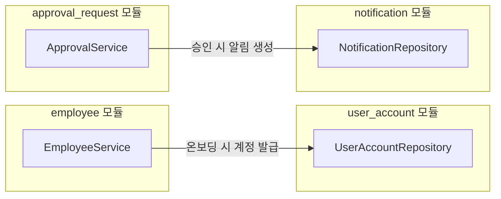

위의 다이어그램처럼 특정 모듈의 애플리케이션 서비스가 다른 모듈의 내부 영속성 계층(Repository, Entity)까지 직접 제어하는 설계가 자연스럽게 정착됩니다. 왜 이러한 강결합 현상이 비즈니스 개발 과정에서 필연적으로 발생하는지 근본적인 원인을 짚고 넘어가야 합니다.

---

## 왜 결합이 생길까? 요구사항의 흐름과 도메인 모델의 불일치

모듈을 구성할 때 우리는 일반적으로 아키텍처 레이어를 모듈 내부에 담아냅니다. 컨트롤러는 프레젠테이션, 서비스는 애플리케이션, 엔티티와 리포지토리는 도메인 및 인프라스트럭처 레이어에 배치됩니다.

여기서 결합이 발생하는 핵심적인 원인은 **"모듈을 가르는 물리적 단위"와 "실제 변경의 경계인 애그리거트(Aggregate)"가 완전히 일치하지 않기 때문**입니다. 애그리거트는 비즈니스 제약 사항 하에서 함께 일관성을 유지해야 하는 논리적 데이터 변경의 단위입니다. 보통 명사 하나당 폴더(모듈)를 하나씩 만들다 보니 '모듈 = 애그리거트'의 구도로 흘러가곤 합니다.

하지만 **실제 사용자의 요구사항(비즈니스 유스케이스)은 하나의 애그리거트 안에서 깔끔하게 완결되지 않습니다.** 조회나 단순 CRUD는 자기 영역 내에서 끝날 수 있지만, 도메인의 핵심 비즈니스는 대개 여러 애그리거트의 상호작용과 협력을 필요로 합니다. 결과적으로 여러 애그리거트를 엮어 비즈니스를 조율하는 **오케스트레이션 서비스(Orchestration Service)**가 탄생하게 되고, 이 서비스가 경계를 넘어 다른 모듈의 요소를 가져다 쓰면서 모듈 간 참조 그래프가 복잡해지기 시작합니다.

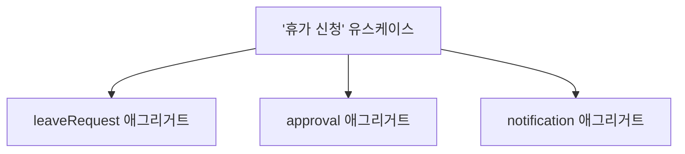

이러한 커플링 자체가 무조건 잘못된 설계인 것은 아닙니다. 시스템의 규모가 작고, 모듈 간의 참조 방향이 명확한 단방향이며, 개발팀이 전체 결합도를 머릿속에 담아두고 제어할 수 있는 범위라면 이 역시 훌륭한 실용주의적 선택입니다. 

하지만 코드베이스가 커지고 참여하는 개발자가 많아지면 '과연 이 모듈이 올바르게 격리되고 있는가?'에 대한 회의감이 들기 마련입니다. 서비스 레이어에서 다른 모듈의 도메인 모델이나 리포지토리를 직접 참조하는 일에 기준을 세우지 못하면 시스템은 금세 스파게티 코드로 변합니다. 따라서 이제는 **유지보수 가능한 경계와 타협할 수 있는 명확한 기준**을 세워야 합니다.

---

## 1단계. 관련된 모듈을 묶어 경계 긋기 (Bounded Context)

결합을 인위적으로 해제하기 위해 어댑터나 추상 레이어를 만드는 등의 비싼 설계 비용을 치르기 전에, 먼저 해야 할 질문이 있습니다. **"이 모듈들이 정말로 독립적으로 존재해야 하는 별개의 비즈니스 영역인가?"** 하는 점입니다.

기능 단위로 분리되어 서로 협력하던 모듈들을 깊이 들여다보면, 사실 그들은 개별 기능이라기보다 **하나의 일관된 도메인 모델을 구성하는 부분적인 조각**에 가까운 경우가 많습니다. 도메인 모델은 하나 이상의 애그리거트로 채워지며, 이 **도메인 모델의 의미와 비즈니스 언어가 일관되게 통용되는 명확한 경계**를 DDD에서는 **바운디드 컨텍스트(Bounded Context, 이하 컨텍스트)**라고 정의합니다.

예를 들어, 앞서 나열한 `employee`, `department`, `rank` 모듈은 사실 각각 격리되어 동작하는 개별 시스템이 아닙니다. 사원이 등록되면 특정 부서에 소속되고 특정한 직급이 매겨집니다. 즉, 세 개의 개념은 언제나 하나의 인사 정보 일관성을 유지하며 상호작용합니다. 따라서 이들은 **'조직(organization)'이라는 하나의 컨텍스트**로 묶이는 것이 훨씬 자연스럽습니다.

`user_account`, `role`, `auth` 모듈 역시 마찬가지입니다. 사용자가 `auth`를 통해 로그인하고, `user_account`가 자격을 검증하며, `role`에 따라 권한이 제어되는 일련의 보안 기능은 서로 떼려야 뗄 수 없는 밀접한 흐름입니다. 따라서 이 셋은 **'IAM(Identity & Access Management)'이라는 하나의 컨텍스트**로 바라볼 수도 있습니다.

이러한 관계성을 바탕으로 폴더 구조를 재정리해 보겠습니다.

```
com.example.tinyhr
├── organization/         # 조직(Organization) 컨텍스트 (지원 하위 도메인)
│   ├── employee/
│   ├── department/
│   └── rank/
├── iam/                  # IAM 컨텍스트 (일반 하위 도메인)
│   ├── user_account/
│   ├── role/
│   └── auth/
└── ...
```

여기서 흥미로운 지점은 앞서 보았던 **사원 온보딩 시의 결합**입니다. `employee` 모듈과 `user_account` 모듈은 각각 서로 다른 컨텍스트(`organization` vs `iam`)에 나뉘어 배치되었습니다. 결합이 존재한다고 해서 무작정 같은 컨텍스트로 통합하는 것은 올바른 해결책이 아닙니다. 이 프로젝트에서 사원의 정보 관리는 인사(HR) 하위 도메인의 책임이고, 인증 수단 및 시스템 계정 관리는 보안(IAM) 하위 도메인의 핵심 책임이기 때문입니다.

이처럼 **컨텍스트의 경계를 가로지르는 결합(Cross-Context Coupling)**은 설계적 결함이 아니라, 비즈니스를 달성하기 위해 필연적으로 존재하는 협력 관계입니다. 그렇기에 우리에게 필요한 것은 이 의존성을 합리적인 방식으로 관리하는 일입니다. 그 구체적인 방법은 뒤에서 이어 다루겠습니다.

> [!IMPORTANT]
> 여기서 나눈 컨텍스트가 절대적인 정답은 아닙니다. 같은 모듈이라도 개발자마다, 또 경험에 따라 다른 컨텍스트로 묶어 볼 수 있어요. 저 역시 제가 이해한 범위 안에서 내린 결론일 뿐입니다. 중요한 건 경계를 한 번에 정확히 맞히는 것이 아니라,따로 떨어져 있다고 여겼던 모듈들도 관련된 관심사끼리 다시 묶일 수 있다는 사실입니다.

---

## 2단계. 컨텍스트 내부 구조 설계 (내부 복잡도 관리)

모듈들을 의미 있는 컨텍스트 단위로 묶었다면, 각 컨텍스트 폴더의 내부 구조를 어떻게 가져갈 것인가에 대한 구체적인 선택지가 생깁니다. 모든 컨텍스트에 획일화된 설계를 강요하지 않고 비즈니스의 복잡도에 따라 차등적으로 아키텍처를 선택하는 것도 하나의 방법이 될 수 있습니다.

### 선택지 A. 모듈 그대로 두기 (Flat 구조)

컨텍스트 폴더 아래에 기존 기능 단위 모듈들을 평평하게 유지하는 방식입니다.

```
organization/
├── employee/
├── department/
└── rank/
```

각 모듈은 자체 컨트롤러, 서비스, 도메인, 리포지토리를 수직적으로 소유합니다. 단순히 패키지 단위로 한 번 묶었을 뿐, 기존 모듈의 구성 방식은 그대로입니다. 각 모듈에서 일어난 변경의 여파가 그 내부에서 끝나는 경우라면, 오히려 이런 구조도 합리적인 선택이라고 생각합니다.

### 선택지 B. 레이어로 정돈하기 (Layered 구조)

반면, 한 컨텍스트 안의 모듈들이 서로 긴밀하게 협력하는 경우라면 컨텍스트 하위를 아키텍처 레이어로 분리하는 편이 더 나을 수 있습니다. 그리고 사실 한 컨텍스트로 묶였다는 것 자체가 모듈 간 협력이 잦다는 뜻이므로, 이런 상황은 어떻게 보면 이미 정해진 전제에 가깝습니다.

```
organization/
├── domain/                 # 핵심 비즈니스 규칙 (Entity, VO, Repository 인터페이스)
│   ├── employee/
│   ├── department/
│   └── rank/
├── application/            # 유스케이스 조율
│   └── EmployeeOnboardingService
└── adapter/
    ├── web/                # 진입점 (EmployeeController)
    └── persistence/        # 영속성 구현 (JpaEmployeeRepository)
```

왜 굳이 레이어로 나눌까요? 유스케이스는 여러 애그리거트를 가로지르며 자주 바뀌고, 각 애그리거트의 규칙은 자기 영역 안에서 천천히 바뀝니다. 문제는 관리입니다. 이들은 원래 한 컨텍스트 식구라 서로 참조하는 게 자연스러워야 하는데, 모듈별로 컨트롤러·서비스·리포지토리·엔티티를 따로 묶어 두면 같은 컨텍스트 안인데도 모듈마다 벽이 둘러쳐진 느낌이 됩니다. 그래서 모듈 칸막이 대신 조율 로직은 application, 규칙은 domain으로 나눠, 같은 컨텍스트 안의 협력이 벽 없이 흐르게 만드는 것입니다.

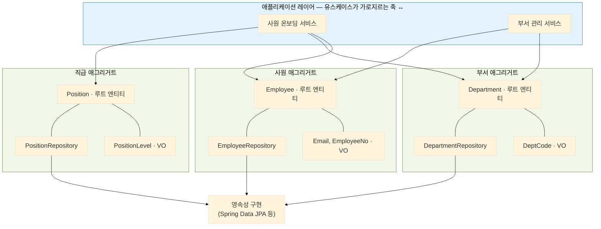

---

## 3단계. 컨텍스트 간의 결합 다스리기 (쓰기 및 프로세스 결합)

컨텍스트 내부를 어떻게 설계했든, 시스템을 확장하다 보면 결국 컨텍스트 경계를 가로지르는 협력과 참조는 계속해서 생겨납니다. 앞선 다이어그램에서는 다루지 않았지만, 이를테면 사원 온보딩 서비스가 IAM 컨텍스트의 계정 애그리거트에 접근해야 하는 상황이 그렇습니다.

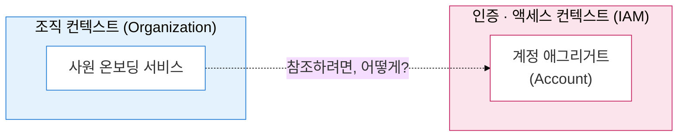

이 "어떻게"에 대한 답은 하나가 아닙니다. 특히 모놀리식 단일 DB 환경에서는 다른 영역의 데이터베이스에 언제든 직접 접근할 수 있다 보니, 별다른 고민 없이 결합을 방치하기 쉽습니다. 그래서 지금부터는 경계를 넘나드는 쓰기(Write)와 프로세스 결합을 체계적으로 다스리는 세 가지 해결법을, 설계 비용과 디커플링 수준에 따라 점진적으로 제시하겠습니다.

---

### 해결책 A. 폴더 구조 제어로 참조 방향 격리하기 (Architectural Control)

결합을 제어하는 가장 직관적이고 코드 추가 비용이 적은 방식은 **물리적인 폴더 레이어에서 참조 방향의 규칙을 세우고 강제**하는 것입니다.

잠깐 지금까지의 구조를 떠올려 볼까요. 예제 코드는 줄곧 `module` 아래에 다섯 개의 컨텍스트가 평평하게 놓인 모습이었습니다.

```
com.example.demo
└─ module
   ├─ iam            // 인증·계정
   ├─ org            // 조직·사원
   ├─ approval       // 결재
   ├─ notification   // 알림
   └─ vacation       // 휴가
```

이 상태에서, 요청을 처리하기 위해 여러 바운디드 컨텍스트를 가로질러야 하는 오케스트레이션의 역할을 하위 모듈 바깥의 별도 최상위 레이어로 격리해 올려버리는 것이 이 방법의 아이디어입니다. 그러면 구조는 이렇게 바뀝니다.

```
com.example.demo
├─ app                                   // 상위 레이어 — 요구사항 흐름 조율
│  ├─ org                                // 요구사항(컨텍스트) 단위로 구성
│  │  ├─ EmployeeOnboardingController    // 진입점(주로 컨트롤러)
│  │  └─ EmployeeOnboardingService       // 여러 애그리거트를 엮는 오케스트레이션 서비스
│  ├─ iam
│  ├─ approval
│  ├─ notification
│  └─ vacation
├─ feature                               // 중간 계층 — app에서 반복되는 조율 로직을 추출
│  └─ AccountProvisioningService         // 여러 진입점이 공유하는 재사용 기능
└─ module                                // 하위 레이어 — 애그리거트 단위로 응집
   ├─ employee                           // 애그리거트 패키지가 바로 옴
   │  ├─ Employee                        // 엔티티 (애그리거트 루트)
   │  └─ EmployeeRepository
   ├─ department
   ├─ rank
   ├─ account
   ├─ approval_request
   ├─ approval_template
   ├─ notification
   ├─ vacation_request
   └─ vacation_entry
```

* **상위 레이어 (`app`)**: 유저 요청을 받는 진입점(주로 컨트롤러)과, 여러 애그리거트를 가로지르며 비즈니스 흐름을 조율하는 오케스트레이션 서비스를 요구사항(컨텍스트) 단위로 모아 둡니다.
* **중간 계층(선택) (`feature`)**: 여러 오케스트레이션 서비스에서 반복되는 조율 로직이 보일 때, 그 기능을 뽑아내 재사용하는 자리입니다.
* **하위 레이어 (`module`)**: 핵심 비즈니스 규칙과 모델이 응집된 애그리거트 패키지가 곧바로 놓이며, 각 패키지 안에 엔티티(애그리거트 루트)와 리포지토리가 함께 담깁니다.

이 구조에서는 다음 세 가지 규칙을 팀의 규약으로 강제합니다.

1. 상위 레이어(`app`)는 하위 레이어(`module`)를 참조할 수 있다.
2. 하위 레이어(`module`) 내부의 애그리거트끼리는 서로를 절대로 참조할 수 없다.
3. 동일 레이어에 속한 형제 모듈끼리의 직접 참조 역시 원칙적으로 금지한다.

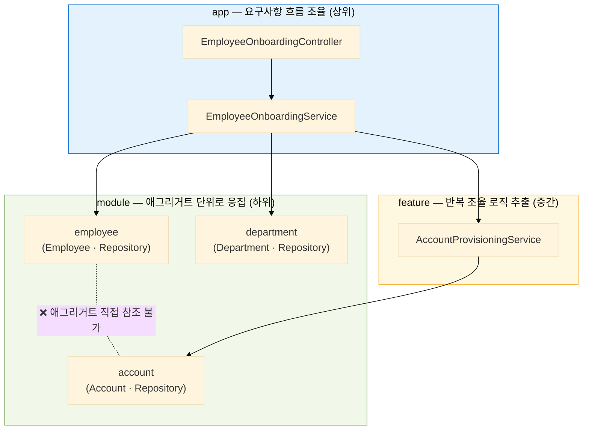

이렇게 구성하면 상위 레이어(`app`)에 위치한 오케스트레이션 서비스가 하위 애그리거트(엔티티·리포지토리)를 공평하게 가져와 조립할 수 있게 됩니다. 이 방식은 컨텍스트 내부의 캡슐화를 엄격하게 밀고 나가는 대신, 참조의 흐름을 단방향(상향 → 하향)으로 제어하여 순환 참조를 원천 봉쇄하는 매우 직관적인 해결책입니다.

다만 이 방식은 컨텍스트 간의 근본적인 결합을 끊어내거나 정돈한다기보다, **모놀리식 환경의 최대 강점인 '모든 데이터에의 직접 접근 가능성'을 살리기 위해 설계를 타협하고 우회하는 트레이드오프**를 인정하는 것일 뿐입니다. 상위 레이어(`app`)의 오케스트레이터가 하위의 구체 애그리거트(엔티티·리포지토리 인터페이스)에 직접 손을 뻗으므로 진정한 도메인 캡슐화나 자율적인 격리는 희생되는 셈이죠. 따라서 팀의 규모가 커지고 비즈니스가 고도화되어 컨텍스트 간의 단단한 물리적 벽이 필요한 시점이 오면, 이 우회로를 벗어나 다음 단계의 해결책들을 고민해야 합니다.

---

> [!NOTE]
> 이 아래에서 다루는 해결법들은 해결책 A처럼 app/module로 레이어를 나누지 않고, 다시 하나의 module 레이어 아래에 컨텍스트 패키지들을 나란히 두는 구조를 그대로 전제로 합니다.

```
com.example.demo
└─ module
   ├─ iam            // 인증·계정
   ├─ org            // 조직·사원
   ├─ approval       // 결재
   ├─ notification   // 알림
   └─ vacation       // 휴가
```

### 해결책 B. 단반향 참조를 인정하고, 양방향 구도만 DIP로 끊어내기

헥사고날 아키텍처는 컨텍스트 간의 모든 물리적 결합을 차단하기 위해 양방향에 포트(Port)와 어댑터(Adapter)를 세우고 변역 레이어(Anti-Corruption Layer)를 요구합니다. 이는 설계의 유연성을 주지만, 단순 참조에 비해서 너무 높은 학습 곡선과 클래스 증폭을 가져옵니다.

따라서 우리는 컨텍스트 간의 참조를 억지로 없애기보다, 그 존재를 인정하는 데서 출발합니다. 대신 과정은 최대한 단순하게 가져갑니다. 참조가 필요하면 참조를 받는 쪽이 외부 컨텍스트들을 위해 공개 서비스(OHS, Open Host Service)를 열어 두는 것이죠. 단, 이 OHS는 여러 컨텍스트를 가로지르며 흐름을 조율하는 오케스트레이션 서비스와는 분명히 구분합니다.
이것만으로 모든 게 해결되면 좋겠지만, 어느 정도 성숙한 도메인(프로젝트 요구사항)에서는 양방향으로 얽히는 순환 참조가 거의 예외 없이 나타납니다. 그래서 양방향 의존이 걸리는 컨텍스트에 한해서는, 앞서 다룬 DIP(의존 역전)를 더해 그 고리를 끊어 냅니다.

#### 1) Open Host Service (OHS) 패턴

제공자 측 컨텍스트에서 외부에 안정적으로 제공할 수 있는 인터페이스(프로토콜)를 정의하고 이를 단방향으로만 호출하도록 열어두는 입구입니다.

앞서 이야기한 '사원 온보딩 시 계정 발급' 비즈니스를 OHS 방식으로 풀어보겠습니다. `organization` 컨텍스트는 계정을 보관하는 `iam` 컨텍스트의 내부 영속성 테이블 구조나 제약 사항을 알 필요가 없습니다. `iam` 컨텍스트가 공식적으로 열어준 서비스 창구만 안전하게 호출하면 됩니다.

```java
// iam 컨텍스트가 외부에 공식적으로 제공하는 Open Host Service (OHS)
@Service
@Transactional
public class AuthOpenHostService {

    private final UserAccountRepository userAccountRepository;

    /** 
     * 신규 사원 등록 시 시스템 로그인을 위한 인증 계정을 프로비저닝한다.
     * 사원 식별자와 이메일을 외부로부터 안전하게 전달받아 비즈니스 정합성을 검증한 후 계정을 생성한다.
     */
    public void provisionAccount(String userAccountId, String email) {
        // 중복 가입 방지, 비즈니스 룰 검증, 생성
        ...
    }
    ...
}
```

#### 2) 의존 역전(DIP)을 활용한 SPI(Service Provider Interface) 패턴

단방향으로 흐르던 OHS 참조 구도에서 역방향으로도 호출을 보내야 하는 비즈니스 상황(순환 참조 우려)에서는 전략 패턴과 의존 역전을 적절히 혼합하여 순환을 끊어내야 합니다.

휴가(`vacation`)와 결재(`approval`)의 관계가 그렇습니다.

1. **정방향 흐름**: 휴가 신청서 작성이 완료되면 결재(`approval`) 컨텍스트에 결재 프로세스를 올려야 합니다. (**휴가 → 결재 OHS 호출**)
2. **역방향 흐름**: 결재 상태가 최종 완료(승인/반려/취소)되면 휴가 컨텍스트는 이에 따라 연차 잔액을 직접 차감하거나 원복해야 합니다. (**결재 → 휴가 호출?**)

이 흐름을 그대로 구현하면 두 컨텍스트가 서로를 마주 보며 순환 참조에 빠집니다.

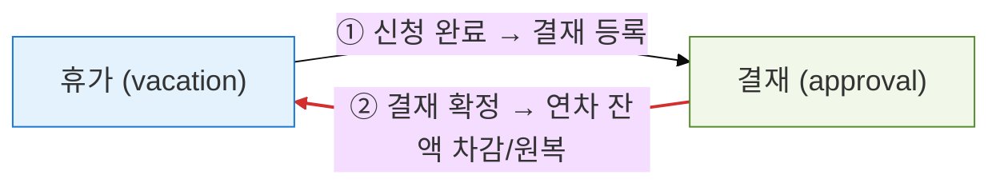

순환을 끊는 열쇠는 **역방향 호출의 방향만 살짝 뒤집는 것**입니다. 결재 측에 "결재가 최종 결정되면 이를 처리할 대상자(Service Providers)는 이 명세를 구현해 등록하라"는 확장 포인트(SPI)를 정의해 두고, 실제 처리는 휴가 측 구현체에 맡깁니다. 구조는 이렇습니다.

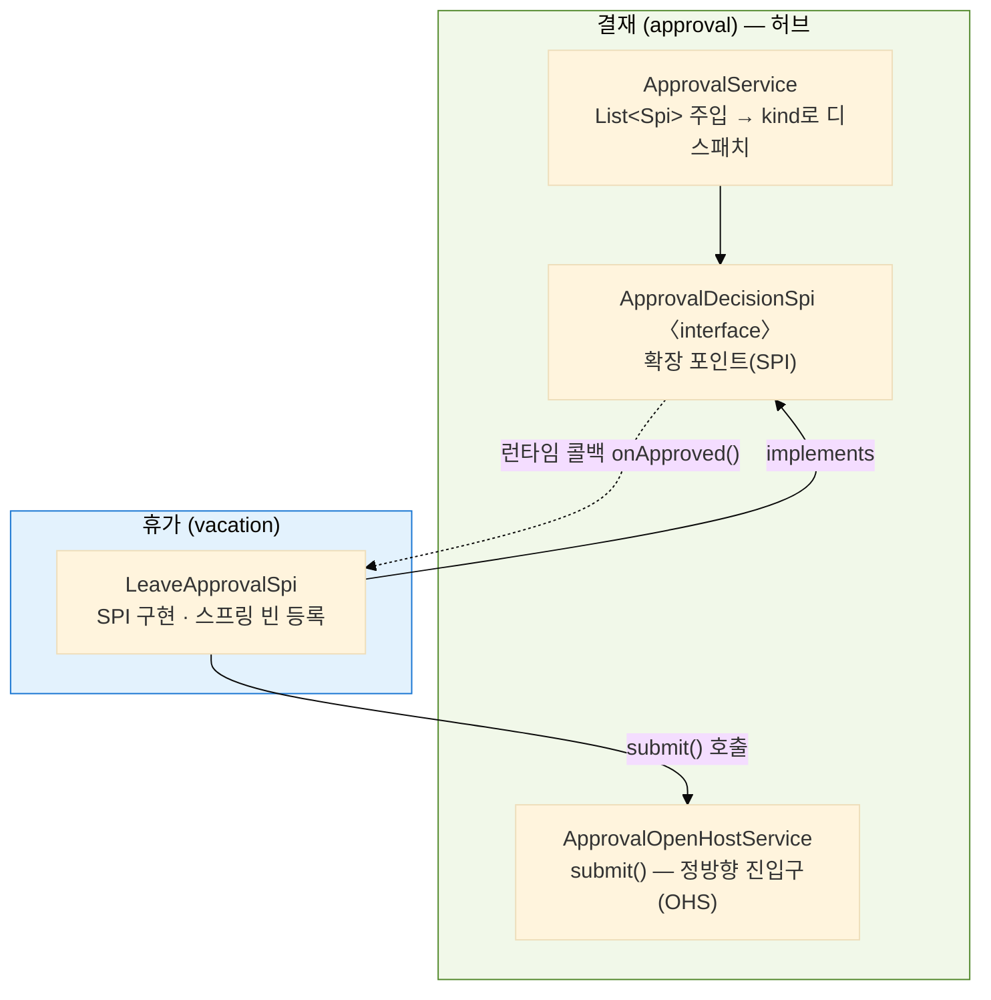

> **실선** = 소스 코드(컴파일) 의존, **점선** = 런타임 호출. 소스 의존은 모두 휴가 → 결재 한 방향이고, 점선 콜백만 결재 → 휴가로 거꾸로 흐릅니다.

각 조각의 역할은 이렇습니다.

* **결재가 여는 정방향 창구 (OHS)**: `ApprovalOpenHostService.submit()`. 휴가가 신청 완료 시 호출해 결재 프로세스를 생성·저장합니다. (요청자는 결재선에서 제외하고, 남는 결재자가 없으면 자동 승인 같은 정책도 이 안에서 처리합니다.)
* **결재가 소유하는 확장 포인트 (SPI)**: `ApprovalDecisionSpi` 인터페이스. 어떤 업무에 반응할지 가르는 `kind()`와, 확정 후속 처리를 위한 `onApproved()` · `onRejected()` · `onCancelled()`를 정의합니다. 인터페이스의 주인은 어디까지나 결재입니다.
* **휴가가 끼우는 구현체**: `LeaveApprovalSpi`가 이 SPI를 구현해 빈으로 등록합니다. `kind()`는 `LEAVE`를 돌려주고, `onApproved()`에서 연차 잔액을 차감하거나 원복하죠.
* **결재의 디스패처**: `ApprovalService`는 구현체의 정체를 전혀 모른 채 `List<ApprovalDecisionSpi>`만 주입받아 `kind`별 맵으로 정리해 둡니다. 결재가 확정되면 상태를 전이시킨 뒤, 알맞은 구현체를 찾아 콜백만 던집니다.

시간 순서로 보면 정방향 신청과 역방향 콜백이 이렇게 이어집니다.

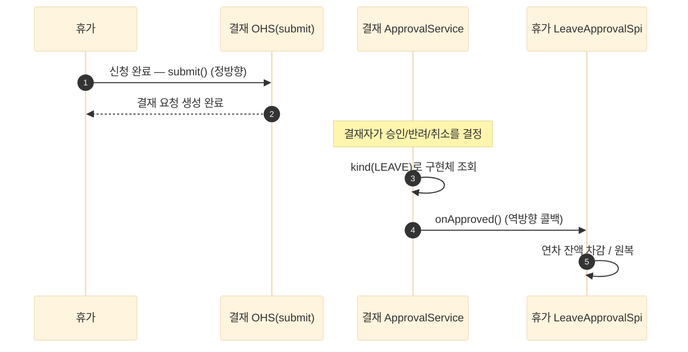

이 전략을 사용하면 소스 코드 수준의 의존성은 여전히 **휴가 → 결재** 단방향으로 흐릅니다. 하지만 런타임 상의 제어 흐름은 결재의 완료 시점에 맞춰 역방향으로 동작하게 됩니다.

이 샘플 예제 프로젝트에서는 설명의 단순화를 위해 '연차(휴가)'와 '결재' 컨텍스트만을 예시로 들었습니다. 하지만 실제 사내 시스템에서는 **휴가 하위 도메인** 내부에서도 연차·공가·특별휴가·무급휴가 등 성격에 따라 잔여형·차감형·이벤트형으로 세부 분기 로직이 존재하며, **휴직 하위 도메인**이나 **근태 하위 도메인**처럼 결재 연동이 필요한 영역이 계속 추가됩니다.

이때 결재 모듈이 각 비즈니스 도메인의 명세와 상태 전이 정책을 일일이 파악하려 든다면 결합도는 극단적으로 높아집니다. 하지만 결재 측에 OHS(`submit` API)와 SPI(인터페이스)를 명확히 설계해 두면, 결재는 그 누구도 참조하지 않고 핵심 하위 도메인들만 결재를 바라보는 구도가 됩니다.

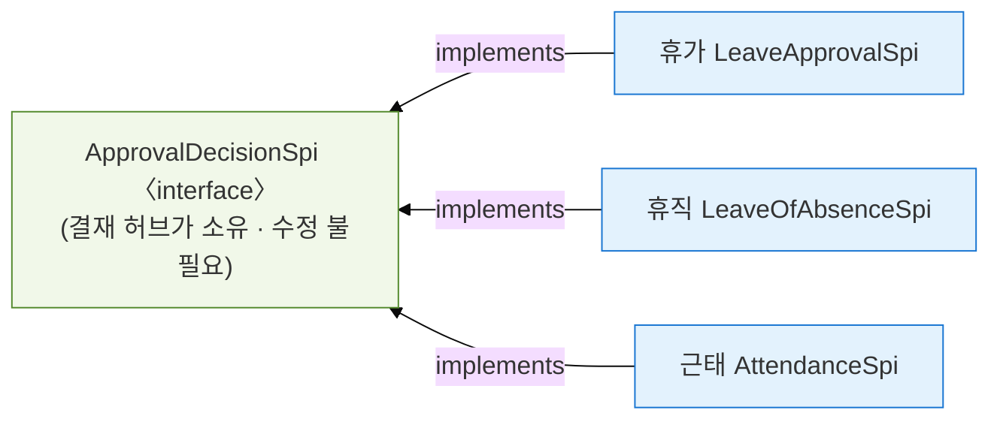

덕분에 새로운 결재 연동 비즈니스가 추가되더라도 결재 모듈의 코드는 손대지 않고, 구현체만 새로 끼워 독자적으로 확장해 나갈 수 있는 견고함을 얻습니다.

---

### 해결책 C. 동기 이벤트로 물리적 결합 끊기

만약 서로 다른 컨텍스트 간의 물리적 클래스 참조나 주입 구조 자체를 완전히 독립시키고 싶다면, 메시징 패턴에 기반한 이벤트를 활용할 수 있습니다.

사원 등록 후 환영 알림 발송 업무를 다시 떠올려보겠습니다. `organization` 컨텍스트의 온보딩 비즈니스가 완료되었을 때 `notification` 컨텍스트를 직접 부르는 대신, **"사원이 온보딩되었다"는 비즈니스 사실(Event)**을 스프링 컨테이너 내부로 조용히 방출하는 것입니다.

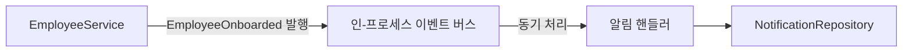

> [!IMPORTANT]
> **모놀리식 동기식 이벤트의 가치**:
> 외부 분산 큐 장비(Kafka, MQ) 없이 동작하는 동기식 인-프로세스(In-Process) 이벤트 구조입니다. 같은 스레드와 트랜잭션 내에서 실행되므로 복잡한 분산 일관성 기법(Saga, Outbox) 없이도 단일 커밋/롤백의 신뢰성을 그대로 유지하며 컨텍스트를 격리시킬 수 있습니다.

물론 이벤트 중심 아키텍처는 제어 흐름을 은닉하므로, 개발자가 디버깅하거나 로직의 전체 진행 양상을 파악하기 어렵게 만든다는 단점이 공존합니다. 따라서 핵심적인 워크플로우를 흐리는 무분별한 이벤트화보다는 OHS와 상호 비교하여 트레이드오프를 현명하게 고려해야 합니다.

참고로 이번 글의 예제 프로젝트는 해결책 B를 기준으로 작성되었으며, 동기 이벤트를 직접 다루고 있지 않아 별도의 코드 예시는 생략합니다. 

솔직히 고백하자면, 저 역시 동기 이벤트 방식에 대해서는 아직 깊은 실무 경험을 갖고 있지는 않습니다. 예전에 진행했던 한 프로젝트에서 이 방식을 성급하게 시도해 보았지만, 이벤트 흐름의 추적과 디버깅 과정에서 관리 부담이 커져 결국 1번 방식(해결책 A. 폴더 구조로 참조 방향 격리하기)으로 되돌리기까지 했으니까요. 

그럼에도 동기 이벤트 방식이 나쁘다고 생각하지는 않습니다. 당시에는 이벤트를 다루기 위한 저의 관리 노하우와 시스템 모니터링 체계가 부족했던 탓이 큽니다. 만약 비즈니스 라이프사이클을 해치지 않는 선에서 구조와 관리 규칙을 꼼꼼하게 잘 잡아둔다면, 이 방식 또한 도메인 모듈 간의 결합도를 물리적으로 끊어낼 수 있는 훌륭한 선택지라고 생각합니다.

---

## 4단계. 컨텍스트 간의 조회(Read) 결합 다스리기 (얕은 CQRS)

아무리 쓰기 모델의 경계를 깔끔하게 단절시키고 의존성을 리팩토링해도, 실무 개발에서 우리 발목을 잡는 주요 요인은 **조회(Read)** 기능입니다. 

화면에 뿌려져야 할 최종 데이터는 항상 여러 바운디드 컨텍스트의 속성들을 복합적으로 모아서 보여주길 요구하기 때문입니다. 단적인 예로 휴가와 결재는 어떤 페이지에서 조회하던 두 컨텍스트의 데이터를 같이 조합해서 보여줘야합니다.

이때 도메인의 무결성(또는 경계)을 지키겠다며, 각 영역의 핵심 엔티티를 컨텍스트 너머로 가져와 이리저리 결합하며(애플리케이션 조인) 데이터를 가공하는 일은 이득 대비 복잡도만 더 높아진다고 생각합니다.

이를 해결하기 위해 **명령(쓰기)과 조회(읽기)의 책임을 한층 가볍게 분리**하는 **얕은 CQRS(Shallow CQRS)** 전략을 생각해볼 수 있습니다.

### 1) 화면 조회를 위한 전용 Query Service 사용

비즈니스 제약 사항과 상태 변경의 불변식(Invariants)을 엄격하게 통제해야 하는 **쓰기 모델**과 달리, **조회 모델**은 복잡한 정합성 규칙이나 비즈니스 제약에서 **대체로 자유로운 편**입니다. 

화면 지향 조회 로직은 각 컨텍스트에서 필요한 **쿼리 서비스(Query Service)**를 구축합니다. 이 쿼리 서비스는 복잡한 DDD 컨텍스트 경계에 얽매이지 않고 여러 테이블을 직접 조인하여 원하는 조회 화면에 맞는 경량화 DTO를 바로 리턴하도록 코드를 단순화합니다.

쓰기와 읽기(화면 조회)를 완전히 다른 채널로 대우함으로써, 도메인 모델의 무결성은 보존하면서도 기형적인 화면 요구사항은 비교적 자유롭게 접근하는것이죠.

### 2) 비즈니스 정책을 위한 읽기 전용 모델(Read-Only Model) 구축

화면 표시 목적이 아니라, 다른 컨텍스트 내부의 비즈니스 정책을 판단하기 위해 상대 도메인 데이터가 일부 쓰기 흐름에 필요한 경우가 있습니다.

예를 들어 알림(`notification`) 컨텍스트가 사원의 수신 가능 상태를 조회해 발송 여부를 비즈니스 규칙으로 결정해야 한다고 해보겠습니다. 알림 시스템이 조직의 사원 데이터를 필요로 하니, 조직 컨텍스트가 OHS로 공개 API를 열어 해결할 수도 있겠죠. 그런데 이것만이 정답일까요? 이런 식이라면 결국 대부분의 컨텍스트가 저마다 OHS를 열어야 할지도 모릅니다.

여기서 *테이블이 하나라고 해서 도메인 모델(또는 엔티티)까지 전 시스템에 단 하나여야 한다*는 고정 관념을 깨야 합니다. 알림 컨텍스트 안에 수신자를 뜻하는 **`Recipient`라는 작고 가벼운 읽기 전용 모델**을 따로 선언하고, 물리적으로는 조직이 관리하는 사원(`employees`) 테이블에 매핑해 직접 조회하는 방식을 택할 수도 있는 거죠.

```java
// notification 컨텍스트 내부에 격리되어 선언된 읽기 전용 매핑 모델
@Table(name = "employees") // organization 에서 관리하는 테이블을 읽기 전용으로 공유
@Entity
@Getter
@NoArgsConstructor(access = AccessLevel.PROTECTED)
public class Recipient {

    @Id
    private String id;
    private String email;
    private boolean receivingActive; // 알림 수신 동의 여부 등, 알림에서만 필요한 관점의 속성

    // 생성 및 수정 관련 비즈니스 메서드는 제공하지 않는다. 오직 조회 목적.
}
```

생성, 변경, 삭제 등 상태를 조작하는 행위(Write)는 조직 컨텍스트의 `Employee`를 통해서만 비즈니스 규칙에 맞춰 안정적으로 수행됩니다. 알림 컨텍스트는 단지 해당 원본 데이터를 읽기 전용 모델인 `Recipient`를 통해 자기 시각에 맞춘 속성만 읽음(Read)으로써, 데이터베이스 결합을 유지하되 코드 수준의 모듈 참조 경계를 깔끔하게 도려낼 수 있습니다.

물론 이 방법이 늘 정답은 아닙니다. 가져온 데이터가 내 컨텍스트의 언어로 매끄럽게 표현되지 않는다면, 억지로 읽기 전용 모델로 감싸기보다 *그것이 외부 컨텍스트의 데이터임을 그대로 인정하는* 편이 나을 수 있습니다. 어디까지를 내 언어로 끌어올지는 상황에 맞는 판단이 필요한 부분입니다.

---

## 마치며

지금까지 날것으로 구현된 초창기 기능 기반 백엔드 프로젝트에서 출발해, 비즈니스의 진정한 논리적 경계인 컨텍스트를 도출하고 그 의존 관계를 제어하여 구조를 실용적으로 잡아가는 일련의 이정표들을 다루었습니다.

이를 간략히 정리해 보면 다음과 같은 의사결정 프레임워크로 요약할 수 있습니다.

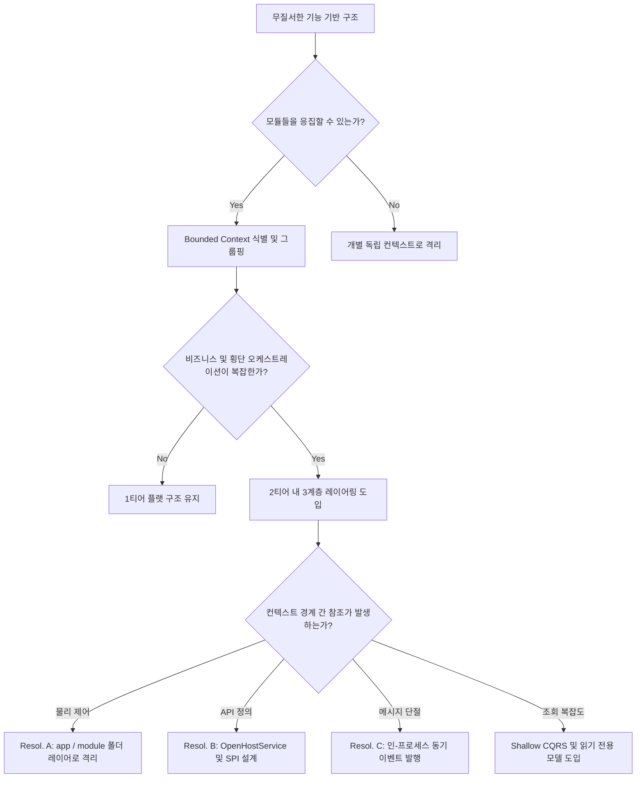

정답이 정해진 절대 아키텍처란 존재하지 않습니다. 모든 구조 설계의 종착지는 항상 우리 비즈니스의 성장 속도, 그리고 함께하고 있는 우리 개발팀의 규모와 역량 간의 현실적인 트레이드오프(Trade-off)에서 타협점을 찾아내는 것입니다. 

너무 빈약한 구조 탓에 변경 비용이 천정부지로 치솟고 있다면, 혹은 반대로 너무 거창한 정석 아키텍처에 짓눌려 오늘 바로 출시해야 하는 한 줄의 CRUD 구현에도 골머리를 앓고 있다면, 본 글에서 제안한 실용적인 타협안들을 하나씩 프로젝트에 알맞게 조합해 보는 기회가 되기를 바랍니다.
