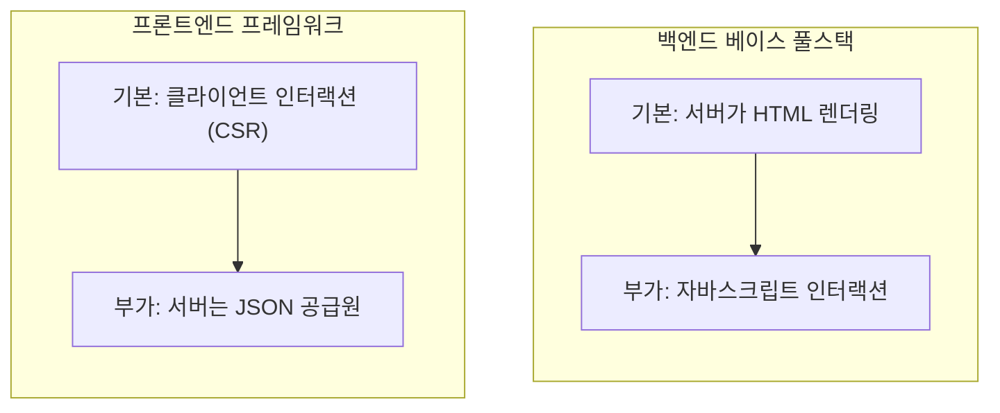
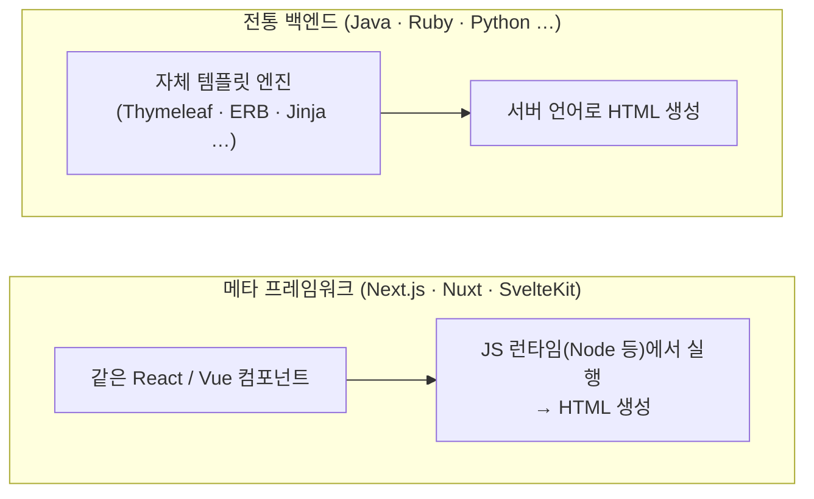
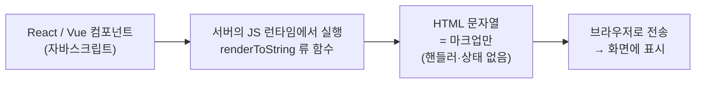
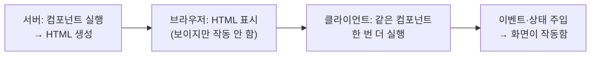
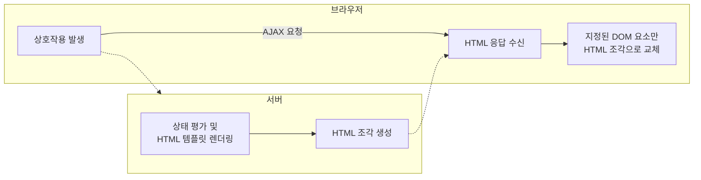
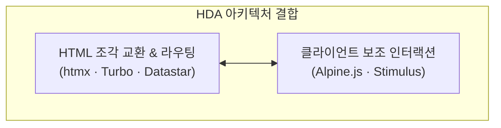
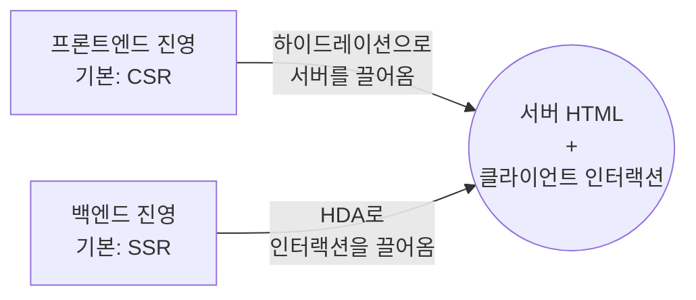

웹의 초기 역사에서 화면을 구현하는 방식은 단순했다. 서버가 HTML을 그려 브라우저로 내려보내는 것이 전부였다. 백엔드 컨트롤러가 데이터를 조회하고 템플릿 엔진이 이를 마크업과 결합하면, 브라우저는 완성된 문서 한 장을 통째로 받아 렌더링하는 뷰어 역할을 수행했다. 링크를 클릭하거나 폼을 제출하면 화면 전체가 깜빡이며 새로운 문서가 날아오던 시절의 이야기다.

화면을 통째로 다시 그리는 고전적인 방식은 명료했지만, 사용자 경험 측면에서 한계가 뚜렷했다. 데이터 하나를 수정하기 위해 매번 전체 페이지를 새로고침해야 하는 구조는 무겁고 굼떴다. 부분적인 갱신, 깜빡임 없는 화면 전환, 즉각적인 피드백을 원하는 흐름은 거스를 수 없는 요구였다. 그렇게 자바스크립트가 도입되어 화면의 일부를 동적으로 조작하기 시작했다. 브라우저가 정적인 문서를 표현하는 단계를 넘어, 동적인 상호작용을 시작한 순간이었다.

이 시점부터 화면은 두 개의 층(Layer)을 품게 된다. **서버가 일차적으로 생성하여 내려보낸 정적 HTML**, 그리고 **클라이언트가 런타임에 자바스크립트로 데이터를 주입해 동적으로 재구성하는 HTML**. 이 글은 이 두 개의 레이어에 대한 이야기다. 서로 다른 패러다임의 진영이 이 구조적 경계를 어떻게 다루어 왔는지, 그리고 언뜻 모순되어 보이는 기술적 선택들이 어떻게 하나의 궁극적인 지향점으로 수렴하는지 짚어보려 한다.

## 프론트엔드는 어쩌다 독립된 진영이 되었나

초기 웹에서 자바스크립트의 역할은 미미했다. 서버가 완성해 준 HTML 위에 jQuery 등으로 이벤트를 연결하고, 필요한 영역만 임의로 교체하는 수준이었다. 화면의 주도권은 온전히 서버에 있었으며, 자바스크립트는 그저 정적인 문서 위에 약간의 생동감을 더하는 보조적인 수단에 불과했다.

변곡점은 웹이 단순한 '문서(Document)'에서 '애플리케이션(Application)'으로 진화하면서 찾아왔다. 단일 페이지 안에서 상태가 무수히 변경되고 실시간 상호작용이 요구되자, 기존의 명령형 DOM 제어 방식은 한계에 직면했다. 코드의 복잡도가 임계점을 넘어서면서 현재 화면이 어떤 상태인지 예측하기 불가능해졌고, UI와 데이터가 불일치하는 버그가 만연했다.

React와 Vue 같은 현대적 라이브러리의 발상은 이 지점을 조준한다. **화면을 상태의 함수(UI = f(State))로 정의한 것**이다. 개발자는 상태(State)의 설계에 집중하고, 그 상태를 기반으로 화면을 어떻게 표현할지는 프레임워크에 위임한다. DOM을 직접 조작하는 명령형 패러다임에서 벗어나, 상태의 변화가 화면의 갱신을 이끌어내는 선언형 패러다임으로의 전향이었다.

이 선언적 모델의 영향력은 강력했다. 화면 렌더링의 무게중심이 클라이언트로 급격히 이동하면서, 프론트엔드는 독자적인 생태계를 구축했다. 라우팅, 상태 관리, 복잡한 빌드 파이프라인 등을 갖추며 백엔드와 분리된 하나의 완전히 독립된 개발 진영으로 자리매김하게 되었다.

## 같은 문제, 반대편에서 출발한 두 진영

화면을 다루는 두 레이어를 어떻게 중재할 것인가는 각 진영의 태생적 출발점에 따라 다르게 정의되었다.

한 축에는 Spring, Ruby on Rails, Django, Laravel 같은 **백엔드 기반의 전통적 웹 프레임워크**가 있다. 이들에게 서버 사이드 렌더링(SSR)은 당연한 기본값이다. 서버가 완전한 HTML을 그려 반환하고, 자바스크립트는 화면 위에 덧입혀지는 부가 요소일 뿐이다. 백엔드 언어 중심의 런타임 특성상 브라우저의 자바스크립트 영역은 온전히 통합하기 어려운 경계 밖의 대상이었기에, '서버가 문서를 생성한다'는 기본 구조를 고수한 채 인터랙션을 결합하려는 흐름을 취해 왔다.

다른 한 축에는 React, Vue처럼 사용자의 동적 인터랙션을 중심으로 탄생한 **프론트엔드 프레임워크** 진영이 있다. 이들의 출발점은 클라이언트 사이드 렌더링(CSR)이다. 화면 전체를 클라이언트가 직접 그리고 관리하며, 서버는 단지 API 요청에 따라 JSON 데이터를 반환하는 역할로 축소된다. 두 개의 레이어 중 클라이언트에서 동작하는 동적 자바스크립트 영역에 절대적인 비중을 둔 접근이다.

동일한 복잡성을 해결하기 위해 백엔드 진영은 서버 렌더링 위에 인터랙션을 얹으려 시도했고, 프론트엔드 진영은 클라이언트 인터랙션 프레임에 서버를 데이터 공급자로 정렬시켰다. 두 진영의 출발점은 이처럼 완벽히 대척점에 서 있었다.

## 프론트엔드가 다시 서버로 돌아오다

클라이언트 사이드 렌더링을 지향했던 프론트엔드 진영은 점차 구조적인 대가를 마주하기 시작했다. SPA가 최초로 로드하는 HTML은 빈 껍데기에 가까웠고, 실제 콘텐츠는 브라우저가 무거운 자바스크립트 번들을 다운로드하고 실행한 뒤에야 비로소 화면에 채워졌다. 이는 검색 엔진 최적화(SEO) 측면에서 취약했을 뿐만 아니라, 사용자에게 로딩 지연을 경험하게 했다. 물론 개발자들은 이를 상쇄하기 위해 로딩 스피너나 스켈레톤 UI 등을 배치하여 체감 대기 시간을 줄이려는 시도를 보완책으로 활용해 왔다.

그러나 근본적인 렌더링 연산이 클라이언트 측 기기에서 수행된다는 점은 또 다른 문제를 낳았다. 렌더링 성능이 온전히 사용자 기기의 하드웨어 사양에 종속되기 때문이다. 상대적으로 고사양 기기에서 작업하는 개발자들은 이러한 지연을 체감하기 어렵지만, 다양한 사양의 기기를 사용하는 대다수 일반 사용자의 환경에서는 화면이 더디게 그려지는 현상이 흔히 발생한다. 비기능적 요구사항인 웹 성능 지표(Web Vitals 등) 관점에서 볼 때, 기기 사양에 따른 성능 편차가 큰 CSR은 안정적인 최적의 환경을 보장하기 어려웠다. 결과적으로 과거 서버에서 완성된 HTML을 즉시 전달받던 시절의 일관된 초기 렌더링 경험을 유실한 셈이다.

이 한계를 극복하기 위해 프론트엔드 진영은 다시 서버 사이드 렌더링(SSR)을 접목하기 시작했다. 화면 단독의 처리에 집중하던 패러다임이 다시 서버의 역할에 주목하게 된 셈이다. 물론 이는 클라이언트가 지고 있던 렌더링 연산의 비용을 서버가 고스란히 양도받았음을 뜻한다. 동시 접속자가 급증할 때 서버 CPU 연산 부담과 인프라 비용이 누적될 수 있기에, 대다수 모던 웹 프레임워크들은 정적 사이트 생성(SSG), 증분 정적 재생성(ISR), 그리고 서버 측 캐싱(Caching) 전략을 동반하여 이 병목을 해결하고 있다.

하지만 프론트엔드 라이브러리 기반으로 서버에서 HTML을 생성하려 할 때 근본적인 질문을 맞닥뜨리게 된다. 브라우저에서 실행되던 컴포넌트 코드를 서버에서 구동한다는 것은 구체적으로 어떤 원리일까?

컴포넌트는 본질적으로 자바스크립트다. 따라서 자바스크립트를 번역하고 실행할 수 있는 환경만 제공된다면 브라우저가 아닌 서버에서도 동일한 로직을 수행할 수 있다. 이 가교 역할을 수행한 것이 Node.js, 즉 브라우저 외부 환경에서도 자바스크립트를 실행할 수 있게 한 런타임의 등장이다. 최근에는 Deno, Bun을 비롯해 경량화된 엣지 런타임이 이 생태계를 확장하고 있다.

그렇다면 Java, Ruby, Python 등 전통적인 서버 언어로 구동되는 환경에서는 이 컴포넌트들을 직접 다룰 수 없을까? 이론적으로는 까다롭다. 예컨대 JVM은 자바스크립트를 바로 해석하지 못하므로, 내부에 자바스크립트 엔진(GraalVM 등)을 이식하거나 렌더링 처리를 전담할 별도의 Node.js 프로세스를 띄워 통신하는 우회책을 써야 한다. 그러나 이는 연동 인프라를 복잡하게 만들고 렌더링 성능에 오버헤드를 발생시킨다.

Next.js, Nuxt, SvelteKit 같은 모던 메타 프레임워크가 자바스크립트(또는 Node.js) 기반의 서버를 요하는 배경이 여기에 있다. 서버가 빌드하고 렌더링할 소스 코드가 클라이언트의 컴포넌트와 동일하므로, 서버 자체를 자바스크립트 실행 환경으로 통일하는 것이 구조적으로 가장 간결하기 때문이다. 프론트엔드가 '서버의 영역으로 회귀했다'는 명제는 이 런타임의 일치라는 토대 위에서 실현된다. (물론 프론트엔드 영역에 자체적인 서버가 도입되면서, 별도의 백엔드 프레임워크 없이 직접 데이터베이스를 연결하고 서버 측 비즈니스 로직을 수행할 수 있게 된 흐름도 존재한다. 하지만 이는 아키텍처적으로 또 다른 깊이를 지닌 별개의 주제이므로 이 글에서는 다루지 않는다.)

서버의 자바스크립트 런타임이 수행하는 핵심 작업은 명료하다. 선언형 컴포넌트 트리를 평가하여 순수한 마크업 구조를 지닌 HTML 문자열로 직렬화하는 과정이다(예컨대 React나 Vue의 `renderToString` 계열 함수들이 이 역할을 전담한다). 그러나 이렇게 렌더링된 결과물은 어디까지나 정적인 껍데기에 불과하다. 사용자와의 접점인 이벤트 핸들러나 컴포넌트 내부의 활성 상태(State)는 마크업 자체에 포함될 수 없기 때문이다.

결과적으로 브라우저가 수신한 HTML은 빠르게 시각적 형태를 갖추지만, 버튼을 클릭해도 아무런 반응이 없는 먹통 상태에 머문다. '서버가 렌더링한 정적 HTML'과 '클라이언트가 인지하는 동적 상태'라는 두 개의 레이어가 다시 분리되는 순간이다.

## 하이드레이션이 도대체 무엇을 하는가

이렇게 비활성화 상태로 멈춰 있는 HTML에 생명을 불어넣어 사용자 인터랙션이 가능한 상태로 전환하는 과정을 **하이드레이션(Hydration)**이라 부른다.

브라우저는 서버가 전송한 HTML을 렌더링하여 우선 시각적으로 화면을 띄운다. 이후 클라이언트 측에서 동일한 컴포넌트 트리를 다시 한번 실행하는데, 이때 화면을 처음부터 리렌더링하는 대신 전용 메서드(React의 `hydrateRoot`, Vue의 `createSSRApp().mount()`)를 활용해 이미 존재하는 DOM 노드를 그대로 매핑한다. 그리고 각 노드에 알맞은 이벤트 핸들러를 부착하고 내부 상태를 주입한다. 메마른 정적 뼈대에 동적인 기능과 데이터라는 수분을 공급한다는 맥락에서 적절히 명명된 용어다.

결국 하이드레이션의 본질은 **서버가 생성한 구조적 HTML 레이어와 클라이언트가 감당해야 하는 런타임 상태 레이어를 빈틈없이 봉합하는 작업**으로 귀결된다.

다만 이 과정에는 결코 가볍지 않은 비용이 따른다. 서버에서 이미 한 차례 평가한 컴포넌트를 브라우저에서 똑같이 재실행(Re-evaluation)해야 하며, 이를 위해 애플리케이션 컴포넌트 코드가 담긴 자바스크립트 번들을 모두 다운로드해야 한다. 그 결과 사용자가 화면을 마주하는 시점(First Contentful Paint, FCP)과 실제로 버튼을 누르고 상호작용할 수 있게 되는 시점(Time to Interactive, TTI) 사이에 인지적 불일치가 생기는 물리적 공백이 발생하게 된다.

## 왜 메타 프레임워크는 SSR을 '기본'으로 두는가

보통은 "단순한 클라이언트 애플리케이션(SPA)을 설계한 후, 검색 노출이나 로딩 성능이 필요한 특정 페이지에만 부분적으로 서버 렌더링(SSR)을 가미하면 되지 않을까"라는 직관적 발상을 하기 쉽다. 그러나 아쉽게도 실제 구현에서는 이러한 접근이 제대로 동작하지 않는다.

CSR 인프라 위에 SSR을 부가 기능처럼 가볍게 얹는 구조는 성립하기 어렵다. SSR을 온전히 실현하려면 서버에서 가상 DOM 컴포넌트를 평가하고, 상태 데이터를 직렬화(Serialization)하여 내려보내며, 클라이언트에서 이를 받아 매끄럽게 하이드레이션하는 '런타임 통합 아키텍처'가 사전에 완벽히 조율되어야 하기 때문이다. 이 토대가 구축되는 순간, 프레임워크는 이미 SSR 아키텍처의 문법을 지니게 된다. 이 아키텍처에서 CSR과 SSR의 타협적 하이브리드 영역은 모호하게 존재할 수 없다.

그렇기에 Next.js, Nuxt, SvelteKit 같은 현대 메타 프레임워크는 패러다임의 방향성을 선회했다. **처음부터 SSR과 하이드레이션을 지배적인 골격으로 설정한 뒤, 인터랙션이 요구되는 한정된 영역만을 클라이언트 런타임으로 점진적으로 위임하는 방식**을 택한 것이다. 

이 지점에서 명확해지는 사실이 있다. **오늘날의 프론트엔드 프레임워크는 복잡도의 차원이 과거와는 확연히 달라졌다는 점**이다. 브라우저 내에서 화면만을 그리던 과거의 단순한 SPA 구도를 넘어, 이제는 서버와 클라이언트라는 양대 런타임을 입체적으로 이해하고 어느 계층에서 어떤 코드가 구동될지 섬세히 설계해야 한다. 이러한 고도화는 초기 로딩과 점진적 인터랙션 활성화라는 두 마리 토끼를 모두 잡기 위한 비용이다. 따라서 이 도구들을 사용할 때는 당연한 기본 사양으로 수용하기보다, '두 개의 레이어를 봉합하는 물리적 비용'을 인지하고 그 당위성을 끊임없이 자문해야 한다.

최근 등장하는 프레임워크들의 혁신 의제 역시 이 하이드레이션 비용을 최소화하는 데 집중되어 있다. React Server Components(RSC), 아일랜드 아키텍처(Island Architecture), 부분 하이드레이션(Partial Hydration), 그리고 Qwik의 재개 가능성(Resumability) 등이 대표적이다. 형태는 상이하나 그 목적지는 동일하다. 브라우저에서 컴포넌트를 재실행하는 과정 자체를 낭비로 규정하고 이를 최소화하거나 회피하는 것. 분리된 두 레이어를 다시 접합하는 노력이 그만큼 막대한 시스템 자원을 소모한다는 방증이다.

## 다른 길 — 애초에 두 겹을 만들지 않기

시선을 돌려 전통적인 백엔드 풀스택 진영의 선택을 살펴보자. 이들은 SSR이라는 고유한 기반 위에서 타협하지 않았다. 하지만 바로 그 기술적 제약 속에서 흥미로운 대안적 패러다임을 꽃피웠다.

상태(State)를 브라우저로 이전하지 않고 서버에 묶어두는 방식을 상상해 보자. 데이터의 단일 진실 공급원(Single Source of Truth)을 서버에 온전히 보존한 채, 인터랙션이 발생할 때마다 변경이 필요한 영역의 **HTML 조각(Fragments)**만을 즉각 교환하는 구조다. 버튼을 클릭하면 서버는 갱신될 화면 조각을 마크업으로 즉시 반환하고, 클라이언트는 해당 조각만을 교체한다. 화면 전체의 리로드(깜빡임)도, 빈 껍데기 전송도 발생하지 않으며, 무엇보다 **클라이언트가 직접 렌더링에 관여해야 할 두 번째 레이어가 생성되지 않는다.** 조립해야 할 레이어가 없으니 하이드레이션이라는 과정 자체가 무색해진다.

이것이 하이퍼미디어(Hypermedia)의 본질적 가치에 주목하는 **HDA(Hypermedia-Driven Application)** 패러다임이다. 데이터를 가공되지 않은 JSON 형태로 받아 클라이언트 단에서 복잡하게 조립하는 대신, 서버와 클라이언트가 주고받는 핵심 애플리케이션 상태 전이 메커니즘으로 HTML 그 자체를 활용하는 방식이다.

HDA를 구현하는 대표적인 기술적 도구들로 **htmx**, **Hotwire(Turbo)**, 그리고 최근 주목받는 **Datastar** 등이 있다. 이들은 자바스크립트 코드를 거의 작성하지 않고도 HTML 속성(Attribute) 정의만으로 정교한 AJAX 요청과 DOM 교체를 수행할 수 있도록 돕는다.

물론 이 구조가 프론트엔드 자바스크립트의 완전한 배제를 의미하진 않는다. 복잡한 모달의 상태나 부드러운 애니메이션, 폼의 즉각적인 클라이언트 검증 등 미세한 반응성을 서버 왕복(Round-trip)만으로 처리하기에는 명백한 한계가 존재하기 때문이다. 그래서 HDA 패러다임에서는 흔히 **Alpine.js**나 **Hotwire(Stimulus)** 같은 경량 선언형 자바스크립트 라이브러리를 함께 결합하여 클라이언트 특유의 반응성을 보완한다. 

다만 기술의 주객(主客)이 전도된다. 자바스크립트가 화면 렌더링과 비즈니스 상태의 지배권을 쥐는 것이 아니라, 서버가 제공한 HTML 문서의 생동감을 더해주는 보조적 역할로 돌아가는 것이다. 이는 백엔드 진영이 오랫동안 정립해 온 자바스크립트의 이상적인 위상과도 맞닿아 있다.

이 접근법은 하이드레이션과 같은 기복적인 복잡도가 없고 직관적이라는 강력한 이점을 지니지만, 현대 주류인 SPA 개발 방식과는 사고방식이 완전히 다르다. 데이터 중심의 API 통신과 클라이언트 상태 관리에 익숙해진 프론트엔드 개발자라면, 화면 조각을 HTML로 직접 다루는 이 패러다임으로의 전향에 다소 적응 기간이 필요할 수 있다. HDA가 강력한 대안임에도 주류가 아닌 소수 진영의 기술로 남아 있는 배경이기도 하다.

실제로 필자 또한 한때 이 패러다임에 깊이 심취했던 적이 있다. 당시 htmx와 Spring Boot, Alpine.js를 결합해 다양한 구현 실험을 진행했었고, 그 기록들을 [예전 블로그의 시리즈 글](https://legacy.goraebap.xyz/series/hypermedia-driven-applicaitons)에 고스란히 담아두었다. 당시 Spring Boot 환경에서 htmx와 Alpine.js를 직접 조화시켜 구축했던 [이전 블로그의 소스 코드](https://github.com/dev-goraebap/springboot-with-htmx-blog)도 공개되어 있으니, 이러한 대안적 웹 설계에 관심이 있다면 참고해 보아도 좋을 것이다.

## 같은 곳을 향하는 두 길

외견상 두 진영은 서로 격렬히 대립하는 것처럼 비칠 수 있다. 한쪽은 거대하고 복잡한 프레임워크 생태계로 진화하는 반면, 다른 한쪽은 그 무게를 대폭 덜어내자고 주장하기 때문이다. 그러나 탐구를 지속할수록 두 패러다임이 추구하는 목적지가 놀랍도록 일치함을 알게 된다.

결국 두 접근법 모두 **서버가 보장하는 고유한 마크업 및 최적의 초기 로딩 성능**과, **클라이언트 환경에서의 기민하고 풍부한 인터랙션**을 단일 화면 안에서 조화롭게 화해시키고자 노력하고 있다. 두 가치 중 어느 하나도 생략할 수 없음을 두 진영 모두 기저에서 깊이 수용하고 있는 셈이다.

단지 설계의 기점과 보존하고자 하는 핵심 가치가 상이할 뿐이다.

프론트엔드 진영은 클라이언트 런타임이라는 익숙한 영토(CSR)를 지키면서 서버의 장점(SSR)을 품기 위해 하이드레이션이라는 통합의 길을 걸어간다. 반면 백엔드 진영은 서버 중심의 견고한 영토(SSR)를 고수하면서 브라우저 상호작용의 가치(HDA)를 흡수하기 위해 결합의 길을 개척한다. 한쪽이 클라이언트에서 서버를 향해 발걸음을 옮길 때, 다른 한쪽은 서버에서 클라이언트를 향해 손을 뻗는 형국이다. 출발 지점은 정반대일지언정, 서로가 수렴하려는 중간 지점은 결코 다르지 않다.

따라서 어느 패러다임이 옳고 그른지를 단정 짓는 이분법적 결론은 유효하지 않다. 두 진영은 '초기 로딩 속도와 극적인 반응성을 모두 취하려는' 아키텍처적 본원적 갈등을 서로 다른 맥락에서 풀어내는 지혜를 발휘하고 있을 뿐이다.

## 마치며

선택의 갈림길에서 정답을 규정할 수는 없다. 다만 프로젝트의 아키텍처를 결정할 때 유용한 나침반이 될 핵심 질문을 도출할 수 있을 따름이다. **해당 애플리케이션에서 상태와 렌더링의 주도권은 어디에 위치해야 하는가, 그리고 두 레이어를 통합하는 데 따르는 시스템 복잡도를 감당할 충분한 효용이 존재하는가.**

UI 그 자체가 하나의 거대한 애플리케이션이며 브라우저 내부에서 실시간으로 정교한 상태 변화가 관리되어야 하는 성격의 프로젝트라면, 클라이언트의 주도권을 유지하면서 서버의 성능을 견인하는 메타 프레임워크와 하이드레이션 아키텍처가 순리에 맞다. 반면 비즈니스 데이터와 영속 상태의 대부분이 백엔드 영역에 머물며 프론트엔드가 이를 표현하는 역할에 집중하는 구조라면, 굳이 렌더링 레이어를 분리하여 병합 비용을 감수할 이유가 희박하다. 이 경우 서버가 즉시 렌더링한 HTML을 교환 매개로 삼는 HDA 패러다임이 효율적이고 안전한 도구가 될 것이다.

물론... 현실의 판도는 냉정하다. 한때는 HDA 패러다임이 새로운 웹 표준의 한 축으로 도약하기를 내심 열망했으나, Node.js와 React 진영이 구축한 커뮤니티와 생태계의 규모는 이미 압도적으로 거대하다. 앞으로도 시장의 주류는 프론트엔드 메타 프레임워크의 눈부신 발전을 따라 움직일 것이다. 다만 그 주도적인 흐름 곁에서도 HDA 진영이 증명해 보인 대안적 단순함의 가치는 여전히 유효하기에, 머지않은 미래에 이 진영에서 더욱 혁신적인 해법이 등장하기를 기대해 본다. 더 나은 기술의 독점보다, 다양한 설계적 대안들이 조화롭게 공존하는 웹 생태계를 바라며 글을 맺는다.