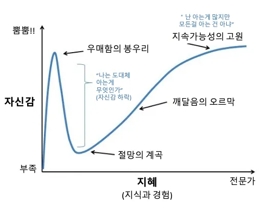

원칙이란 일관되게 고수해야 하는 근본적인 규범을 뜻한다. "SOLID 원칙은 객체지향 설계를 지향하는 개발자라면 마땅히 준수해야 하는 도그마(Dogma)다." 이 명제는 오랜 시간 나를 지배했다. 그러나 실제 개발 현장에서 마주한 '비용'이라는 벽 앞에서, 나는 규칙을 우회하고 깨뜨리는 범법자가 될 수밖에 없었다.

이 글은 SOLID 원칙을 절대선으로 믿고 지키려 분투하던 한 개발자가, 그 맹목적인 믿음의 균열을 마주하고 끝내 실용적인 타협점에 도달하기까지의 회고다.

## 의문의 회피와 부메랑

주니어 시절 Java 생태계에 입문하며 SOLID 원칙을 처음 접했다. 당시 개발 커뮤니티에서 이 원칙의 실효성을 두고 벌어지는 치열한 논쟁을 지켜보았으나, 깊이 고민하기보다 "필요할 때 적절히 적용하면 된다"는 타협적인 댓글 한 줄에 안도하며 골치 아픈 의문을 묻어두었다.

각 원칙이 어떤 단어의 두문자어(Acronym)인지, 면접을 대비해 암기해 둔 기계적인 예제와 정의가 아는 것의 전부였다. 그 이면의 설계적 고민에는 전혀 닿지 못했다. 부끄러운 고백이다.

몇 년의 시간이 흐르고, 스스로 모든 것을 안다고 착각하던 '우매함의 봉우리'에서 설계의 난관에 봉착하는 '절망의 계곡'으로 떨어졌을 때, 외면했던 SOLID에 대한 질문들이 부메랑처럼 돌아왔다. 마치 이제야 비로소 실질적인 설계를 고민할 최소한의 자격을 갖추었다는 듯이.

지나온 무지가 부끄러웠던 탓에 한동안 객체지향의 본질을 파고들며 SOLID 원칙을 강박적으로 학습했다. 다양한 설계 실험을 거듭하며 지식을 스펀지처럼 흡수하려 애썼다.

그러나 그토록 몰두하던 시절에도 단일 책임 원칙(SRP)만큼은 끝내 명쾌하게 소화하지 못했다. 머리로는 이론을 명확히 인지하고 있어도 가슴 깊이 와닿지 않았던 탓이다. 훗날 이 혼란을 돌아보기 위해 자료를 탐색하다 보니, 업계의 수많은 구루들 역시 단일 책임 원칙의 모호함에 대해 지적한 에세이들을 심심치 않게 발견할 수 있었다. 이 원칙은 유독 개발자의 주관적 해석과 경험적 배경에 따라 판이하게 정의된다. 누군가에게는 자명한 법칙이, 다른 누군가에게는 끝내 포착되지 않는 아지랑이 같은 것이다.

물론 로버트 마틴(Robert C. Martin)이 『클린 아키텍처』를 통해 명확히 정의한 기준은 존재한다. "하나의 모듈은 오직 하나의 액터(Actor)에 대해서만 책임져야 한다"는 것. 문제는 텍스트로서의 정의가 결여되어서가 아니라, 그 정의의 실체가 내 구체적인 개발 경험과 끝내 포개지지 않는다는 점에 있었다.

## 감각의 획득과 학습의 임계점

어린 시절 두발자전거를 처음 배우던 순간이 떠오른다. 아무리 발버둥 치며 중심을 잡으려 해도 균형은 번번이 무너졌고 그날은 결국 실패로 끝났다. 그러나 며칠이 지난 뒤 아무런 긴장 없이 올라탄 자전거는 마법처럼 중심을 잡고 앞으로 나아갔다. 학습 직후보다 일정 시간 휴식을 취한 뒤 수행 능력이 도약하는 '레미니센스(Reminiscence) 효과'다.

추상적인 설계 개념을 체득하는 과정도 이와 닮았다. 당시 나는 개발을 하며 처음으로 지적 '감동'을 경험했다. 머리를 싸매도 도무지 이해되지 않던 개념이, 오랜 시간 잠복기를 거친 뒤 사소한 계기를 통해 불현듯 손끝으로 이해되는 순간이었다. 비로소 지식의 주인이 되었다는 확신과 성취감은 나를 강하게 매료시켰다.

뇌리로 이해한 원칙들을 실제 코드로 검증하고 싶어 직접 오픈소스 라이브러리를 배포하기도 했다. 비록 지금은 관리하지 않는 유산에 가깝지만, 당시의 나에게는 배운 지식을 실험하는 든든한 실험실이었다.

- [nestjs-mvc-tools](https://www.npmjs.com/package/nestjs-mvc-tools)
- [angular-flow-oauth2](https://www.npmjs.com/package/@angular-flow/oauth2)

이러한 좋았던 경험이 누적되면서, 객체지향과 SOLID 원칙은 내 엔지니어링 정체성을 구성하는 필수결정적인 신념으로 자리 잡았다.

## 왜곡된 신념과 비대해진 복잡성

그러나 맹목적인 믿음은 독이 되어 돌아왔다. 어느 순간부터 SOLID는 비판적으로 검증하고 응용할 도구가 아니라, 무조건 복종해야 할 교리처럼 변질되었다. 그리고 그 강박이 임계점에 달했을 때, 나는 비로소 설계의 과잉을 인지하기 시작했다.

본래 나에게 소프트웨어 개발이란 무언가를 창작하는 즐거움이 본질이었다. 지식을 습득하고 이를 서비스에 투영하며 스스로 성장함을 확인하는 과정이 즐거움의 원천이었다. 그러나 원칙을 사수하는 데 과도하게 몰입하면서 주객이 전도되었다. 최종 결과물은 투입한 공수에 비해 조잡한 반면, 이를 떠받치는 코드 구조만 쓸데없이 거대하고 장황했다. 완벽하다고 자부하며 설계했던 구조조차 불과 몇 달 뒤에 열어보면 유지보수하기 까다로운 미로로 변해 있었다.

냉정한 성찰을 거치고 나서야 원인이 보였다. 업계에서 찬양받는 우아한 아키텍처와 디자인 패턴들은 대규모 조직과 복잡한 협업 환경에서 그 진가를 발휘하는 도구들이다. 나는 1인 프로젝트라는 소규모 환경에 대형 오픈소스의 옷을 억지로 껴입히고 있었다. 맞지 않는 옷을 입고 비대해진 복잡성을 감당하려 끙끙댄 셈이다.

이후 아키텍트 산디 메츠(Sandi Metz)의 에세이에서 내 지난 자책의 실체를 대변해 주는 명징한 문장을 발견했다.

> Duplication is far cheaper than the wrong abstraction.
> 잘못된 추상화보다 중복이 훨씬 싸다.
>
> — Sandi Metz, [The Wrong Abstraction](https://sandimetz.com/blog/2016/1/20/the-wrong-abstraction)

내가 구축해 둔 것은 미래의 유연성을 확보한 우아한 코드가 아니었다. 일어나지 않을 확장을 대비해 성급하게 쌓아 올린 '잘못된 추상화의 잔해'였을 뿐이다. 배운 기술을 과시하듯 어울리지 않는 패턴을 남발했고, 차라리 중복을 허용하는 직관적인 코드가 나았을 자리에 원칙이라는 이름으로 정교한 장벽을 쌓아 올렸다.

이를 계기로 비로소 아키텍처의 순수주의를 조금씩 덜어내기 시작했다. 사실 소규모 프로젝트에서는 객체지향의 찬란한 추상화가 꽃을 피우기 어려웠고, 반대로 거대하고 복잡한 프로덕션 환경에서는 우아한 설계 원칙보다 당장 쏟아지는 비즈니스 요구사항을 처리하는 속도와 기술 스택의 제약이 우선이었다.

결국 아키텍처적 완성도를 추구하던 내가 다다른 지점은 하나였다. 교조적인 규칙의 준수가 아닌, 제품을 지속 가능하게 굴릴 수 있는 실천적 개발 경험의 보존. 실용주의라는 명분 아래 내린 현실적인 타협이었다.

## 그래서, 아름다운가

한동안 신봉했던 가치들을 스스로 부정하고 타협해야 함을 수용한 순간, 개발자로서의 깊은 권태와 마주했다. 아키텍처에 정답이란 존재하지 않는다는 무력감이 마음 한구석을 짓눌렀다. 솔직히 고백하자면 이 글을 집필하는 지금도 그 복잡한 굴레에서 온전히 벗어나지 못했다. 어쩌면 머릿속을 표류하는 회의감을 한 편의 텍스트로 박제하여 정돈해 보고 싶었을지도 모른다.

내 인생에서 스스로 주도했던 학업은 프로그래밍이 처음이었다. 새로운 개념을 습득하는 도파민에 취해 앞만 보고 달렸던 것일까. 그 뜨겁던 열기가 차갑게 식어 내린 지금, 무엇이 엔지니어링의 정답인지 명쾌한 확신을 내리기 어렵다.

그럼에도 객체지향과 SOLID를 치열하게 쫓은 여정은 내게 값진 교훈을 남겼다. 나는 본성적으로 완벽한 설계를 지향하지만, 결코 완벽에 닿을 수 없음을 겸손히 인정하는 법을 배웠다. 한때는 더 엄격한 규칙과 원칙을 적층할수록 완벽에 수렴할 것이라 맹신했다. 그러나 지금 내가 나아가는 궤적은 정반대다. 더하는 설계가 아닌 빼는 설계, 원칙에 얽매이지 않고 과감하게 현실과 절충하는 타협의 미학에서 비로소 위안을 얻는다.

먼 훗날 더 넓은 시야를 가졌을 때, 이 고백을 뒤엎을 또 다른 깨달음을 얻을지도 모른다.

그러나 지금 이 시점의 나에게 SOLID 원칙은—그리 아름답지 않다.
