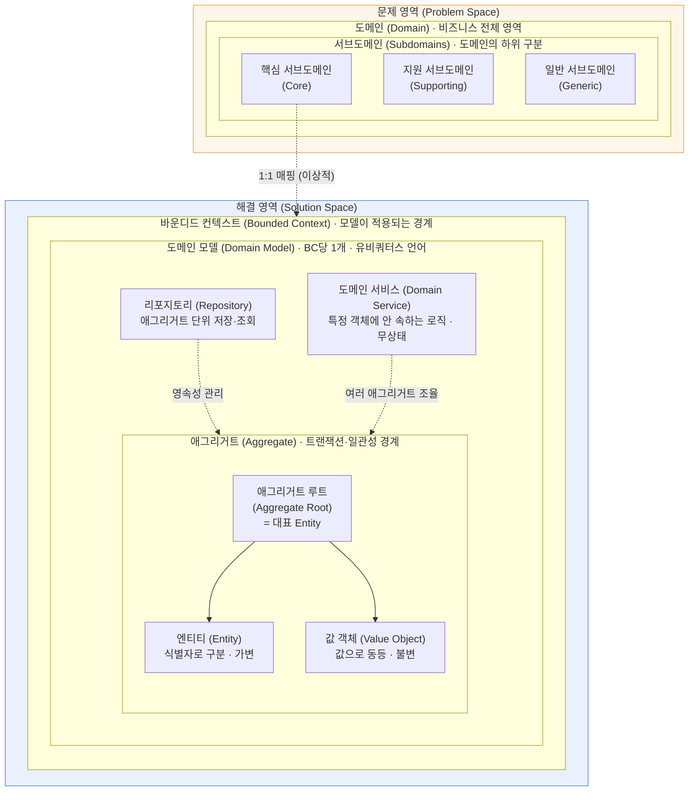
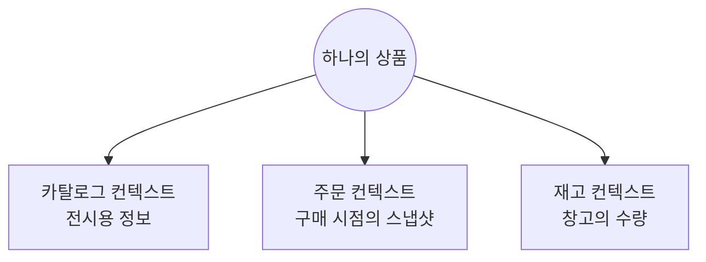
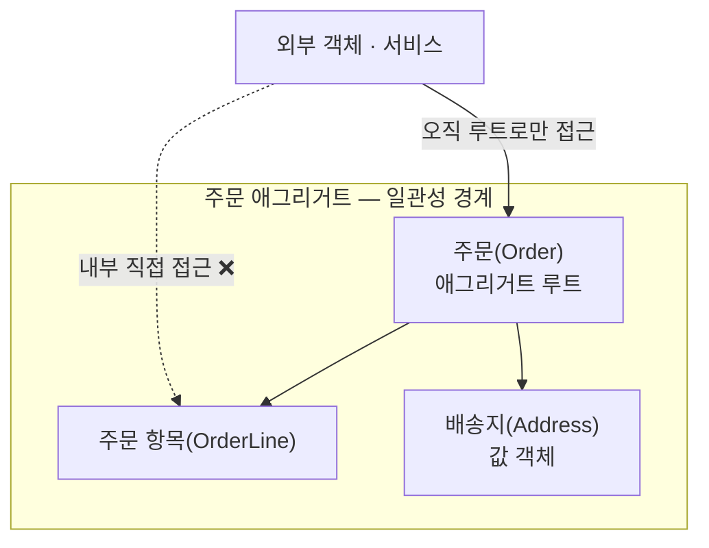

웹 애플리케이션을 개발하다 보면 자연스럽게 다양한 아키텍처를 접하게 된다. 레이어드, 클린, 헥사고날 등 이른바 '정석'이라 불리는 구조들이다. 그러나 교과서적인 정석들은 늘 내 손에 맞지 않았다. 때로는 불필요하게 무거웠고, 때로는 요구사항을 담아내기에 턱없이 가벼웠다.

결국 한동안은 나만의 방식으로 프로젝트 구조를 직관적으로 설계해 보았다. 그러나 스스로 설계한 구조의 타당성을 객관적으로 검증할 *명확한 기준*이 없었기에, 마음 한구석에는 늘 어설픈 봉합이 아닌가 하는 찜찜함이 맴돌았다.

'도메인 주도 설계(DDD)' 역시 처음에는 나와 상관없는 거대 담론으로 여겼다. 다수의 팀이 협업하는 대규모 비즈니스나 마이크로서비스 아키텍처(MSA)에서나 필요한 방법론이라 생각했기 때문이다. 그러나 변화에 유연하게 대응할 수 있는 아키텍처의 기준을 집요하게 고민할수록, 나는 결국 DDD라는 키워드 앞으로 회귀할 수밖에 없었다.

본론으로 들어가기 전에, 앞으로 풀어낼 개념들의 지도를 한 장 펼쳐 두려 한다. 도메인과 하위 도메인은 '무엇을 해결할 것인가'를 가르는 **문제 영역(Problem Space)**에 속하고, 바운디드 컨텍스트와 도메인 모델, 애그리거트는 '그것을 어떻게 모델링할 것인가'를 다루는 **해결 영역(Solution Space)**에 속한다. 이 다섯 단어는 제각기 떨어진 용어가 아니라, 바깥에서 안으로 서로를 감싸안는 동심원의 울타리에 가깝다. 이 글은 결국 그 울타리들을 하나씩 더듬어 나가는 여정이다.

이제 이 지도를 가장 바깥 울타리에서부터 안쪽으로, 한 겹씩 짚어 가며 풀어 보자. 출발점은 모든 것을 품는 가장 넓은 영역, '도메인'이다.

## 도메인이라는 개념의 경계

우리는 실무에서 '도메인'이라는 단어를 꽤 모호하고 직관적으로 사용한다. 기능 분석이나 요구사항 정의 회의에서 "이 도메인의 흐름은—" 하고 대화의 물꼬를 트는 식이다. 개념의 혼선을 막기 위해 도메인의 명확한 정의부터 짚어볼 필요가 있다. 도메인이란 우리가 구현하려는 소프트웨어 대상 전체이자, **현실 세계에서 코드로 해결하고자 하는 문제 영역(Problem Domain)** 그 자체다.

여기서 흥미로운 지점은 도메인을 규정하는 '관점의 상대성'이다. 내 프로젝트가 하나의 도메인인 까닭은, 그 프로젝트 자체가 내가 정의하고 해결하려는 주된 문제 공간이기 때문이다. 그러나 관점을 조금만 틀어보면 이야기는 달라진다. 내 시스템에서는 부차적인 기능 하나에 불과한 영역이, 다른 비즈니스 진영에서는 기업의 사활을 건 핵심 도메인일 수 있다. 예컨대 내 서비스에서 '결제'는 단순한 결제 연동 모듈에 불과하지만, PG(Payment Gateway)사에게 결제는 비즈니스의 본질이자 도메인 그 자체다.

이러한 상대적 관점을 대입해 보면, 흔히 우리가 프로젝트 내부에서 "주문 도메인", "상품 도메인"이라 칭하는 단위들은 엄밀히 말해 전체 도메인의 하위 범주인 **하위 도메인(Subdomain)**이다. 사실 실무 대화에서는 이 둘을 굳이 가려 쓰지 않아도 무방하다. 도메인과 하위 도메인의 관계만 정확히 이해하고 있다면, '주문 도메인'이라 부르든 '주문 하위 도메인'이라 부르든 소통에는 아무런 지장이 없기 때문이다. 다만 이 글에서는 혼동의 여지를 남기지 않기 위해, 하위 도메인은 끝까지 **'하위 도메인'이라 또렷이 표기**하려 한다. 이러한 용어의 혼용에 대해서는 『도메인 주도 설계 첫걸음』의 저자 블라드 코노노프(Vlad Khononov) 역시 솔직한 견해를 밝힌 바 있다.

> 핵심 하위 도메인은 핵심 도메인이라고도 부른다. 예를 들어 에릭 에반스의 『도메인 주도 설계』에서는 '핵심 하위 도메인'과 '핵심 도메인'을 같은 의미로 사용했다. '핵심 도메인'이라는 용어가 자주 쓰이지만, 나는 여러 이유로 '핵심 하위 도메인'이라는 표현을 더 선호한다. 핵심 도메인이 실제로는 하위 도메인이며, 비즈니스 도메인과의 혼동을 피할 수 있기 때문이다.

## 하위 도메인의 유형과 의사결정

하나의 거대한 도메인을 가치 있게 완성하려면 필연적으로 이를 쪼갠 여러 하위 도메인들을 유기적으로 결합해야 한다. 하위 도메인은 비즈니스의 복잡성을 완화하기 위해 영역을 식별하고 분할한 조각들이다. 이를 분류하는 표준적인 기준은 비즈니스 기여도와 개발 난이도에 따라 **핵심(Core), 일반(Generic), 지원(Support)** 하위 도메인으로 삼분하는 것이다.

| 하위 도메인 | 경쟁 우위 | 복잡성 | 변동성 | 구현 방식 | 문제의 성격 |
|------|:---:|:---:|:---:|:---:|:---:|
| **핵심(Core)** | 예 | 높음 | 높음 | 사내 개발 | 흥미로움 |
| **일반(Generic)** | 아니오 | 높음 | 낮음 | 구매/도입 | 해결됨 |
| **지원(Support)** | 아니오 | 낮음 | 낮음 | 사내 개발/하청 | 뻔함 |

전자상거래(E-Commerce) 서비스를 예로 들면, 주문 처리나 고유한 추천 엔진처럼 서비스의 정체성을 관통하는 영역이 핵심이다. **핵심 하위 도메인이 반드시 유일할 필요는 없다.** 비즈니스의 성격에 따라 주문과 상품 전시를 독립적인 두 개의 핵심 하위 도메인으로 병렬 구성하는 것도 자연스럽다.

반면 사용자 인증이나 PG 결제, 대용량 파일 저장소 등은 자체 구현의 난이도가 높을지언정 이미 시장에 완성도 높은 오픈소스와 클라우드 서비스(SaaS)가 존재한다. 바퀴를 새로 발명하기보다 검증된 기성 솔루션을 도입하는 편이 실용적이며, 이러한 기술 인프라 영역을 **일반 하위 도메인**으로 분류한다. 마지막으로 공지사항이나 기초 회원 정보 관리와 같이, 비즈니스 경쟁력은 낮지만 핵심 하위 도메인의 활성화를 돕는 조력자 역할을 수행하는 영역은 **지원 하위 도메인**으로 관리한다.

여기까지가 문제 공간을 분해하는 '분류'의 영역이었다면, 진짜 아키텍처적 고민은 이를 코드로 구현하는 해결 공간에서 마주하게 된다.

## 맥락의 울타리: 바운디드 컨텍스트

이 지점에서 등장하는 개념이 **바운디드 컨텍스트(Bounded Context)**다. 의미적으로 해석하면 '경계 지어진 맥락'으로, 모델과 언어가 통용되는 구체적인 환경에 명시적인 울타리를 설정하는 작업이다. 이 작업의 핵심 당위성은 현실 아키텍처에서 마주하는 하나의 아이러니에서 기인한다. 바로 **동일한 단어가 속한 하위 도메인에 따라 완전히 다른 개념으로 전치된다**는 사실이다.

전자상거래 시스템에서 '상품(Product)'은 어디서나 균일한 의미를 가질까. 카탈로그 하위 도메인에서 상품은 화려한 썸네일, 마케팅 상세 설명, 검색 태그의 집합이다. 반면 주문 하위 도메인에서 상품은 *결제가 이루어진 역사적 순간*의 명칭과 금액을 고정해 둔 불변의 스냅샷이다. 구매 이후 상품 가격이 변동하더라도 과거 주문 영수증의 금액이 훼손되면 안 되기 때문이다. 재고 하위 도메인에서의 상품은 단지 창고 랙(Rack)에 적재된 물리적 수량에 지나지 않는다. 이처럼 현실 세계의 동일한 대상조차, 각 맥락(Context)이 바라보는 단면은 완전히 상이하다.

책에서 말하는 위와 같은 내용은 머리로는 받아들일 수 있을지언정, 막상 *그래서 내 프로젝트에는 어떻게 대입하라는 것인가*에 이르면 좀처럼 손에 잡히질 않았다. 상품 예시는 어쩌면 지나치게 깔끔한 교과서적 사례인지도 모른다. 하나의 명사가 세 갈래 의미로 또렷이 갈라지니, 경계를 긋는 일이 점선을 따라 종이를 찢는 것마냥 자명해 보인다.

그래서 나는 평소 손풀기로 만지작거리던 투두리스트 확장 프로젝트를 펼쳐 놓고, 저 '상품'처럼 의미가 갈라지는 명사를 찾아 한참을 헤맸다. 그런데 아무리 뜯어봐도 그런 단어가 보이질 않았다. '할일(Task)'은 어디서나 그저 할일이었다. 그러다 문득, 어쩌면 내가 출발점부터 질문을 잘못 쥐고 있었던 게 아닐까 하는 생각이 들었다.

적어도 지금의 나로서는, '같은 단어가 다른 의미를 갖는 지점'이 컨텍스트를 *나누는 기준*이라기보다, 하나로 뭉쳐 있어 경계가 보이지 않던 모델 안에 사실은 둘이 숨어 있었음을 들춰내는 *탐지기*에 가깝지 않나 싶다. 상품이 그런 숨은 분열의 사례일 것이다. 가령 카탈로그·주문·재고의 관심사를 한데 아우르는 단 하나의 거대한 `Product` 클래스를 빚는다면, 홍보용 텍스트와 결제 시점의 스냅샷 가격과 실시간 재고 수량이 한 객체 안에 뒤엉킨다. 어느 한 영역의 룰이 바뀔 때마다 비대한 클래스 전체가 동요할 테니, 경계 침범이 빚어내는 스파게티성 커플링에 가깝다. '같은 단어 다른 의미'라는 신호는 이렇듯 이미 한 덩어리로 엉겨 붙은 것을 갈라내야 할 때 비로소 쓸모를 갖는 듯하다.

그렇게 보면 많은 경계는 애초에 그런 탐지기를 필요로 하지 않는 것 같다. 서로 다른 일을 하는 영역들은 단어가 갈리는지 따져볼 것도 없이 그냥 다른 컨텍스트인 셈이니까. 내 투두 프로젝트의 '할일 관리'와 '알림'이 그런 경우라고 느낀다. 할일 관리는 *무엇을 할지*를 다루는 세계라 할일·우선순위·목록·완료라는 말로 굴러가고, 알림은 *메시지를 언제 어디로 보낼지*의 세계라 채널·발송 시각·성공과 실패·읽음이라는 말로 굴러간다. 두 세계의 어휘는 거의 겹치지 않는다. 심지어 알림은 할일을 모델로 품지조차 않고, 그저 할일의 식별자와 보낼 시각을 참조할 따름이다. 할일에 하위 할일 기능을 보태도 알림은 무심하고, 알림에 새 발송 채널을 늘려도 할일 관리는 아랑곳하지 않는다. 이렇게 각자 자족적으로 돌아가며 서로의 변경에 흔들리지 않는다면, 굳이 단어를 비교하지 않아도 다른 컨텍스트로 보아도 괜찮지 않을까 싶다.

부엌과 화장실이 다른 공간인 까닭을 떠올리면 조금 쉬워진다. 두 방이 나뉘는 것은 '물'이라는 단어가 양쪽에서 다른 뜻이어서가 아니라, 단지 그곳에서 벌어지는 일이 다르기 때문이다. '같은 단어 다른 의미'는 오히려, 한 칸을 부엌 겸 화장실로 욱여 쓰다가 "이 싱크대를 설거지에도 양치에도 쓰고 있구나" 하고 뒤엉킨 것을 갈라낼 때에야 떠오르는 사후적 단서에 가까운 듯하다.

이렇게 더듬다 보니 경계를 가늠하는 상황이 내 안에서 대략 둘로 나뉘었다. 서로 다른 주제가 각자의 언어로 자족하면 그저 다른 컨텍스트이니 단어를 비교할 일이 없고(할일 관리 vs 알림), 같은 대상을 두 맥락이 서로 다르게 바라볼 때라야 비로소 '같은 단어 다른 의미'가 뭉친 것을 쪼개라는 신호로 등장하는 것 같다(상품). 물론 이건 어디까지나 지금 내가 짚어 본 기준일 뿐, 정답이라고 내세울 만한 것은 못 된다. 참고로 한 컨텍스트 안에서 모델이 하나의 분명한 의미로 통하도록 떠받치는 이 전용 언어를, DDD에서는 유비쿼터스 언어(Ubiquitous Language)라 부른다고 한다.

## 경계 안의 경계: 도메인 모델과 애그리거트

울타리를 세웠다면, 이제 그 안에 무엇이 담기는지를 들여다볼 차례다. 바운디드 컨텍스트 하나는 그 안에 정확히 하나의 **도메인 모델(Domain Model)**을 품는다. 사실 이것이 컨텍스트가 존재하는 이유이기도 하다. 경계 안에서는 같은 용어가 늘 같은 의미를 가지며, 모델이 모순 없이 한 덩어리로 맞물린다.

다만 '모델 하나'를 '클래스 하나'로 읽으면 곤란하다. 여기서 말하는 도메인 모델은 단일 객체가 아니라, 여러 구성 요소가 하나의 언어 체계로 묶인 *통일된 모델 체계*를 가리킨다. 그리고 그 구성 요소들은 데이터를 실어 나르는 수동적인 DTO에 머무르지 않고, 비즈니스 규칙과 행위(Behavior)를 제 안에 품은 객체들이다. 역할에 따라 크게 네 가지로 나뉜다.

| 구성 요소 | 한 줄 정의 |
|------|-----------|
| **엔티티(Entity)** | 식별자(ID)로 구분되고 생명주기를 갖는 객체 |
| **값 객체(Value Object)** | 식별자 없이 값 자체로 동등성이 결정되는 객체 |
| **애그리거트(Aggregate)** | 함께 일관성을 지켜야 하는 엔티티·값 객체의 묶음 |
| **도메인 서비스** | 특정 엔티티에 넣기 애매한 도메인 로직 |

여기서 한 가지는 짚고 넘어가고 싶다. 흔히 도메인 모델은 영속성의 때를 묻히지 않은 '순수한' 객체여야 한다며, 도메인 모델과 영속성 모델을 갈라 그 사이에 매퍼를 끼우라고들 한다. 다만 내 생각은 조금 다르다. 실제로 엔티티는 대개 테이블과 일대일로 짝을 이루고, ORM이라는 도구 자체가 객체 지향과 관계형 데이터베이스 사이의 불일치(Impedance Mismatch)를 메우려 태어난 것이다. 그렇다면 순수성을 사수하겠다고 매퍼 계층을 따로 두기보다, ORM이 주는 이점을 그대로 누리며 둘을 하나로 합치는 편이 낫지 않나 싶다. 적어도 단일 모놀리식 환경에서라면, 엔티티 하나가 영속성 매핑과 도메인 행위를 함께 짊어져도 충분히 실용적이라고 본다.

이 구성 요소들 가운데 애그리거트는 그 자체로 컨텍스트 안에 놓인 또 하나의 작은 경계다. 그래서 따로 떼어 들여다볼 가치가 있다.

애그리거트는 *언제나 함께 일관성을 지켜야 하는* 엔티티와 값 객체를 한 덩어리로 묶은 단위다. 그리고 그 덩어리의 대표로 단 하나의 엔티티를 세우는데, 이를 **애그리거트 루트(Aggregate Root)**라 한다. 바깥세상은 오직 이 루트를 통해서만 애그리거트에 접근할 수 있고, 내부의 자식 객체를 직접 붙잡는 일은 막힌다. 모든 변경이 루트라는 단일 출입구를 거치게 함으로써, 루트가 문지기처럼 묶음 전체의 규칙(불변식)을 지켜내는 셈이다.

가령 위의 '주문' 애그리거트에서 외부는 `주문(Order)` 루트만 손에 쥔다. 항목을 더하고 빼는 일조차 루트를 거치니, "주문 총액은 늘 항목들의 합과 같다" 같은 규칙이 한 군데에서 안전하게 지켜진다.

물론 애그리거트를 어떻게 나누고 일관성을 어디까지 책임질지는 그 자체로 묵직한 주제다. 다만 이 글의 본래 목적이 바운디드 컨텍스트를 이해하는 데 있었던 만큼, 애그리거트의 깊은 설계는 다른 글로 미뤄 두고 여기서는 이 정도로 갈무리하려 한다.

## 마치며

도메인의 경계를 긋고 맥락의 울타리를 치는 일은 늘 아키텍처의 큰 화두다. 사실 도메인의 순수성을 강제하는 규칙이 도메인 주도 설계(DDD)에서 온 것인지, 혹은 클린 아키텍처의 의존성 역전 규칙에서 온 것인지는 명확히 가리기 어렵다. 두 패러다임 모두 지향하는 형태는 다르지만 도메인 로직이 외부 기술이나 데이터베이스 스키마에 오염되지 않도록 '순수하게 격리할 것'을 강조하기 때문이다.

그러나 도메인을 얼마나 완벽하게 보호하든 결국 가장 중요한 가치는 '적당함'과 '유연함'이라고 생각한다. 아직까지 나는 도메인의 순수성을 철저히 지키지 않았다고 해서 시스템이 붕괴하거나 치명적인 실패를 겪은 적은 없다. 반대로, 프로젝트 초기부터 이상적인 순수주의 설계를 고집하다가 장황한 코드 구조와 복잡함의 무게를 이기지 못해 좌절했던 기억은 선명하다. 

나에게 도메인 주도 설계는 순수함 그 자체가 목표가 아니라, 내 설계가 합당한지를 스스로 되묻게 해주는 잣대에 가깝다. 정답을 내미는 교본이라기보다, 더 나은 타협점을 찾도록 돕는 하나의 언어인 셈이다.