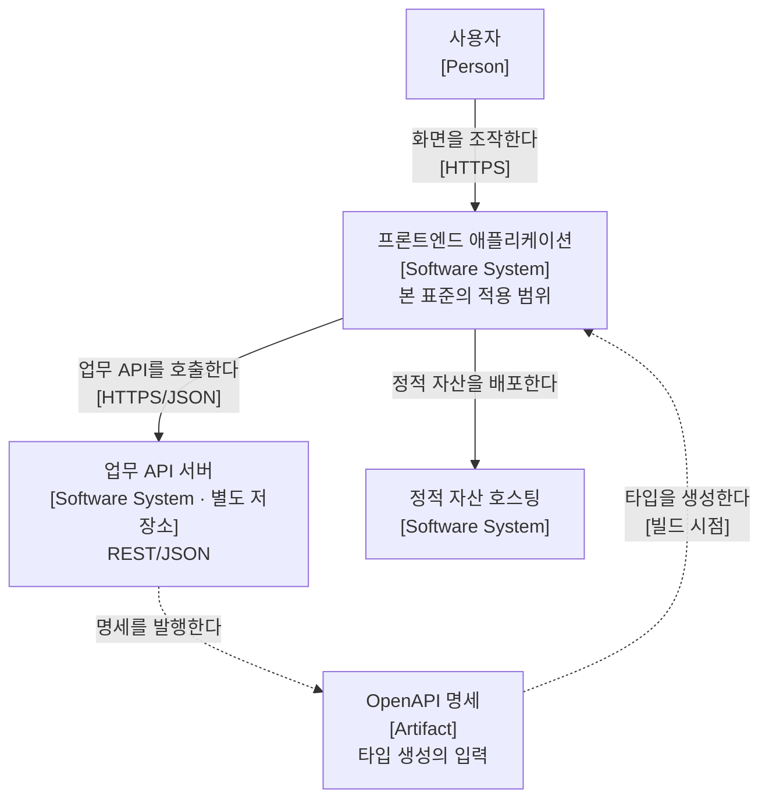
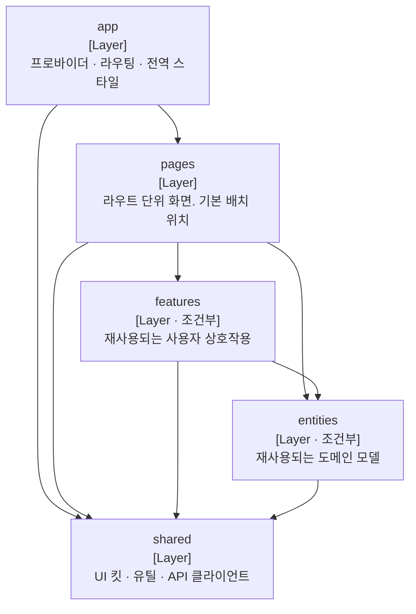

# 프론트엔드 아키텍처

본 문서는 Angular 기반 프론트엔드 애플리케이션의 구조, 모듈 경계, 그리고 주요 설계 결정과 근거를 기술하는 표준 명세입니다.

특정 시스템 하나의 명세가 아니라 **여러 프로젝트에 적용하는 규범집**입니다. 프로젝트마다 달라지는 항목은 본 문서에서 판단 기준만 제시하고 구체 구성은 각 프로젝트 저장소가 소유합니다.

문서의 전체 체계는 소프트웨어 아키텍처 문서화 표준 프레임워크인 [arc42](https://arc42.org/) 12절 구조를 따르며, 구성 요소 간 관계 시각화에는 [C4 Model](https://c4model.com/) 표기 규약을 적용했습니다. 모듈 분할 방법론은 [Feature-Sliced Design](https://fsd.how/) v2.1을 채택했습니다.

각 항목의 세부 규칙은 [references/](references/) 디렉터리의 개별 참조 문서가 원본입니다. 본 문서는 목차와 판단 근거만 제공합니다.

| 찾고자 하는 항목 | 관련 섹션 및 참조 문서 |
| :--- | :--- |
| **새 코드를 어디에 둘 것인가** | §8.1 → [패키지 배치와 참조 규칙](references/패키지-배치와-참조-규칙.md) |
| **서버 데이터의 조회와 캐시** | §8.2 → [서버 상태와 클라이언트 상태](references/서버-상태와-클라이언트-상태.md) |
| **대기 중 무엇을 보여주는가** | §8.3 → [로딩 전략](references/로딩-전략.md) |
| **SSR · 하이드레이션 경계** | §8.4 → [렌더링 전략](references/렌더링-전략.md) |
| **서버 타입과 화면 모델** | §8.5 → [API 계약 소비](references/API-계약-소비.md) |
| **화면 골격과 스크롤** | §8.6 → [레이아웃](references/레이아웃.md) |
| **화면 이동과 URL 상태** | §8.7 → [라우팅과 네비게이션](references/라우팅과-네비게이션.md) |
| **폼 검증의 역할 분담** | §8.8 → [폼과 검증](references/폼과-검증.md) |
| **컴포넌트의 상태 소유** | §8.9 → [컴포넌트 설계](references/컴포넌트-설계.md) |
| **UI 킷과 디자인 토큰** | §8.10 → [디자인 시스템과 토큰](references/디자인-시스템과-토큰.md) |
| **기기별 UI 전환** | §8.11 → [적응형 UI](references/적응형-UI.md) |
| **토큰 보관과 XSS 대응** | §8.12 → [보안](references/보안.md) |
| **에러 표시와 관측** | §8.13 → [예외 · 에러 표시 · 로깅](references/예외-에러표시-로깅.md) |
| **키보드 조작과 스크린리더** | §8.14 → [접근성](references/접근성.md) |
| **번들 예산과 측정** | §8.15 → [성능](references/성능.md) |
| **파일명과 식별자 규약** | §8.16 → [명명 규칙](references/명명-규칙.md) |
| **검증 수준과 도구** | §8.17 → [테스트](references/테스트.md) |
| **구성 파일과 실행 명령** | §2 → [개발 환경](references/개발-환경.md) |
| **아키텍처 결정 기록 (ADR)** | §9 → [decisions/](decisions/) |

arc42 12개 절 중 본 문서에서 다루지 않는 절은 해당 절 본문에 사유를 명시했습니다.

## 1. 서론과 목표

### 본 문서의 역할

본 문서는 프론트엔드 코드의 배치와 참조 규칙을 정의합니다. 업무 기능이나 화면 요구사항은 다루지 않으며, 그 원본은 각 프로젝트의 요구사항정의서와 유스케이스 명세서입니다.

주된 독자는 **작성자 본인과 AI 코딩 에이전트**입니다. 에이전트가 규칙을 읽고 코드를 올바른 위치에 배치하는 것이 1차 목적이며, 사람이 읽는 것은 2차입니다. 이 우선순위가 §1의 품질 목표와 §4의 전략 선택을 결정합니다.

### 품질 목표

| 순위 | 품질 목표 | 정의 및 선정 사유 |
| :---: | :--- | :--- |
| **1** | **예측 가능성 (Predictability)** | 규칙만으로 코드의 배치 위치가 일의적으로 결정됩니다. 배치가 결정적이면 위반 자체가 덜 발생하므로, 위반을 사후에 차단하는 것보다 상위에 둡니다. |
| **2** | **규칙의 자동 강제 (Automation)** | 린터와 CI로 차단되는 규칙만 실효성을 가집니다. 문서상의 규약은 준수를 보장하지 못하므로, 1순위를 실효화하는 수단으로 배치합니다. |
| **3** | **변경 유연성 (Maintainability)** | 화면 요구사항 변경이 구조 수정으로 번지지 않아야 합니다. 1·2와 충돌할 때 양보하는 쪽입니다. |

성능과 접근성은 품질 목표 서열에 포함하지 않습니다. 두 항목 모두 §10의 검증 항목과 §11의 자동 강제 수단으로는 등재하되, 목표 서열에서 제외한 이유는 프로젝트마다 요구 수준이 크게 달라 규범집 차원의 순위를 정할 수 없기 때문입니다.

상기 세 목표의 우선순위는 §4의 아키텍처 전략을 결정하는 기준입니다. FSD를 채택하고 `widgets` 계층을 도입하지 않은 근거는 **예측 가능성(목표 1)** 이며, 조회 수단으로 외부 라이브러리 대신 프레임워크 내장 API를 우선한 근거도 같습니다.

### 이해관계자별 관심사

| 이해관계자 | 주요 관심사항 |
| :--- | :--- |
| **AI 코딩 에이전트** | 코드 배치 위치의 판정 규칙, 계층 간 참조 허용 범위 |
| **프론트엔드 개발자** | 슬라이스 구조, 상태 소유 위치, UI 킷 사용 방법 |
| **백엔드 개발자** | API 계약 변경이 프론트엔드에 미치는 영향 범위 |

## 2. 제약 조건

시스템 구조 선택 및 아키텍처 결정(§4)의 전제가 되는 제약사항입니다.

### 기술 스택

본 표준은 프레임워크 중립이 아니며 Angular를 전제합니다. 중립적으로 기술하면 규칙이 "상태를 적절히 분리합니다" 수준으로 흐려져 판정 기준으로 기능하지 못하기 때문입니다.

| 항목 | 값 | 비고 |
| :--- | :--- | :--- |
| **프레임워크** | Angular 22 | |
| **스타일** | Tailwind CSS 4 | Spartan이 `>=4.0.0`을 요구합니다 |
| **렌더링** | Angular SSR | 경로별 모드는 §4-3에서 정합니다 |
| **테스트 러너** | Vitest | |
| **TypeScript** | 6.0 | `@angular/compiler-cli`의 peer 범위가 `>=6.0 <6.1`이므로 선택 항목이 아닙니다 |
| **UI 기반** | Spartan (brain + helm), Angular CDK | brain이 CDK를 peer로 요구합니다 |

버전과 의존성의 원본은 `package.json`입니다. 본 문서에 버전 목록을 중복 기재하지 않습니다.

### 대상 시스템이 고정되지 않음

본 문서는 규범집이므로 특정 시스템의 외부 연계나 배포 환경을 알 수 없습니다. arc42 §3과 §7은 이 제약의 직접적 결과이며, 해당 절에서 구체 구성 대신 판단 기준만 제시하거나 프로젝트 문서로 위임합니다.

### 백엔드 분리

- 백엔드는 별도 저장소로 관리되며 REST API 계약이 유일한 인터페이스입니다.
- 계약 변경 시 양측 사전 협의가 필요하며, 기존 응답 필드 삭제보다 필드 추가의 변경 비용이 낮습니다.
- 이 비대칭은 §8.5에서 생성 타입을 상위 계층에 그대로 노출하기로 한 결정의 근거입니다.

### 문서화 정책

- 본 저장소의 Markdown 문서가 아키텍처 명세의 원본입니다.
- 규칙의 강제 수단 설정(`eslint.config.js`, `steiger.config.ts`, `angular.json`의 budgets)은 그 자체가 원본이며, 본 문서는 참조만 합니다. 설정값을 문서에 옮겨 적으면 두 벌이 되어 한쪽이 낡습니다.

구성 파일의 역할과 실행 명령은 [개발 환경](references/개발-환경.md)이 원본입니다.

## 3. 컨텍스트와 범위

### 시스템 컨텍스트의 전형 (System Context)

구체적인 외부 연계는 프로젝트마다 다르므로 본 문서는 전형적인 형태만 제시합니다. 각 프로젝트는 자신의 `docs/아키텍처.md`에서 실제 구성을 기술합니다.

범례: 사각형은 사용자 또는 소프트웨어 시스템이며 대괄호 안은 요소의 종류입니다. 실선 화살표는 런타임 의존 관계, 점선 화살표는 빌드 시점의 산출물 흐름을 나타냅니다. 본 표준의 관리 범위는 `프론트엔드 애플리케이션` 내부이며 나머지는 외부 요소입니다.

### 데이터 조립 위치의 판정 기준

여러 API 응답을 조합해야 하는 화면에서 서버가 집계할지 프론트엔드가 조합할지에 대한 판단 기준입니다.

프론트엔드에서 분할 호출하면 HTTP 왕복 비용이 추가되므로 기본적으로 서버 측 집계를 우선 요청합니다.

| 조립 위치 | 선택 기준 |
| :--- | :--- |
| **서버 (API)** | 목록 조회 시 행별 추가 조회가 필요한 경우 조립 로직에 업무 규칙이 포함된 경우 데이터 간 시점 일관성이 필요한 경우 |
| **화면 (Front)** | 각 데이터가 독립적인 UI 영역으로 분리된 경우 영역별로 권한 체계가 다른 경우 화면마다 조합 규칙이 달라지는 경우 |

판정이 모호하면 재사용성을 기준으로 구분합니다. 여러 화면이 동일한 조합 형태를 사용하면 서버에 응답 구조를 요청하고, 특정 화면 전용의 1회성 조합이면 프론트엔드에서 조립합니다.

## 4. 아키텍처 전략

품질 목표(§1)와 제약 조건(§2)을 달성하기 위한 세 가지 전략입니다.

### 1) 모듈 경계 — Feature-Sliced Design

코드 분할 방법론으로 [FSD v2.1](https://fsd.how/)을 채택합니다. 계층 간 단방향 임포트와 슬라이스 공개 API가 방법론 자체에 정의되어 있고, 공식 린터(Steiger)로 강제됩니다.

- **선택 사유:** 배치 규칙과 그 강제 수단이 이미 정의되어 있어 규범을 재발명하지 않아도 됩니다. 에이전트가 이미 학습한 규범이므로 문서 분량이 줄어듭니다. 목표 1과 2를 동시에 만족합니다.
- **트레이드오프:** FSD 공식 프레임워크 통합 가이드에 Angular가 포함되어 있지 않습니다(Next.js · Nuxt · Vite · Astro만 존재). Angular와의 교차 규칙은 본 표준이 직접 정의해야 하며, 검증된 선례가 부족합니다(§11 참조).

계층은 최소 구성으로 시작합니다. `app` · `pages` · `shared` 세 계층만 두고, `features`와 `entities`는 동일 코드가 실제로 두 곳 이상에서 사용되는 것이 확인된 시점에 생성합니다. **`widgets` 계층은 사용을 금지합니다.**

`widgets`를 금지하는 근거는 다음과 같습니다. FSD 현행 공식 문서([fsd.how](https://fsd.how/))가 이 계층의 신규 도입을 비권장하며, 사유는 "재사용 가능한 UI 블록"(widgets)과 "재사용 가능한 사용자 상호작용"(features)의 정의가 겹쳐 경계가 불분명해진다는 것입니다. 하나의 코드가 두 정의를 동시에 만족하면 배치 위치가 두 개가 되어 목표 1과 정면으로 충돌합니다.

> **주의: 두 공식 문서 사이트의 서술이 다릅니다**
> 구 문서 사이트인 [feature-sliced.design](https://feature-sliced.design/docs/reference/layers)은 `widgets`를 정상 계층으로 기술하며 비권장 문구가 없습니다. 현행 사이트인 [fsd.how](https://fsd.how/)와 공식 FSD 스킬만이 비권장을 명시합니다. 구 사이트를 근거로 이 결정을 되돌리지 않습니다.

### 2) 상태 소유권 — 세 종류의 분리

상태를 수명과 소유자에 따라 세 가지로 나누고, 각각의 저장 위치를 고정합니다.

| 상태 종류 | 소유 위치 | 수명 |
| :--- | :--- | :--- |
| **서버 상태** | 조회 지점의 `api` · `model` 세그먼트 | 서버가 원본이며 화면은 사본을 들고 있습니다 |
| **클라이언트 상태** | 해당 컴포넌트 또는 슬라이스의 `model` 세그먼트 | 화면 수명과 동일합니다 |
| **URL 상태** | Angular Router의 경로와 쿼리 파라미터 | 브라우저 히스토리가 소유합니다 |

서버 상태의 조회 수단은 **화면 진입에 필수인가**로 갈립니다.

| 조건 | 수단 |
| :--- | :--- |
| 화면 진입에 필수 | 라우트 리졸버 (`ResolveFn`) |
| 필수가 아님 (오버레이 내부, 보조 정보, 폴링) | `httpResource` |

- **선택 사유:** 데이터를 진입 전에 받으면 반쯤 채워진 화면과 순차적 레이아웃 이동이 발생하지 않습니다. 로딩 표현을 화면마다 설계하지 않아도 되므로 목표 1에 부합합니다. 판정이 "필수인가" 하나로 고정되어 배치 결정에 재량이 들어가지 않습니다.
- **트레이드오프:** 첫 표시가 가장 느린 요청에 묶입니다. 리졸버는 지연 로딩되지 않아 초기 번들에 포함되므로 가볍게 유지해야 합니다.

`httpResource`는 교차 화면 캐시, 요청 중복 제거, 키 단위 무효화를 제공하지 않습니다. 이 기능들이 실측으로 필요해지면 TanStack Query 도입을 ADR로 판단합니다. 도입 이전까지는 무효화 신호를 `shared`에 두어 계층 위반 없이 해소합니다(§8.2).

목록 필터나 페이지 번호를 컴포넌트 상태가 아닌 URL에 두는 이유는 두 가지입니다. 새로고침·뒤로가기·링크 공유가 별도 구현 없이 동작하고, **로딩 표현의 판정이 URL 비교로 자동 결정되기 때문**입니다(§8.3).

### 3) 렌더링 경계 — 인증 여부에 따른 분리

경로별 렌더링 모드를 인증 필요 여부로 가릅니다.

| 경로 | 모드 | 근거 |
| :--- | :--- | :--- |
| **공개 경로** (랜딩, 로그인, 약관) | `RenderMode.Prerender` | 사용자별 데이터가 없어 빌드 시점에 생성 가능합니다 |
| **그 외 전체** (`**`) | `RenderMode.Client` | 기본값을 안전한 쪽에 둡니다 |

- **선택 사유:** 인증 화면을 서버에서 렌더링하려면 서버가 인증 상태를 알아야 하고, 이는 토큰을 httpOnly 쿠키로 강제해 백엔드와의 협의를 요구합니다. 규범집 차원에서 백엔드 인증 방식을 강제하지 않기 위해 인증 화면을 클라이언트 렌더링으로 둡니다.
- **트레이드오프:** SSR의 이득이 공개 경로에 국한됩니다. 업무 화면의 초기 로딩은 순수 클라이언트 렌더링과 동일합니다.

`**`를 `Client`로 둔 것은 목표 1의 적용입니다. 규칙을 모르는 사람이나 에이전트가 라우트를 추가해도 기본값이 안전한 쪽으로 떨어져 빌드가 깨지지 않습니다. 정적 생성은 명시적으로 열거한 경로만 받습니다.

이 결정은 §8.11의 적응형 UI 제약과 직접 연결됩니다. 서버에는 포인터와 뷰포트가 없어 적응형 컴포넌트가 하이드레이션 불일치를 일으키는데, 업무 화면 전체가 `Client` 모드이므로 이 위험에서 벗어납니다.

## 5. 빌딩블록 뷰 (Building Block View)

애플리케이션 내부는 FSD 계층으로 구성됩니다.

범례: 사각형은 FSD 계층이며 대괄호 안의 `조건부`는 재사용이 확인된 뒤에만 생성하는 계층을 뜻합니다. 화살표는 허용된 임포트 방향이며, 화살표가 없는 방향의 임포트는 금지입니다. 동일 계층 내 슬라이스 간 임포트도 금지입니다.

| 계층 | 역할 | 생성 시점 |
| :--- | :--- | :--- |
| **app** | 프로바이더 등록, 라우트 설정, 전역 스타일, 애플리케이션 진입 | 필수 |
| **pages** | 라우트 단위 화면과 그 화면 전용 로직. **기본 배치 위치** | 필수 |
| **features** | 여러 화면에서 재사용되는 사용자 동작과 그 UI | 2곳 이상 사용 확인 후 |
| **entities** | 여러 화면에서 재사용되는 도메인 모델과 규칙 | 2곳 이상 사용 확인 후 |
| **shared** | 비즈니스 로직이 없는 인프라. UI 킷, 유틸, API 클라이언트, 인증 토큰 | 필수 |

Angular 프로젝트의 `src/app` 디렉터리를 FSD `app` 계층으로 그대로 사용합니다. Angular는 라우팅이 코드 기반이라 폴더명을 선점하지 않으므로, Next.js가 요구하는 접두사 없이 FSD 정석 레이아웃을 사용할 수 있습니다.

상세 참조: [패키지 배치와 참조 규칙](references/패키지-배치와-참조-규칙.md)

## 6. 런타임 뷰 (Runtime View)

구체적인 화면 흐름과 업무 시퀀스는 각 프로젝트의 요구사항정의서와 유스케이스 명세서가 원본이므로 본 문서에 기재하지 않습니다.

계층을 넘나드는 공통 호출 규칙은 §8.1과 §8.2에 있으며, 조회·명령·무효화의 흐름은 [서버 상태와 클라이언트 상태](references/서버-상태와-클라이언트-상태.md)가 원본입니다.

## 7. 배포 뷰 (Deployment View)

**해당 없음.** 본 문서는 규범집이므로 배포 대상 환경과 파이프라인을 알 수 없습니다.

각 프로젝트가 자신의 `docs/아키텍처.md` §7에서 실제 브랜치 전략과 배포 파이프라인을 기술합니다. 파이프라인 정의의 원본은 각 프로젝트의 CI 설정 파일입니다.

절을 생략하지 않고 비워 두는 이유는 자매 백엔드 문서와 절 번호를 맞춰 두 문서 사이를 이동할 때 대응 관계가 유지되도록 하기 위함입니다.

## 8. 횡단 개념 (Cross-cutting Concepts)

전 계층에 공통 적용되는 원칙입니다. 세부 규칙은 각 참조 문서가 원본이며 본 절은 목차 역할만 합니다.

### 8.1 계층 배치와 참조 방향
임포트는 하위 계층으로만 향합니다. 동일 계층 슬라이스 간 임포트는 금지하며, 슬라이스 외부는 `index.ts` 공개 API를 통해서만 접근합니다. 애매한 코드는 `pages`에 둡니다.
→ [패키지 배치와 참조 규칙](references/패키지-배치와-참조-규칙.md)

### 8.2 서버 상태와 클라이언트 상태
서버 상태는 조회 지점이 소유하고, 무효화 신호는 `shared`에 두어 상위 계층 참조 없이 전달합니다.
→ [서버 상태와 클라이언트 상태](references/서버-상태와-클라이언트-상태.md)

### 8.3 로딩 전략
화면 진입에 필수인 데이터는 라우트 리졸버로 진입 전에 받고, 대기 중에는 이전 화면을 유지한 채 베일을 덮습니다. 스켈레톤은 사용하지 않습니다. 베일과 인디케이터의 선택은 URL 경로 비교로 자동 결정됩니다.  
→ [로딩 전략](references/로딩-전략.md)

### 8.4 렌더링 경계
공개 경로만 정적 생성하고 나머지는 클라이언트 렌더링합니다. `shared`의 코드는 모듈 최상위에서 브라우저 API를 호출하지 않습니다.
→ [렌더링 전략](references/렌더링-전략.md)

### 8.5 API 계약 소비
서버 응답 타입은 OpenAPI 명세에서 생성하며 손으로 작성하지 않습니다. 생성물은 `shared/api/generated/`에 두고 수정을 금지합니다.
→ [API 계약 소비](references/API-계약-소비.md)

### 8.6 레이아웃
화면 골격은 `app` 계층이 소유하며 `pages`는 자신이 어느 레이아웃에 놓이는지 알지 못합니다. 스크롤 컨테이너의 위치가 골격을 나누는 기준이며, HTTP 에러는 셸을 유지하지 않고 전체 화면으로 통일합니다.  
→ [레이아웃](references/레이아웃.md)

### 8.7 라우팅과 네비게이션
목록 필터·정렬·페이지 번호는 URL 쿼리 파라미터가 소유합니다. 라우트 가드는 사용자 경험을 위한 장치이며 인가 수단이 아닙니다.
→ [라우팅과 네비게이션](references/라우팅과-네비게이션.md)

### 8.8 폼과 검증
프론트엔드 검증은 즉시 피드백을 위한 것이며 서버 검증을 대체하지 않습니다.
→ [폼과 검증](references/폼과-검증.md)

### 8.9 컴포넌트 설계
상태는 그것을 사용하는 최소 범위가 소유합니다. 슬라이스 내부의 표현 컴포넌트는 공개 API로 내보내지 않습니다.
→ [컴포넌트 설계](references/컴포넌트-설계.md)

### 8.10 디자인 시스템과 토큰
색상·간격·타이포그래피의 원본은 `styles.css`의 CSS 변수입니다. 임의 색상값의 직접 기재를 금지합니다. Spartan helm 컴포넌트는 `shared/ui`로 복사한 뒤 자유롭게 수정합니다.
→ [디자인 시스템과 토큰](references/디자인-시스템과-토큰.md)

### 8.11 적응형 UI
기기 판정 축은 화면 너비가 아니라 포인터 정밀도와 호버 가능 여부입니다. 컴포넌트는 미디어 쿼리 문자열을 직접 갖지 않고 `shared/lib/adaptive`의 의미 신호만 사용합니다.
→ [적응형 UI](references/적응형-UI.md)

### 8.12 보안
인증 토큰의 보관 위치는 `shared/auth`가 단독으로 소유합니다.

> **주의: 라우트 가드는 인가가 아닙니다**
> 라우트 가드는 사용자가 접근 불가한 화면으로 이동하는 것을 막아 경험을 개선하는 장치입니다. 클라이언트 코드는 전부 조작 가능하므로 가드만으로 데이터 접근을 통제할 수 없습니다. 모든 인가 판정의 최종 책임은 서버에 있으며, 프론트엔드는 서버가 거부할 것을 미리 숨길 뿐입니다.

→ [보안](references/보안.md)

### 8.13 예외 · 에러 표시 · 로깅
HTTP 인터셉터가 공통 에러 응답을 해석하고, 화면은 사용자에게 보여줄 메시지만 결정합니다. 로그에 개인정보를 출력하지 않습니다.
→ [예외 · 에러 표시 · 로깅](references/예외-에러표시-로깅.md)

### 8.14 접근성
동작과 ARIA는 Spartan brain과 Angular CDK가 소유합니다. 직접 구현하는 상호작용에 대해서만 별도 기준을 적용합니다.
→ [접근성](references/접근성.md)

### 8.15 성능
번들 예산은 `angular.json`의 budgets가 원본이며 초과 시 빌드가 실패합니다.
→ [성능](references/성능.md)

### 8.16 명명 규칙
파일명은 Angular 스타일 가이드의 2025년 규약(타입 접미사 없음)을 따르고, 세그먼트 내부 파일명은 FSD의 도메인 기반 명명을 따릅니다.
→ [명명 규칙](references/명명-규칙.md)

### 8.17 테스트
검증 수준은 대상의 성격으로 결정합니다. 적응형 컴포넌트는 두 상호작용 모드 각각에 대한 테스트를 갖습니다.
→ [테스트](references/테스트.md)

## 9. 아키텍처 결정 기록 (ADR)

주요 설계 선택의 사유와 기각한 대안은 [decisions/](decisions/) 디렉터리의 ADR로 관리합니다.

### ADR 대상 선정 기준

| 구분 | 기록 대상 (Do) | 비기록 대상 (Don't) |
| :--- | :--- | :--- |
| **대상 범위** | 계층 구조, 의존성, 외부 인터페이스, 주요 구현 기법에 영향을 주는 결정 ([Michael Nygard 기준](https://cognitect.com/blog/2011/11/15/documenting-architecture-decisions)) | 단일 화면 내부의 일회성 구현 방식, 기존 패턴을 그대로 따르는 코드 추가 |
| **판단 기준** | 변경 비용이 높거나 설계 이유에 대한 설명이 반복적으로 필요한 항목 | 대안 검토 사실만 존재하는 단기성 결정 |

에이전트와의 협업 과정에서 생성되는 다수의 일시적 대안은 커밋 메시지로 기록하며 ADR로 발췌하지 않습니다.

### 채번 및 관리 규칙

- 파일명 포맷은 `XXXX-ADR-한글-슬러그.md`입니다.
- **결정 변경 시** 기존 ADR을 직접 수정하지 않고 신규 ADR을 작성해 이전 ADR을 상쇄하도록 기록합니다. 소규모 완화와 예외 추가는 원 ADR의 개정 절에 날짜와 함께 추기합니다.
- 커밋 메시지와 코드 주석이 ADR 번호를 참조하므로 부여된 번호는 변경하지 않습니다.

### ADR 등록 현황 목록

| 번호 | 제목 | 상태 |
| :---: | :--- | :---: |
| **[0001](decisions/0001-ADR-FSD-채택.md)** | 모듈 분할 방법론으로 FSD v2.1 채택 | Accepted |
| **[0002](decisions/0002-ADR-widgets-계층-미도입.md)** | widgets 계층을 사용하지 않는다 | Accepted |
| **[0003](decisions/0003-ADR-서버상태-httpResource-채택.md)** | 서버 상태 조회 수단으로 내장 httpResource 채택 | Superseded by 0011 |
| **[0004](decisions/0004-ADR-인증화면-클라이언트-렌더링.md)** | 인증 화면을 클라이언트 렌더링으로 고정 | Accepted |
| **[0005](decisions/0005-ADR-생성타입-직접-노출.md)** | OpenAPI 생성 타입을 상위 계층에 그대로 노출 | Accepted |
| **[0006](decisions/0006-ADR-helm-자유-수정.md)** | Spartan helm 컴포넌트의 자유 수정 허용 | Accepted |
| **[0007](decisions/0007-ADR-적응형-UI-패턴.md)** | 적응형 UI의 판정 축과 구현 패턴 고정, 네이티브 위임 기각 | Accepted |
| **[0008](decisions/0008-ADR-Signal-Forms-채택.md)** | 폼 구현 수단으로 Signal Forms 채택 | Accepted |
| **[0009](decisions/0009-ADR-레이아웃-골격-체계.md)** | 레이아웃을 골격 2종과 표면 2종으로 나누고 골격만 템플릿 분기 | Accepted |
| **[0010](decisions/0010-ADR-에러화면-전체화면-통일.md)** | HTTP 에러 화면을 전체 화면으로 통일 | Accepted |
| **[0011](decisions/0011-ADR-리졸버-베일-채택.md)** | 스켈레톤 기각, 리졸버와 베일 채택 (0003 대체) | Accepted |
| **[0012](decisions/0012-ADR-로딩-적용-경계.md)** | 로딩 표현의 적용 경계를 층별로 고정 | Accepted |

## 10. 품질 요구사항 검증

§1에서 수립한 품질 목표를 검증 가능한 시나리오로 정의합니다.

| 품질 목표 | 검증 시나리오 | 판정 기준 |
| :--- | :--- | :--- |
| **예측 가능성** | 동일한 화면 요구사항을 서로 다른 시점에 두 번 구현 | 코드가 같은 계층·슬라이스·세그먼트에 배치됨 |
| **예측 가능성** | 규칙 문서만 읽고 신규 코드의 배치 위치를 판정 | 문서 외 정보 없이 위치가 하나로 결정됨 |
| **예측 가능성** | 한 화면에서만 쓰이는 코드를 `entities`로 추출 | Steiger `insignificant-slice`가 지적 |
| **자동 강제** | 하위 계층에서 상위 계층을 임포트하는 코드 작성 | Steiger `forbidden-imports` 실패로 빌드 차단 |
| **자동 강제** | 슬라이스 내부 파일을 `index.ts` 우회로 직접 임포트 | Steiger `no-public-api-sidestep` 실패로 빌드 차단 |
| **자동 강제** | 번들 크기가 설정된 예산을 초과 | `angular.json` budgets 초과로 빌드 실패 |
| **자동 강제** | `shared/api/generated/`의 파일을 직접 수정 | ESLint 규칙 위반으로 차단 |
| **변경 유연성** | API 응답에 필드가 1개 추가되고 화면이 이를 표시 | 타입 재생성과 화면 코드 수정만으로 완료. 계층 구조 변경 없음 |
| **접근성** | 마우스 없이 키보드만으로 주요 흐름을 완주 | 모든 조작 지점에 도달 가능하며 포커스가 보임 |

## 11. 리스크 및 기술 부채

### 아키텍처 규칙 강제 수단 현황

| 규칙 | 자동 강제 수단 | 통제 방식 |
| :--- | :--- | :--- |
| **계층 임포트 방향** | Steiger `forbidden-imports`, `no-higher-level-imports` | 빌드 실패로 차단 |
| **슬라이스 공개 API** | Steiger `public-api`, `no-public-api-sidestep`, `no-layer-public-api` | 빌드 실패로 차단 |
| **동일 계층 크로스임포트 금지** | Steiger `no-cross-imports` | 빌드 실패로 차단 |
| **조기 추출 억제** | Steiger `insignificant-slice`, `excessive-slicing` | 빌드 실패로 차단 |
| **`app` 계층에 `ui` 세그먼트 금지** | Steiger `no-ui-in-app` | 빌드 실패로 차단 |
| **도메인 기반 파일명** | Steiger `inconsistent-naming`, `ambiguous-slice-names`, `segments-by-purpose` | 부분 강제 |
| **번들 예산** | `angular.json` budgets | 빌드 실패로 차단 |
| **전역 프로바이더 위치 제한** | ESLint 규칙 (`providedIn: 'root'`을 `shared`·`app` 밖에서 금지) | 린트 실패로 차단 |
| **생성물 직접 수정 금지** | ESLint 규칙 (`shared/api/generated/` 경로) | 린트 실패로 차단 |
| **`shared`에 비즈니스 로직 금지** | 없음 | **코드 리뷰 (수동)** |
| **적응형 컴포넌트의 두 모드 테스트** | 없음 | **코드 리뷰 (수동)** |
| **Prerender 경로의 적응형 컴포넌트 금지** | 없음 | **코드 리뷰 (수동)** |

Angular의 의존성 주입은 임포트 규칙을 우회하지 않습니다. `inject(SomeService)`를 사용하려면 해당 파일이 서비스 클래스를 임포트해야 하므로 Steiger의 계층 검사 대상이 됩니다. 남는 위험은 동적 토큰 주입 한 가지이며, 이는 ESLint의 구문 제한 규칙으로 차단합니다. `shared`에 인젝션 토큰을 정의하고 상위 계층이 구현을 제공하는 형태는 의존성 역전이므로 위반이 아닙니다.

### 미검증 위험

| 항목 | 내용 | 완화 |
| :--- | :--- | :--- |
| **FSD와 Angular의 조합 선례 부족** | FSD 공식 통합 가이드에 Angular가 없습니다. 대규모 적용 사후 보고를 확인하지 못했습니다 | 교차 규칙을 본 표준이 직접 정의하고 ADR로 근거를 남깁니다 |
| **Steiger의 성숙도** | 0.6.0 베타이며 README에 API 변경 가능성이 명시되어 있습니다. 0.5.0에서 설정 형식이 변경된 전례가 있습니다 | 규칙 본문을 문서에 옮겨 적지 않고 `steiger.config.ts`를 원본으로 둡니다 |
| **Spartan의 확장 지점** | brain이 CDK Overlay의 위치 전략 교체를 허용하는지 확인되지 않았습니다 | 불가할 경우 적응형 구현이 표현 컴포넌트 교체 방식으로 일원화됩니다 |

## 12. 용어집 (Glossary)

| 용어 | 정의 | 참고 출처 |
| :--- | :--- | :--- |
| **FSD (Feature-Sliced Design)** | 프론트엔드 코드를 계층·슬라이스·세그먼트로 분할하고 계층 간 단방향 임포트를 강제하는 아키텍처 방법론 | [fsd.how](https://fsd.how/) |
| **계층 (Layer)** | FSD의 최상위 분할 단위. `app`, `pages`, `features`, `entities`, `shared` | [Layers](https://fsd.how/) |
| **슬라이스 (Slice)** | 계층 내부의 도메인 단위 분할. `pages/risk-assessment-list` 등 | |
| **세그먼트 (Segment)** | 슬라이스 내부의 기술적 목적별 분할. `ui`, `model`, `api`, `lib`, `config` | |
| **공개 API (Public API)** | 슬라이스가 `index.ts`로 노출하는 진입점. 외부는 이것을 통해서만 접근합니다 | |
| **하이드레이션 (Hydration)** | 서버가 생성한 HTML에 클라이언트가 이벤트와 상태를 결합해 상호작용 가능한 상태로 만드는 과정 | |
| **증분 하이드레이션 (Incremental Hydration)** | 화면 전체가 아니라 필요한 블록만 선택적으로 하이드레이션하는 방식. Angular 22에서 기본 활성화 | |
| **적응형 UI (Adaptive UI)** | 기기의 상호작용 특성에 따라 컴포넌트와 상호작용 모델 자체를 교체하는 방식. 레이아웃만 바꾸는 반응형과 구분됩니다 | |
| **브레인 · 헬름 (brain · helm)** | Spartan의 두 층. brain은 접근성과 동작을 담당하는 헤드리스 프리미티브이며 npm 의존성입니다. helm은 스타일 층이며 프로젝트로 복사해 소유합니다 | [spartan.ng](https://www.spartan.ng/) |
| **전송 상태 (Transfer State)** | 서버 렌더링 시 조회한 데이터를 HTML에 실어 클라이언트로 전달해 중복 요청을 막는 기법 | |
